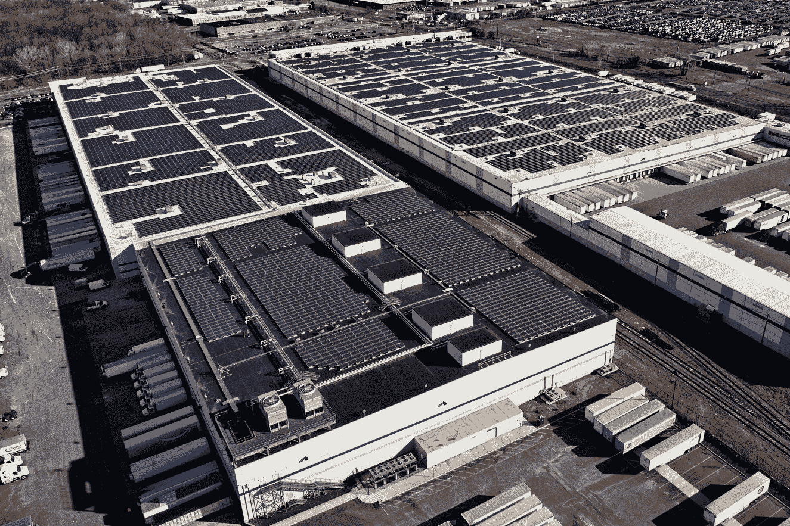

# 亚马逊开始在其仓库内安装大规模屋顶太阳能设备 

> 原文：<https://web.archive.org/web/https://techcrunch.com/2017/03/02/amazon-begins-large-scale-rooftop-solar-installation-across-its-warehouses/>

# 亚马逊开始在其仓库内大规模安装屋顶太阳能

亚马逊希望改善其可再生能源的记录，通过一个新项目，它将在全球许多履行和分拣设施的屋顶安装大型太阳能收集阵列。该计划将于今年年底开始在美国安装 15 套系统，并计划在 2020 年前在大约 50 栋建筑上安装。

最初的 15 个太阳能项目将产生大约 41 兆瓦的总输出。亚马逊表示，单独来看，一个设施的太阳能电池阵列可以为其提供每年约 80%的能源需求，这取决于它接受的阳光照射量、亚马逊能够进行的安装类型以及该设施管理的运营情况。亚马逊提供的一个具体例子是其加利福尼亚州帕特森的履行中心，该建筑 110 万平方英尺的屋顶有 75%以上将被太阳能电池板覆盖，这将有助于为内部的数百个亚马逊分拣机器人供电。

亚马逊的绿色能源计划包括遍布各州的风力和太阳能工厂，为其 AWS 数据中心提供电力，该公司表示，它已经承诺实施一些项目，最终将从可再生资源中产生总计 260 万兆瓦的能源。

尽管亚马逊做出了承诺，但还是受到了环境监管机构绿色和平组织(T4)的批评，该组织在 1 月份的一份报告中称，就可再生能源承诺和项目而言，这家电子商务提供商仍落后于苹果、脸书和谷歌。太阳能装置将有助于支付其使用电网的电力，并改善其整体能源记录，但亚马逊仍需要投资大规模专用能源生产设施，以解决绿色和平组织更大的担忧。