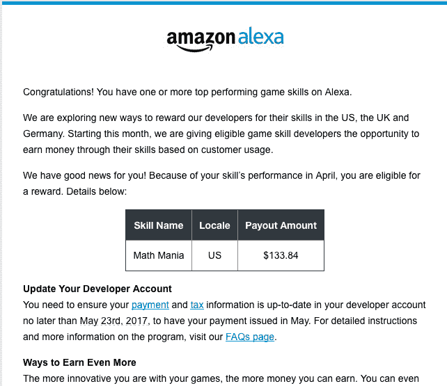

# 亚马逊开始通过直接支付奖励表现出色的 Alexa 技能开发人员 

> 原文：<https://web.archive.org/web/https://techcrunch.com/2017/05/16/amazon-begins-rewarding-top-performing-alexa-skill-developers-with-direct-payments/>

亚马逊悄悄推出了一个新项目，将直接向开发高质量 Alexa 技能的开发人员支付费用——为亚马逊 Echo 扬声器等 Alexa 驱动的设备和相关产品提供语音激活应用。这是亚马逊第一次为 Alexa 开发者提供一种手段，让他们在应用商店中赚钱。

开发人员报告说收到了来自亚马逊的电子邮件(见下面的截图)，其中解释了该程序如何运行。

邮件的开头是祝贺被选中的开发者拥有该平台上最优秀的游戏技能之一。它接着指出，亚马逊正在“探索新的方式来奖励我们的开发者”，根据客户的使用情况，为他们的技能提供报酬。

亚马逊网站上的问答& A 进一步证实了该计划的细节，但没有提供如何衡量使用情况以及这里使用何种支付规模的许多细节。相反，它只是简单地解释了使用“可以”通过各种指标来衡量，如技能使用的分钟数、增加的新客户数量以及其他参与度指标。

至于报酬，亚马逊只是含糊地表示，这将取决于技能的使用情况。

该计划于本月开始，如果开发者的技能符合入选条件，他们将收到来自 Alexa 团队的电子邮件提醒。

广告技术公司 Veritonic 的首席技术官凯文·马歇尔说:“我不确定有多少人收到了(这封邮件)，但我知道有几个人收到了。”他在业余时间开发了“数学狂热”技能。“还没有人分享他们的数额，所以不清楚我的 133.84 美元属于哪个等级，”他说。

随着越来越多的开发者加入该计划，并了解他们赚了多少钱，就更容易弄清楚亚马逊使用什么样的尺度来确定其支出。

虽然直接补偿开发者背后的明显动机是帮助 Alexa 技能商店播种消费者喜欢的高质量内容，但亚马逊在其 [FAQ](https://web.archive.org/web/20221206170254/https://developer.amazon.com/public/solutions/alexa/rewards-for-skill-developers?mkt_tok=eyJpIjoiTkRSbFpUQXhZVE16Wm1ZeiIsInQiOiJ6SXNieHp3aVJrdnNOVDRpdmZ3MWx4Wnc1bFlFU25sUktUcmtUZEhrYjlreHZ6YjQwU0M3eXI0VjFpd0x1Zjg5bWNvWFFDZFYwdnBDaUVBU25YdVZRZmxZN3BMNmo1UzBrT3lseklXVjFJZlVsN3JHZXRKRWZlc3lYR0tmbEdWZiJ9) 中阐明了这一点:

“我们开始奖励游戏技能开发者，因为游戏技能不仅有趣和令人愉快，而且代表了我们的客户在 Alexa 上最迷人的体验，”该网站说。

最初，只有游戏开发者得到补偿，但上述声明暗示，该计划未来可能会扩展到其他类别。

然而，今天，亚马逊只从那些归类于“游戏、琐事和配件”类别的语音应用中选择技能。

尽管这是亚马逊第一次以直接支付的形式奖励开发者的技能，但在此之前，亚马逊已经通过向那些拥有生产技能的人提供 AWS 积分来激励开发者构建其 Alexa 平台。

亚马逊拒绝置评。