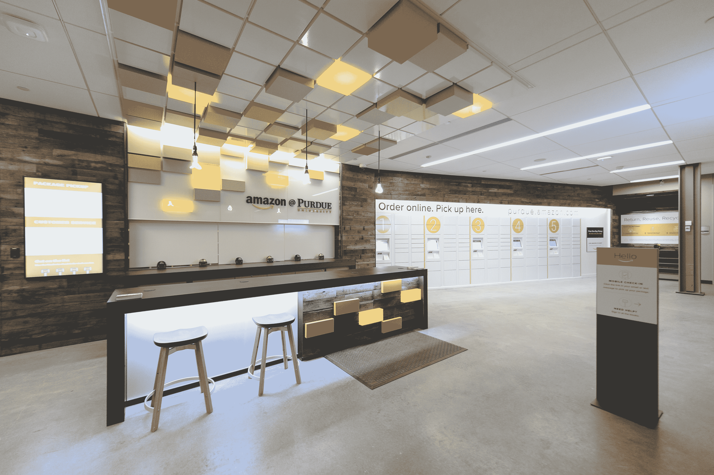

# 亚马逊第一家配备员工的大学校园商店应该让零售商担心了

> 原文：<https://web.archive.org/web/http://techcrunch.com/2015/02/03/amazon-campus-store/>

# 亚马逊第一家配备员工的大学校园商店应该让零售商感到担忧

亚马逊正在美国大学校园扎根，今天它正在庆祝其在其中一所学校的第一个员工办公地点的盛大开业。[普渡大学是亚马逊的第一个校园接送点，由亚马逊的实际员工运营，虽然这在一定程度上是亚马逊扩大其在教育教科书市场的存在的一种方式，但更有影响力的有效载荷可能是，它还有效地充当了目录销售风格的零售店，嵌入在学生最需要的地方。](https://web.archive.org/web/20230121054134/http://phx.corporate-ir.net/phoenix.zhtml?c=176060&p=irol-newsArticle&ID=2013031)

通过新的人员配备位置，使用 purdue.amazon.com 版零售门户网站的亚马逊学生可以通过普渡大学的徽标徽章找到分配给班级的书籍，他们还可以购买任何亚马逊商品，以及仅在一天内就可以取用的 Prime Campus 合格商品。一旦他们结账，他们可以选择 Amazon@Purdue 作为运输目的地，然后当商品实际到达现场时，他们会收到一封电子邮件或短信。只要学生有能力，就可以通过自助储物柜或真正的亚马逊员工来取。

这个最初的位置只是一个开始:亚马逊计划今年春天在校园的其他地方设立第二个实体书桌，它还计划在扩张发生后，专门向所有学生解释普渡大学教科书的免费一日运输。

亚马逊在这方面的策略很聪明:将一小部分收入交易给学校，以确保位置、学校品牌和紧密的课程安排。但不仅如此，它还几乎变成了一家便利店，为其服务的学生提供近乎无限的库存和选择，这让他们没有理由走出校园，去实体零售店购买除了最专业的商品之外的所有商品。

便利、价格竞争和健康的学校自豪感使这成为亚马逊为学生提供的强大产品，并可能影响使用它的学生一生的购物行为，这取决于体验。亚马逊也已经与加州大学戴维斯分校和马萨诸塞大学阿姆赫斯特分校建立了关系，并计划扩张，所以不要指望这是其校园零售野心的程度。