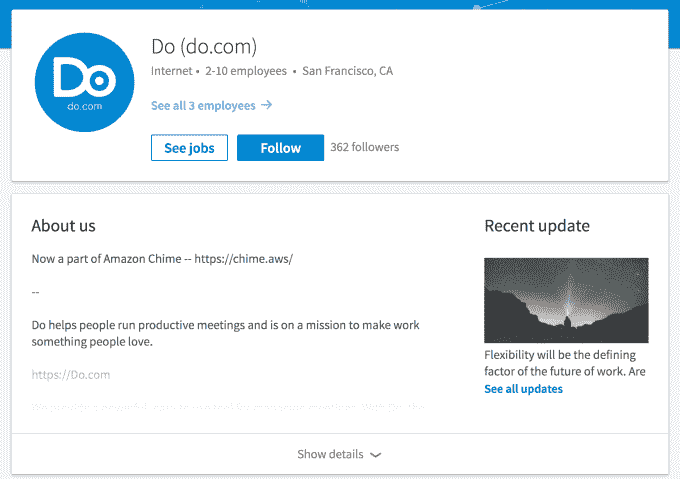
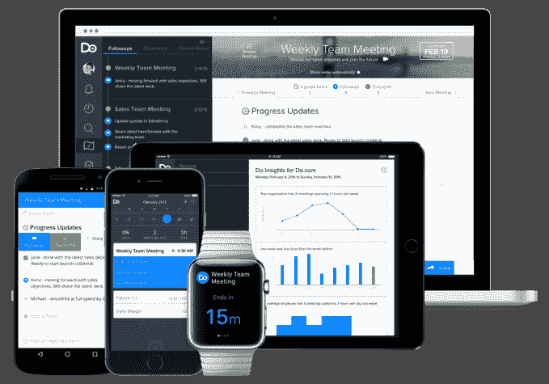

# 亚马逊的 AWS 收购了会议生产力初创公司 Do 以扩大 Chime 

> 原文：<https://web.archive.org/web/https://techcrunch.com/2017/03/08/amazon-can-do-chime/>

亚马逊已经悄悄地进行了又一次收购，以在其云平台 AWS 上构建生产力服务。该公司已经收购了一家初创公司[Do.com](https://web.archive.org/web/20221209135351/http://do.com/)，该公司已经建立了一个平台，通过管理会议准备笔记、为不在现场的人创建报告以及自己组织会议来提高会议效率。亚马逊正在将它整合到 [Chime](https://web.archive.org/web/20221209135351/https://chime.aws/) 中，这是一个[的新通信套件](https://web.archive.org/web/20221209135351/https://beta.techcrunch.com/2017/02/13/amazon-chime/)，它于上个月推出，通过 AWS 提供。

2 月 15 日(Chime 推出两天后)， [Do 宣布](https://web.archive.org/web/20221209135351/http://blog.do.com/post/157299307009/announcing-our-next-chapter)它已被收购，并将在月底关闭其服务——包括其网络、移动和 Apple Watch 应用。Do 没有指明买家，但一位读者向我们透露了 LinkedIn 上的[公司简介，其中提到这家初创公司“现在是亚马逊 Chime 的一部分。”其他 Do 工作人员](https://web.archive.org/web/20221209135351/https://www.linkedin.com/company-beta/3124393/)[也在个人资料中注明了收购](https://web.archive.org/web/20221209135351/https://www.linkedin.com/in/samir-javer-25bb955b/)。

我们已经联系了亚马逊的几个人，以及 Do.com 的创始人兼首席执行官杰森·沙阿，他现在说他是 Chime 的[产品经理，希望得到正式确认。随着我们了解更多，我们将对此进行更新。更新如下。](https://web.archive.org/web/20221209135351/https://www.linkedin.com/in/jasonyogeshshah/)

尚不清楚 AWS 正在使用 Do.com 的哪些地方(尽管另一名前雇员[现在在亚马逊](https://web.archive.org/web/20221209135351/https://twitter.com/amahanti)从事工程工作)——或者亚马逊支付了什么价格。

如果有其他人在讨论，我不会感到惊讶。Do had [只筹集了 240 万美元](https://web.archive.org/web/20221209135351/https://beta.techcrunch.com/2015/03/10/do-2m/)，但来自[一份很长的人脉广泛的投资者名单](https://web.archive.org/web/20221209135351/https://www.crunchbase.com/organization/do/investors)。其中包括 Salesforce，它对[产品](https://web.archive.org/web/20221209135351/http://force.com/)和[简称](https://web.archive.org/web/20221209135351/http://desk.com/)有[的偏好，并且像亚马逊一样，正在努力](https://web.archive.org/web/20221209135351/http://data.com/)[扩大](https://web.archive.org/web/20221209135351/http://quip.com/)其平台上提供给用户的增值服务的数量。(这里有一个科技品牌观察家的问题:Salesforce 甚至曾经有自己的任务管理服务，名为 Do.com，它在 2013 年[关闭了它。也许提供网址是它对创业公司的投资。)](https://web.archive.org/web/20221209135351/https://beta.techcrunch.com/2013/10/27/salesforce-coms-odd-decision-to-close-do-com/)

亚马逊的 AWS——上个季度公布了 35.3 亿美元的收入——最近一直在进行小规模收购，以扩展其在云基础设施上提供的服务——特别是在生产力和安全等领域。

其中许多都是 AWS 的明智之举:它们可以帮助它扩大每用户收入和基本云服务的利润，亚马逊降低了基本云服务的价格，以与谷歌、微软和 Rackspace 等其他公司竞争基本上是商品化的产品。

这是我们能够确定的亚马逊为构建 Chime 而进行的第二次收购。第一个是 Biba，它于去年收购了这项服务的视频会议部分。尽管我们找到了很多证据，但亚马逊当时从未直接证实过这笔交易，今天 [Biba 网站将其用户重定向至 Chime](https://web.archive.org/web/20221209135351/http://biba.com/) 。

本周一，有消息称 AWS 已经收购了为专业视频编辑制作工具的 Thinkbox 软件公司。这利用了这样一个事实，即视频已经是通过 AWS 存储和分发的内容的重要组成部分。

我们可能会看到其他收购转化为产品，包括云安全服务，通过 [Harvest.ai](https://web.archive.org/web/20221209135351/https://beta.techcrunch.com/2017/01/09/amazon-aws-harvest-ai/) ，这是我们在 1 月份发现的另一项收购。2016 年 7 月[收购的 cloud 9](https://web.archive.org/web/20221209135351/https://beta.techcrunch.com/2016/07/14/amazons-aws-buys-cloud9-to-add-more-development-tools-to-its-web-services-stack/)已经表示，它正在为 AWS 构建开发者工具，以便在网络和移动之间工作。

Do.com 是第一家来自旧金山的创业公司，总部设在旧金山的夏尔巴铸造公司是由夏尔巴资本公司、谢尔文·皮舍瓦和斯科特·斯坦福的同一批人发起的孵化器式组织。Sherpa Foundry 作为一个独立的实体运营，专注于与企业客户合作，帮助他们联系和整合新的创业公司(包括那些在 Sherpa Capital 投资组合内外的公司)。

虽然亚马逊对 Do 的收购可能不适合更大的夏尔巴铸造厂任务，但它的位置可以帮助 Do 获得更多的大客户。

2016 年，当 Do.com 扩展到 Android 时，沙阿在给我们的一封电子邮件中说，该服务已被用于 500 多万次会议，拥有 2.5 万名客户。该公司还与 Slack、Zapier、Google Apps、Microsoft Exchange 和 Office 365 以及 Evernote 建立了集成。

同样，还不清楚 Do 的哪些部分将进入 Chime，但当你考虑初创公司背后的基础，机制和一般概念和愿望时，很明显亚马逊现在有几个角度来实现自己的扩大雄心。

**更新**:自从昨天发表这篇文章后，我们有了一些进展。

AWS 发言人通过电话确认了我(英格丽德)的电子邮件，但拒绝发表评论。

此外，看起来 AWS 和 Do.com 试图把精灵放回瓶子里。Do 已经删除了宣布关闭和收购的博客帖子，以及 LinkedIn 页面(以及也注意到收购的员工页面)上关于成为亚马逊 Chime 一部分的说明。移动和网络应用程序仍在应用商店下架。

你可以在上面看到 Do.com 的 LinkedIn 页面截图；而且，因为互联网不擅长让世界忘记事情，你可以在这里找到博客文章的[缓存版本。](https://web.archive.org/web/20221209135351/http://webcache.googleusercontent.com/search?q=cache:uf5f_XPcaEgJ:blog.do.com/post/157299307009/announcing-our-next-chapter+&cd=1&hl=en&ct=clnk&gl=uk)

同样值得注意的是，尽管我们每次都尝试*，但我们从未得到过关于 Biba 或 Harvest.ai 的正式确认，或者事实上我们的很多亚马逊独家新闻已经被证明是正确的。_(ツ)_/*