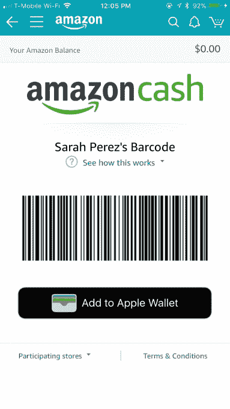

# 让你可以用现金在亚马逊网上购物的亚马逊现金服务在 7-Eleven TechCrunch 推出

> 原文：<https://web.archive.org/web/https://techcrunch.com/2017/11/06/amazon-cash-the-service-that-lets-you-use-cash-to-shop-online-arrives-at-7-eleven/>

公司今天宣布，亚马逊现金服务(Amazon Cash)现在可以在近 8000 家 7-Eleven 便利店中使用，该服务让消费者(T2)在实体零售商(T3)的 Amazon.com 余额中增加现金。这是亚马逊现金的一次重大扩张，此前亚马逊现金在 CVS、Speedway 和 GameStop 等零售商以及少数其他连锁超市和便利店都有售。

这项服务对亚马逊来说仍然相对较新，今年 4 月第一个[推出了](https://web.archive.org/web/20230129095521/https://techcrunch.com/2017/04/03/amazon-launches-amazon-cash-a-way-to-shop-its-site-without-a-bank-card/)，作为更好地服务于银行存款不足和没有银行存款的美国客户群的一种方式。

亚马逊并不是唯一一家试图触及这一人群的公司。其他公司也这么做，比如 PayPal 的 My Cash Card(我的现金卡)或者沃尔玛的 Pay with Cash(现金支付)选项。

尽管零售商试图接触“现金顾客”似乎有悖常理，但他们仍然占据着相当大的市场份额。根据美国联邦存款保险公司 2015 年的报告，这一人群占消费者的 27%。由于结账时需要使用信用卡或借记卡，这些客户可能不会经常在网上购物。

过去，如果他们想从亚马逊购物，他们必须购买指定金额的亚马逊礼品卡，或者将现金添加到预付费支付卡中，以便在结账时使用。

但是网上购物不应该是困难的，或者只有中产阶级和更高阶层才有的奢侈品。毕竟，网上商店通常比实体商店更划算，而且顾客可以通过网上订购来节省油钱或车费。

允许顾客使用现金支付只是零售商瞄准这个市场的一种方式。沃尔玛和 T2 亚马逊今年都让接受政府援助的顾客更容易购买他们的网站和使用他们的服务。

要在 7-Eleven 使用亚马逊现金，顾客需要向收银员出示他们在亚马逊应用程序中找到的个性化条形码，以及他们想要加载的钱。条形码也可以通过文本发送或打印。然后，收银员扫描条形码，立即将资金添加到客户在 Amazon.com 的账户余额中。

客户可以在单笔交易中存入 15 至 500 美元，不收取任何费用。

亚马逊将其现金服务扩展到 7-Eleven 代表了这两家零售商之间的又一次合作。

7-Eleven 已经与亚马逊合作，为包裹递送提供亚马逊储物柜。亮黄色的储物柜首先安装在西雅图和曼哈顿的商店，现在在 300 多个城市的精选商店中可以买到。

7-Eleven 还出售面值从 25 美元到 500 美元的亚马逊预付礼品卡。

7-11 高级产品总监托尼·斯泰普顿在一份声明中说:“7-11 长期以来一直倡导让顾客在如何支付产品和服务方面有多种选择。”“7-Eleven 不断更新和推出新的支付形式，以应对客户偏好、生活方式和新技术采用的不断变化。”

7-Eleven 在美国和加拿大经营、特许经营或授权了 10，900 家商店，因此此次发布覆盖了 7-Eleven 在美国的大部分地区。亚马逊现金从今天开始在 7-11 出售。