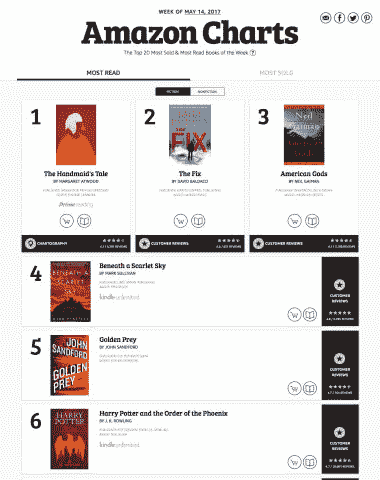

# 亚马逊排行榜是亚马逊新的畅销书排行榜，根据“阅读量最大”等因素对书籍进行排名

> 原文：<https://web.archive.org/web/https://techcrunch.com/2017/05/18/amazon-charts-amazons-new-bestseller-list-ranks-titles-by-most-read-and-more/>

亚马逊长期以来一直依赖客户提供反馈和其他排名数据，作为鼓励其平台上更多销售的过程的一部分，现在这家电子商务巨头正在增加新的转折，以刺激其图书业务的更多购买。

今天，亚马逊宣布了亚马逊排行榜，这是一种新的畅销书排行榜，有史以来第一次为用户提供亚马逊上“最受欢迎”书籍的前 20 名——这是一种新的衡量标准，结合了在 Kindle 上阅读和通过 Audible 收听的书籍数量。

除此之外，亚马逊还将提供一种新的“最畅销”前 20 名名单，现在不仅包括已售出和预订的书籍，还包括每周在 Amazon.com、Audible 和亚马逊图书上被借阅的书籍。它还将提供其他选择性的统计数据和销售数据。

这不是亚马逊第一次提供图书排名。

自亚马逊推出以来，该公司提供了一份畅销书排行榜，衡量书籍的销量，包括总排名和特定类别。它还为作者提供了一定程度的销售分析，作为其推动更多人在其平台上出版和销售的一部分。

该公司长期以来一直在试图寻找更有效的方式来推动社交角度，利用其他人正在阅读的信息来鼓励更多的销售。

亚马逊在这方面做出的最引人注目的举动可能是在 2013 年收购了广受欢迎的 Goodreads 服务，据报道价值约 1.5 亿美元，引入了一种社交网络，人们可以在其中跟踪他们的朋友和 Goodreads 社区中的其他人在读什么，以及他们如何评价这些书。

如果 Goodreads 是我们的朋友和其他志同道合的人如何对世界上更广泛的书籍做出反应的长尾图片，你可以认为亚马逊图表是实现相同想法的新的、更快的方法。

亚马逊 Kindle 内容副总裁 David Naggar 说，这是一个尝试，提供一个纯数据的推荐列表，通过一些人为的管理来渲染其他畅销书列表。

“当朋友推荐一本书时，他们推荐的是他们真正阅读和喜爱的书，”他在一份声明中说。“如今，许多著名的畅销书排行榜基于编辑考虑对书籍进行添加、删除或重新排名，而客户要求的畅销书排行榜是基于阅读参与度和销售数据，而不是基于他们应该关注哪些书籍的意见。我们很高兴为图书爱好者提供亚马逊图表，帮助他们发现自己的下一本好书。”

提供图书消费数据不仅仅是亚马逊的领域。其他像 Jellybooks 也在这个前提下尝试搭建推荐和发现平台。

这里值得注意的是，亚马逊是如何紧密结合其庞大平台上的数据来鼓励闭环的。

其中，亚马逊还提供了迷你仪表盘，用于测量一本书的消费情况。

我之前看过，玛格丽特·阿特伍德的《女仆的故事》被列为美国最受欢迎的书。亚马逊还为我提供了这部小说的“图表”，告诉我这是缅因州最受欢迎的书。(为什么是缅因州？我不太清楚，但这可能与这本书的背景有关。)它还提供了一些关于这本书如何被拍成电视剧的信息。

另外两本书在最受欢迎阅读榜前 20 名中，宝拉·霍金斯的*入水*和 J.K .罗琳的*哈利·波特与魔法石*还有其他数据点:霍金斯的书在 Audible 上听得比在 Kindle 上读得多，而哈利·波特是本周最受欢迎阅读榜上最短的书:

这些数据点是有选择性的，目前还不清楚亚马逊会选择在哪里披露其所做的事情。我在这里提到它的主要原因是因为它揭示了该公司通过其庞大的销售和分销业务一直在收集多少关于销售和消费的数据。归根结底，这一切都是为了吸引更多的顾客:每个标题的方框都链接到书籍的销售页面。

对于那些有这种倾向的人来说，亚马逊也将图表与 Alexa 联系起来，这是你现在可以问你的 Echo 或其他由语音助手驱动的设备的另一件事。“Alexa，本周最受欢迎的书是什么？”会给你一个口头的 20 大清单。

随着 Alexa 和亚马逊在语音界面方面的努力继续增长，你应该会看到像这样的集成成为该公司更多(也许是所有)未来产品发布的核心部分。