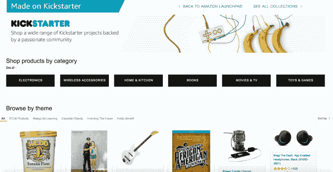

# 亚马逊推出 Kickstarter 产品专卖店 

> 原文：<https://web.archive.org/web/https://techcrunch.com/2016/07/27/amazon-debuts-a-dedicated-shop-for-kickstarter-products/>

在 Kickstarter 上资助一个项目就像下赌注——这个项目会成功吗？会出货吗？或者你只是失去了一大笔零钱？也就是说，众筹平台已经让许多公司起步，包括从小工具和电子产品到玩具和家居用品等各种产品。今天，[亚马逊宣布将与 Kickstarter](https://web.archive.org/web/20221214134832/http://phx.corporate-ir.net/phoenix.zhtml?c=176060&p=RssLanding&cat=news&id=2188842) 合作，通过亚马逊网站上的专门版块，为那些成功的 Kickstarter 产品提供一种接触更多客户的方式。

via[www.amazon.com/launchpad/kickstarter,](https://web.archive.org/web/20221214134832/https://www.amazon.com/b/?node=13514636011)这家在线零售商现在在 Kickstarter 上推出了 300 多种产品，涵盖各种类别，如电子产品、书籍、家庭厨房、电影电视等等。

这些产品也可以按主题浏览，比如 STEM 产品，“永远学习”，“精美物品”，“发明未来”，以及“公共利益”。

首次亮相的系列产品包括[派珀的电脑套件](https://web.archive.org/web/20221214134832/https://www.amazon.com/dp/B016HLFW44)、 [Zivix 的 jamstik +便携式智能吉他](https://web.archive.org/web/20221214134832/https://www.amazon.com/dp/B0149YRRXA)、[Prynt Case](https://web.archive.org/web/20221214134832/https://www.amazon.com/dp/B017BK9RXC)、 [MudWatt 的清洁能源套件](https://web.archive.org/web/20221214134832/https://www.amazon.com/dp/B004GY5P06)等。

新的 Kickstarter 部分实际上是亚马逊一年前推出的 Launchpad 平台的扩展。2015 年 7 月，[这家零售商推出了一个专门的门户网站](https://web.archive.org/web/20221214134832/https://beta.techcrunch.com/2015/07/28/amazon-takes-on-product-hunt-shopify-with-launchpad-an-all-in-one-marketing-and-sales-portal/)，为年轻科技公司的硬件和实物产品提供营销和销售服务。它当时表示，它正在与超过 25 家风险投资公司、加速器和众筹平台合作，为新网站采购产品，例如，包括 Andreessen Horowitz、Y Combinator 和 Indiegogo 等知名公司。这家在线商店在首次亮相时有 200 多种商品。

今天，亚马逊表示，它现在已经与 100 多家风投、加速器和众筹公司合作，并帮助美国、英国、中国、德国和法国的 1000 多家公司推出产品。

零售商指出，所有参与 Launchpad 的初创公司都将收到定制产品页面、全面的营销包，以及进入亚马逊全球履约网络的权限。

虽然专门的在线商店对亚马逊来说是新的，但这家零售商此前已经在其网站上销售 Kickstarter 商品。该公司表示，迄今为止，Amazon.com 客户已经购买了“数百万”Kickstarter 产品。