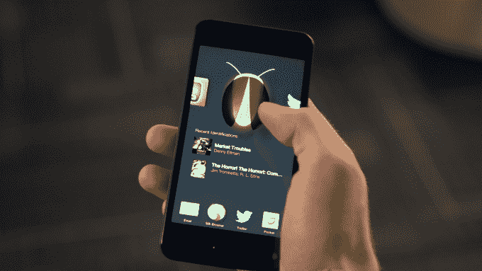

# 亚马逊将 Fire 手机价格降至 99 美分 

> 原文：<https://web.archive.org/web/https://techcrunch.com/2014/09/08/amazon-dumps-the-fire-phone-down-to-99-cents/>

# 亚马逊将 Fire 手机的价格降至 99 美分

因为没有什么说“我们的新产品卖得很好！”就像推出两个月后降价 99.5%一样，亚马逊也将 Fire 手机的价格从 200 美元降至 99 美分。

在你除了一部《华盛顿》之外一无所有地前往亚马逊之前，请记住:与签订 2 年合约的价格是 99 美分*，在& T 上只有*有售。按照& T 目前最便宜的月费率(60 美元)，那部 1 美元的手机最终实际上要花掉你将近 1441 美元。

如果没有服务计划，32GB 的 Fire Phone 仍然需要 449 美元。

如果你愿意忽略几乎肯定会在明天发布的新 iPhone，或者从长远来看市场上的任何 Android 手机都可能是更好的选择，你可以在这里找到大幅打折的 Fire 手机