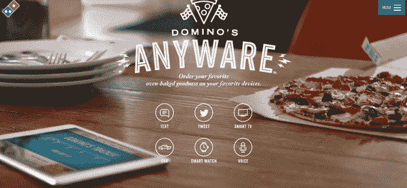

# 亚马逊 Echo 现在可以订购你的披萨了

> 原文：<https://web.archive.org/web/https://techcrunch.com/2016/02/03/amazon-echo-can-now-order-your-pizza/>

如果你需要另一个理由来购买亚马逊的互联网扬声器，亚马逊回声(Amazon Echo)现在可以根据你的口头命令为你订购披萨。我所有的梦想都实现了吗？是的。*是的，他们有。*该功能实际上是通过来自配送链[达美乐](https://web.archive.org/web/20230316161010/http://anyware.dominos.com/)的第三方应用程序实现的，达美乐在过去一年中一直在试验新的数字订购系统，包括通过[推特](https://web.archive.org/web/20230316161010/https://techcrunch.com/2015/05/20/dominos-tweet-to-order-system-isnt-as-great-as-it-sounds/#.s2agxy:gXI0)表情符号订购披萨的选项。

达美乐现在是披萨和快餐餐饮业中第一家支持通过亚马逊 Echo 的虚拟助手 Alexa 点餐的公司。

与它的其他努力类似，通过 Echo 订购的过程将首先要求 Domino 的客户建立一个"[披萨档案](https://web.archive.org/web/20230316161010/https://www.dominos.com/en/pages/customer/#/customer/profile/)"这是一个个人资料，您可以在其中输入您的姓名、地址和支付信息，以及您的“简单点餐”偏好——也就是您最喜欢的达美乐点餐——比如一个大香肠。

披萨档案是利用多米诺现在支持的所有平台的数字订购所需要的，今天的[包括](https://web.archive.org/web/20230316161010/http://anyware.dominos.com/)桌面、移动、短信、Twitter、三星智能电视、福特 Sync、Android Wear 和 Pebble 等智能手表，以及它自己的原生应用程序(你也可以通过语音与它的虚拟助手 Dom 说话)。

通过推特点餐可能会让人觉得[有点噱头](https://web.archive.org/web/20230316161010/https://techcrunch.com/2015/05/20/dominos-tweet-to-order-system-isnt-as-great-as-it-sounds/)——通过移动网络建立披萨档案的过程并不像听起来那样天衣无缝。达美乐也没有利用 Twitter 的“购买”按钮，这使得首次用户很难在 Twitter 上发布他们的披萨订单。

然而，一旦你建立了你的比萨档案，订购就容易多了。Domino 的其他数字订购系统也是如此，包括现在通过 Alexa 的语音订单。

此外，通过亚马逊 Echo 订购非常有意义。亚马逊 Echo 正在成为智能家居的中枢，支持从购物清单到家庭自动化到新闻、天气、音乐等一切内容。

唯一的麻烦是，该功能仍然受到 Alexa 需要以某种方式表达请求的限制。这不仅仅是 Domino 的问题，而是困扰整个平台的问题。

亚马逊告诉我们，你需要说“Alexa，打开达美乐，下我的简单订单”来启动你的披萨外卖请求。这还不够好。您应该能够告诉 Alexa 简单地“订购披萨”Alexa 应该足够聪明，能够将请求连接到给定的应用程序。(或者在美好的未来，多米诺是众多订餐应用中的一个，Alexa 可以问你想用哪个应用)。

要使用 Domino 的应用程序，Echo 所有者首先需要通过将他们的帐户链接到他们的披萨个人资料，从亚马逊 Alexa 应用程序中启用 Domino 的“技能”。然后，在下订单后，Amazon Echo 还可以根据请求跟踪您的订单进度。

具体来说，就是说:“Alexa，让达美乐跟踪我的订单。”

亚马逊表示，该功能将于周五上线——当然，远远早于超级碗周日的时间。