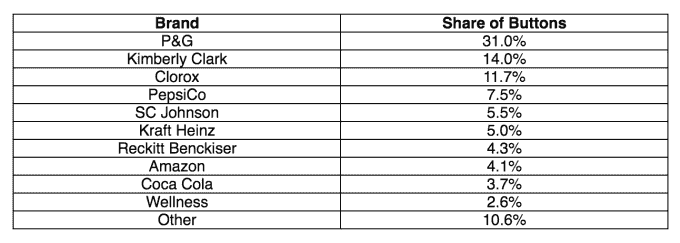

# 亚马逊扩大仪表板按钮系列，迄今为止最畅销的包括 Tide、Bounty、cotton elle 

> 原文：<https://web.archive.org/web/https://techcrunch.com/2016/03/31/amazon-expands-dash-button-line-up-top-sellers-to-date-include-tide-bounty-cottonelle/>

亚马逊今天早上宣布扩大其 [Dash Buttons](https://web.archive.org/web/20221207055445/http://www.amazon.com/b/?ie=UTF8&node=11267118011) 产品线——那些 [Wi-Fi 连接的按钮设备](https://web.archive.org/web/20221207055445/https://beta.techcrunch.com/2015/03/31/amazons-new-dash-button-hardware-offers-instant-orders-for-staple-products/)，让你只需按一下就能从其网站上购买产品。按钮上线一年后，显然不是人们曾经想象的[愚人节玩笑](https://web.archive.org/web/20221207055445/https://beta.techcrunch.com/2015/03/31/amazons-new-dash-button-hardware-offers-instant-orders-for-staple-products/#.m6iein:FwzB)，亚马逊表示现在有超过 100 个按钮可用，订单在过去三个月增加了 75%以上。

此次扩张包括大约 80 多个品牌加入之前的阵容，其中包括几个现在在食品和饮料领域，而不是消费包装商品(CPG)。

当然，亚马逊就是亚马逊，该公司拒绝提供任何关于这些按钮的性能及其对亚马逊底线的贡献的真实数字。目前还不清楚有多少顾客购买了这种纽扣，有多少在野外使用，或者它们的销量如何等。

尽管如此，那些拥有按钮的人似乎是活跃用户——亚马逊表示，破折号按钮订单平均每分钟超过一次。

最初，这些设备用于重新订购常见的家居用品，如纸巾、洗衣液、卫生纸、垃圾袋、狗粮、尿布等。但自首次亮相以来的一年里，Dash Buttons 已经推出了各种产品，包括截至今天，你可能认为不需要按钮订购便利的产品，如口香糖，或食品和饮料产品，如红牛和苗条吉姆。(也许是编码员？)

如果你愿意，你甚至可以按下按钮重新订购避孕套。

今天，这家在线零售商表示，它已经将该计划中可用的品牌增加了两倍，该计划仅适用于 Prime 会员。现在有 100 多个按钮可供选择，包括新增加的品牌，如 Brawny，Charmin，Clorox，Doritos，Energizer，Gain，Honest Kids，巴黎欧莱雅振兴，Lysol，Peet's Coffee，Playtex，Purina，红牛，第七代，Slim Jim，Snuggle，星巴克，Trojan，维生素水等。

实际上，似乎每个 CPG 公司都想通过 Dash Button 提供产品。

由于亚马逊没有提供任何关于设备性能的真实信息，我们只能依靠第三方数据来得出任何结论。

本月早些时候，1010data 的 Ecom Insights Panel(由美国数百万网购者组成)的一项研究显示，最畅销的单个 Dash 按钮是 P&G 的两款产品，Tide Pods 和 Powder Dash Button(并列第一)；P&G 的赏金破折号按钮在# 2；排在第三位的是金伯利·克拉克的棉质镶饰纽扣。

该公司表示，这些数据是从 2015 年 5 月到 2016 年 1 月收集的。

研究表明，事实上，P&G 控制着 Dash Button 市场，占据了 31%的销售份额。继 P&G 之后，金伯莉·克拉克(卡顿贝尔，休吉斯)以 14%的市场份额位居第二，克洛克斯(高兴)以 11.7%的市场份额位居前三。

该研究还发现，前 10 名中的其他公司包括百事可乐、强生公司、卡夫亨氏、雷克雅未克、亚马逊、可口可乐和健康。

虽然您必须花 4.99 美元购买一个 Dash Button，但这些按钮本身实际上是免费的。首次订购时，亚马逊会向您的账户贷记 4.99 美元。

情况并不总是这样——在发布会上，亚马逊向顾客收取按钮费用，这似乎有点荒谬。*花钱是为了更容易在亚马逊购物，从而给他们钱？*亚马逊很快意识到，很明显，从长远来看，将按钮交到购物者手中值 5 美元。

如果您想了解使用破折号按钮的感觉，您可以在[查看我们的指南](https://web.archive.org/web/20221207055445/https://beta.techcrunch.com/gallery/what-its-like-to-use-amazons-new-dash-buttons/)。

[YouTube https://www.youtube.com/watch?v=y46tBLdgwnY]