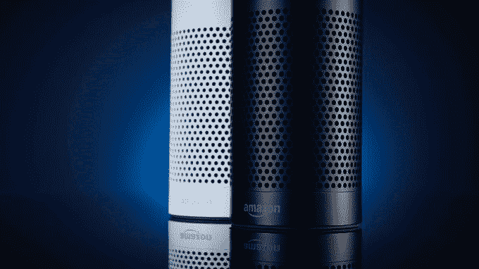
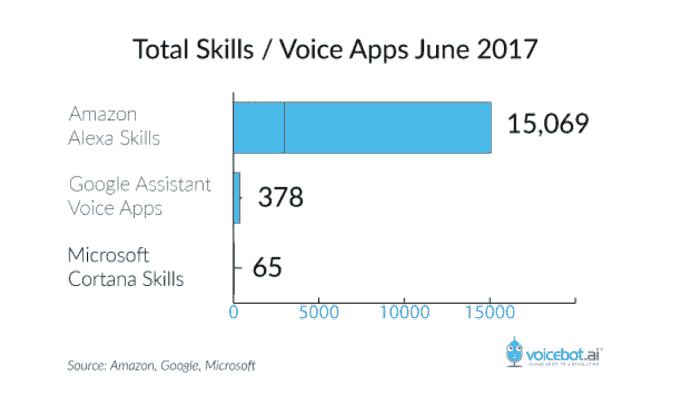

# 亚马逊扩大向 Alexa 开发者支付顶级语音应用程序费用的计划 

> 原文：<https://web.archive.org/web/https://techcrunch.com/2017/08/16/amazon-expands-program-that-pays-alexa-developers-for-top-performing-voice-apps/>

亚马逊今天宣布了一项新计划，为开发人员提供了一种为他们的 Alexa 技能赚钱的方法——在 Echo 等智能扬声器和其他 Alexa 驱动的设备上运行的语音应用程序。据该公司称，开发者将获得超过六个类别的最高性能和“迷人”的语音应用的报酬，包括游戏，此前通过类似的计划获得报酬。

这个项目最早开始于 5 月，当时亚马逊悄悄地向 Alexa 开发热门游戏的开发者引入了直接现金支付。

现在，亚马逊将开始奖励其他类别的语音应用程序，包括教育和参考，食品和饮料，健康和健身，生活方式，音乐和音频，以及生产力。

这里的想法是在任何正式的货币化计划之前，为开发者提供一种从他们的 Alexa 技能中赚钱的手段。今天的 Alexa 应用商店不允许开发者向用户收取付费语音应用的费用，也不允许应用内购买。亚马逊甚至改变了与 Alexa 技能培养相关的政策，以便[在六月关闭第一个为 Alexa 技能设计的广告网络](https://web.archive.org/web/20221206002929/https://beta.techcrunch.com/2017/06/15/the-first-ad-network-for-alexa-skills-shuts-down-following-amazons-policy-changes/)。

这使得开发人员在很大程度上把培养技能作为一项热爱的工作——因为当亚马逊最终推出某种从语音应用中赚钱的真正商业模式时，他们希望走在游戏的前面。

亚马逊没有在它的博客文章中详细说明它是如何决定什么使 Alexa 技能“吸引人”相反，该公司解释说，与使用搜索引擎相比，它正在寻找旨在“语音优先”的技能，这些技能是独特的，定期提供新鲜内容，并使人们的生活更容易。

亚马逊表示，例如，使用翻译技能来找出如何用另一种语言表达某件事，比在搜索引擎中输入查询更简单。

此外，亚马逊重申，游戏是 Alexa 平台上最具吸引力的技能之一——这可能是为什么它们是第一个获得报酬的类别。

虽然亚马逊没有提供开发者应该注意的指标或阈值的完整列表，但一位因游戏技能而获得奖励的 Alexa 开发者告诉我们，他认为奖金很大程度上与排名有关。他估计，前六项技能的奖金从第一名的 5000 美元下降到第六名的 2000 美元左右。然后，接下来的 300 名左右的玩家将从 7 号玩家的大约 1，000 美元到 300 号玩家的大约 100 美元不等。

目前，Alexa 开发人员没有太多的数字可以跟踪。他们的仪表板提供了会话、唯一用户、意图和话语(语音命令)等指标。但是这些和支出之间没有直接的联系。这表明亚马逊还有其他未披露的考虑因素。亚马逊向我们确认了它检查的一些因素，包括使用分钟数、新客户、回头客和客户评级。

为顶级技能提供现金只是亚马逊试图发展其语音应用生态系统的一种方式。该公司还向 Alexa 开发者发放亚马逊网络服务推广积分，这样如果技能变得流行，他们就不必支付 AWS 使用费。此外，亚马逊正在[全球运营一系列 Alexa 培训研讨会](https://web.archive.org/web/20221206002929/https://beta.techcrunch.com/2017/07/06/amazon-is-launching-a-series-of-alexa-training-workshops-worldwide/)，并且已经[向开发者提供免费的 Echo 设备](https://web.archive.org/web/20221206002929/https://developer.amazon.com/alexa-skills-kit/alexa-developer-skill-promotion)。

值得注意的是，在任何正式的补偿计划或支持传统应用货币化商业模式(如免费增值应用、付费应用和广告)之前，Alexa 平台已经成功吸引了相当多的开发人员。尽管如此，Alexa 的应用商店在相对较短的时间内已经增长到超过 [15，000 种技能](https://web.archive.org/web/20221206002929/https://beta.techcrunch.com/2017/07/03/amazons-alexa-passes-15000-skills-up-from-10000-in-february/)——毕竟，亚马逊的第一款 Alexa 设备[Echo speaker 甚至直到 2015 年 7 月才在](https://web.archive.org/web/20221206002929/https://www.androidcentral.com/amazon-echo-now-available-everyone-buy-17999-shipments-start-july-14)向公众开放。

也就是说，直接支付技能是一个只能持续这么久的项目。最终，开发者会要求对他们的业务有更多的控制，而不是依赖于一些难以理解的算法。与此同时，亚马逊将面临来自竞争对手的竞争，包括谷歌主页和苹果即将推出的 HomePod，这两家公司都更了解应用商店生态系统的工作方式。

但是那两个人来晚了。由于亚马逊的 Echo 扬声器的流行，Alexa 拥有牵引力，现在，它的平价小表弟 Echo Dot，以及其他[更新的](https://web.archive.org/web/20221206002929/https://beta.techcrunch.com/2017/06/26/the-echo-show-is-a-small-step-for-echo-a-big-leap-for-amazon/) [设备](https://web.archive.org/web/20221206002929/https://beta.techcrunch.com/2017/04/26/amazons-new-echo-look-has-a-built-in-camera-for-style-selfies/)。该公司不是第一个开发语音的公司，但它基本上弄清楚了语音计算应该如何工作，以满足消费者日益增长的需求。

Echo 位于你家中的一个单独的地方，而不是从口袋或钱包里拿出来的电话上运行的语音助手。你只要大声说出来，“电脑”就会做出反应。这是很久以前为我们描绘的未来科幻，我们已经知道如何使用它。现在，亚马逊需要证明它可以建立一个可持续的应用生态系统，这将使它保持在语音计算领域的地位；让开发者满意是关键的一步。