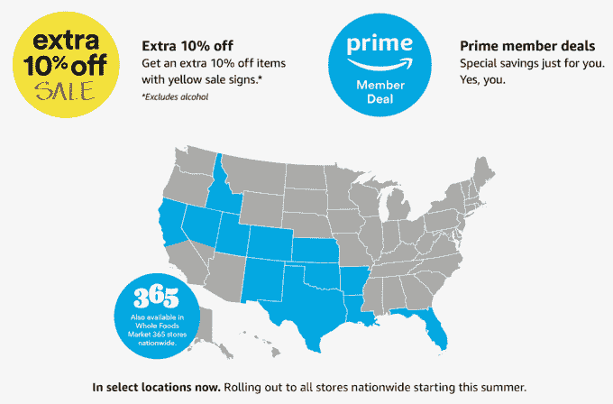

# 亚马逊开始在全国范围内扩大全食超市 Prime 会员折扣 

> 原文：<https://web.archive.org/web/https://techcrunch.com/2018/05/30/amazon-expands-whole-foods-discounts-for-prime-members/>

# 亚马逊开始在全国范围内扩大全食超市 Prime 会员折扣

本月早些时候，亚马逊在全食超市为 Prime 会员推出了 10%的优惠，今天它开始在全国范围内推广这一举措。

Prime Whole Foods 折扣是继[亚马逊收购 Whole Foods](https://web.archive.org/web/20221206145751/https://techcrunch.com/2017/06/16/report-amazon-is-gobbling-whole-foods-for-a-reported-13-7-billion/) 后的一系列措施之一，它涵盖了每周特色产品的折扣，以及已经销售的商品的 10%的增量折扣，亚马逊表示，这通常涵盖了每家商店的“数百个”。今天，这个项目[扩展到另外 12 个州](https://web.archive.org/web/20221206145751/http://phx.corporate-ir.net/phoenix.zhtml?c=176060&p=RssLanding&cat=news&id=2351161)，包括北加州、科罗拉多州和得克萨斯州，更多的州将很快跟进。

这种合作是订阅亚马逊 Prime 的另一个原因，对消费者来说极具吸引力的套餐让零售商——无论是线上还是线下——更有理由害怕亚马逊。

该优惠首先在佛罗里达州推出，但这次扩展是第一波，旨在让整个美国的 Prime 客户在今年夏末之前在 Whole Foods 和 Whole Foods Market 365 商店获得折扣。全食超市目前在美国、加拿大和英国总共有 470 多家门店，但大多数——准确地说是 463 家——都在美国，所以还有很多工作要做。也就是说，亚马逊表示，美国所有的全食超市 365 门店现在都被覆盖了。

使用全食配送服务[的顾客也可以享受折扣，全食配送服务也是亚马逊在选定城市的 Now 服务](https://web.archive.org/web/20221206145751/https://techcrunch.com/2018/02/07/amazon-whole-foods-integration/)的一部分。Prime 会员的订单达到 35 美元或以上就可以免费送货，并且有两个小时的送货窗口。

> 亚马逊已经开始在全食超市全国范围内扩大优惠折扣

“从美味的晚餐选择，如虾或烤鸡，到新鲜的有机覆盆子，我们正在为顾客喜欢并能与家人一起享用的产品提供优惠。全食超市总裁兼首席运营官在一份声明中说:“像可持续捕捞的比目鱼这样的独家交易在佛罗里达州非常受欢迎，我们很高兴与我们的供应商合作，为 Prime 会员带来更多季节性和日常主食折扣。”