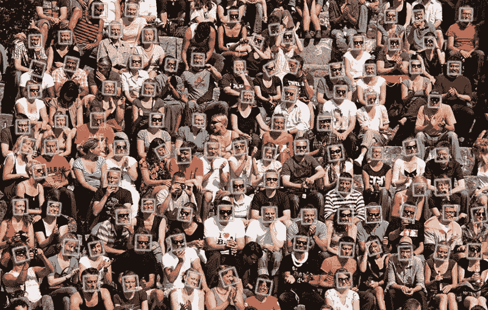

# 亚马逊面部识别软件引发了美国公民自由联盟 TechCrunch 对隐私的担忧

> 原文：<https://web.archive.org/web/https://techcrunch.com/2018/05/22/amazon-facial-recognition-software-raises-privacy-concerns-with-the-aclu/>

# 亚马逊面部识别软件引发了美国公民自由联盟对隐私的担忧

亚马逊并没有完全保密认知。2016 年底，这家软件巨头在一篇相对温和的 AWS 帖子中称赞了其面部检测软件，宣布这项技术已经由俄勒冈州华盛顿州警长办公室用于嫌疑人识别。

北加州的美国公民自由联盟[本周](https://web.archive.org/web/20221228234504/https://www.aclunc.org/blog/amazon-teams-law-enforcement-deploy-dangerous-new-face-recognition-technology)更加关注这项技术，然而，在宣布它已经获得了更多关于这项服务的文件后，它认为这项服务“引发了深刻的公民自由和公民权利问题”

有问题的文件强调了华盛顿县 30 万张面部照片的数据库和一个专门为代表设计的移动应用程序，以交叉引用面孔。他们还指出，亚马逊已经请求该国接触这项服务的其他潜在客户，包括一家制造人体相机的公司。

“人们应该可以自由地走在街上，不受政府监视，”美国公民自由联盟律师马特·卡格尔在一篇与新闻相关的帖子中写道。“通过自动化大规模监控，像 Rekognition 这样的面部识别系统威胁到了这种自由，对在当前政治气候下已经成为不公正目标的社区构成了特别的威胁。一旦像这样强大的监控系统被建立和部署，伤害将非常难以消除。”

《华盛顿邮报》[在报道之后联系了该县的公共信息官员，副杰夫·塔尔伯特。该代表告诉该报，技术不会偏离现有系统太远。“我们的目标是让公众了解我们为破案所做的工作，”塔尔博特说。"这不是大规模监视或无目标的监视."](https://web.archive.org/web/20221228234504/https://www.washingtonpost.com/news/the-switch/wp/2018/05/22/amazon-is-selling-facial-recognition-to-law-enforcement-for-a-fistful-of-dollars/?utm_term=.f592ecc1ce6d)

亚马逊类似地反驳了该技术天生具有侵入性的说法。“作为一项技术，亚马逊 Rekognition 在现实世界中有许多有用的应用，”该公司在给 TechCrunch 的一份声明中写道。“而且，随着越来越多的公司开始使用像亚马逊 Rekognition 这样的先进技术，像这样的人工智能服务的效用只会增加。如果我们取缔新技术，我们的生活质量会更差，因为有些人可能会选择滥用技术。想象一下，如果客户因为计算机可能被用于非法目的而无法购买该计算机，情况会怎样？像我们的任何 AWS 服务一样，我们要求我们的客户在使用亚马逊 Rekognition 时遵守法律并负责任。”