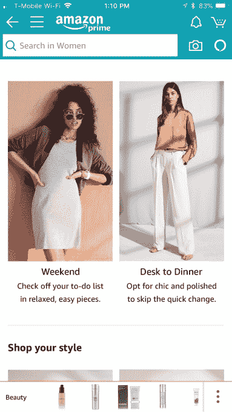

# 亚马逊终于向更多顾客开放了 Prime 衣橱

> 原文：<https://web.archive.org/web/https://techcrunch.com/2018/04/12/amazon-finally-opens-up-prime-wardrobe-to-more-customers/>

亚马逊的 Prime 衣橱似乎正准备推出。这家零售商的“先试后买”购物服务于 2017 年 6 月首次宣布[，旨在挑战市场上的现有企业，如 Stitch Fix、Trunk Club、Wantable 等。自去年以来，这项服务一直处于邀请测试阶段，亚马逊声称情况仍然如此。然而，最近的一系列推文，包括——*咳咳*，来自](https://web.archive.org/web/20230406142023/https://techcrunch.com/2017/06/20/amazon-prime-wardrobe/)[亚马逊](https://web.archive.org/web/20230406142023/https://twitter.com/AmazonAtUCI/status/984137014650986496)账户的推文和参与该项目的[人](https://web.archive.org/web/20230406142023/https://twitter.com/pixalu/status/981201796075892737)——不敢苟同。

不幸的是，在我们询问亚马逊后，亚马逊员工的推文被删除了。上面写着:*“亚马逊 Prime 衣橱正式推出！万岁！这是一个有趣的项目。”在我们截屏之前，它已经消失了。但如果你好奇的话，这是 Chrome 的历史:*

亚马逊最初否认 Prime 衣柜有任何变化，称它仍处于只有受邀者才能进入的状态。但当我们分享推文时，发言人澄清说，亚马逊的时尚团队现在已经将该计划扩展到更多的 Prime 客户。

这位发言人说，顾客可以“从我们为女性、男性、儿童和婴儿提供的众多品牌中购物”。

Twitter 上的许多亚马逊 Prime 购物者似乎意识到他们刚刚被骗了:

亚马逊拒绝透露在此之前有多少人在测试它，或者在这次扩大的测试中增加了多少人。

但亚马逊肯定不会再花太多时间来更广泛地推出该计划，因为它距离最初的宣布已经过去了一年。在此期间， [Stitch Fix 已经上市](https://web.archive.org/web/20230406142023/https://www.cnbc.com/2017/11/17/stitch-fix-ipo-opening-trade.html)，Gwynnie Bee [为其他零售商推出了一个订阅服装盒子平台](https://web.archive.org/web/20230406142023/https://techcrunch.com/2018/03/22/gwynnie-bee-is-bringing-subscription-clothing-rental-to-traditional-retailers-with-launch-of-caastle/)，该平台已被 Anne Taylor 和 New York &公司采用。亚马逊也该站出来了。

[Prime 衣柜](https://web.archive.org/web/20230406142023/https://www.amazon.com/prime-wardrobe/b/ref=topnav_storetab_tbyb_l0?ie=UTF8&node=14807110011)可能是亚马逊在在线服装市场的战略优势，也是提高 Prime 订阅量的一种手段。

这项服务旨在解决在线购物在服装领域面临的最大挑战之一——很难从在线照片或视频中判断某样东西是否合身，或者看起来是否好看。首先，模特的比例和大多数购物者不一样，服装制造商裁剪的尺寸也不一样。此外，在衣服穿在身上之前，你通常不知道布料的感觉如何，是否悬挂良好，某些地方是否太紧或太松，太短或太长，或者作为整套服装的一部分看起来如何。

过去，这导致一些人避免在网上购买服装。尽管如此，服装是网上增长最快的类别之一——例如，这就是为什么沃尔玛收购了 [ShoeBuy](https://web.archive.org/web/20230406142023/http://news.walmart.com/2017/01/05/jet-announces-the-acquisition-of-shoebuy-a-leading-online-footwear-retailer) 、[倭黑猩猩](https://web.archive.org/web/20230406142023/https://techcrunch.com/2017/06/16/walmart-to-buy-bonobos-for-310m-in-its-bigger-push-into-fashion-retail/)和 [ModCloth](https://web.archive.org/web/20230406142023/https://techcrunch.com/2017/03/17/confirmed-walmart-jet-modcloth/) 。

像 Stitch Fix 这样的公司通过向购物者发送精选的服装和其他配饰来应对在线购买服装的挑战，消费者可以在家里试穿，然后使用一个密封的预付费运输袋保留或退货。

Prime 衣柜跳过了个性化的造型服务——坦白地说，在我使用这项服务一年多后的经验中，它在缝合方面并不是很好。造型师公然无视顾客的要求，而且这项服务似乎从来不会根据顾客的购买行为做出很好的调整。“个性化”可能存在，但它感觉像是烟雾和镜子。事实上，Stitch Fix 的大部分服装都是流行或经典的，所以一般不会冒犯大多数购物者。它很畅销。但实际上，在家试穿和退货的便利才是最好的。这些方面也是 Prime 衣柜的重点。

为了使用 Prime 衣柜，Prime 会员可以在亚马逊网站上购买专门选择的商品，这些商品被分为高层次的类别，如女性、男性、女孩、男孩和婴儿。

从每个部分，项目进一步按风格(时尚、浪漫、运动、休闲等)组织。)、偶尔(工作、周末等。)，还有更多。还有“编辑精选”等精选，以及“完美春装”等季节性系列，还有“新品”、“我们喜爱的品牌”和其他分组，可以更容易地找到你可能喜欢的东西。

据我了解，亚马逊并不太喜欢 Prime 衣橱里的自有品牌。它自己的品牌只是简单地与其他知名品牌混合在一起，如汤米·席尔菲格、阿迪斯、Guess、李维斯、卡尔文·克莱恩、玖熙和许多其他品牌。

你必须选择至少 3 件物品，然后才能给自己寄一箱衣服、鞋子和配饰，然后可以在家里试穿 7 天再付费。这个箱子最多能装 8 件物品。

[gallery ids="1621341，1621340，1621339，1621338，1621337，1621336，1621335，1621334"]

包括预付费 UPS 标签，因此您可以退回决定不保留的物品。当你购买 200 美元或更多时，目前的促销活动提供 20 美元的折扣，这取代了 20 美元的“造型费”缝纫费，当你从盒子里购买时，这笔费用将被退还。

虽然 Prime 衣柜只对 Prime 会员开放，但物品不会像 Prime 一样在 2 天内发货。因为箱子包括多件物品，它们可能需要四到六天的运输时间。

虽然 Prime 衣柜现在可供更多人使用，但亚马逊没有透露这项服务将于何时公开推出。

你有最好的衣柜吗？在 sarahp@techcrunch.com 与我分享你的想法。