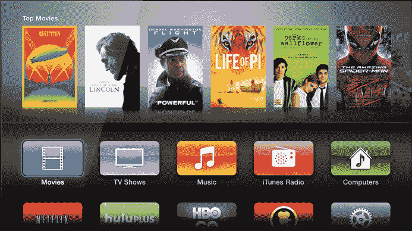

# 亚马逊 Fire TV 如何与 Apple TV、Chromecast 和 Roku TechCrunch 相抗衡

> 原文：<https://web.archive.org/web/https://techcrunch.com/2014/04/02/amazon-fire-tv-or-roku-or-chromecast-or-apple-tv/>

亚马逊刚刚宣布了其流媒体电视设备 [Fire TV](https://web.archive.org/web/20221207100146/https://beta.techcrunch.com/2014/04/02/amazon-media-device/) ，这意味着它现在将在另一个类别中与其他科技巨头和现有公司展开竞争。那么，亚马逊 TK 与苹果电视、谷歌的 Chromecast 和 Roku 的流媒体机顶盒和新的 HDMI 棒相比如何？这是一个基本纲要。

## 第一方内容

亚马逊在这方面有相当大的优势；它的亚马逊即时视频库很大，涵盖了顶级来源的各种不同类型的内容。例如，该公司刚刚否决了流媒体 Fox hit 24 的独家版权，亚马逊也投资了原创内容，视频和游戏领域也将有更多内容。此外，亚马逊还提供 MP3 商店和用户图书馆的访问权限。这里的问题是，要想免费获得即时视频，你需要成为 prime 订户，价格标签是每年 99 美元。

由于 iTunes 音乐、电影和电视内容，Apple TV 提供了可能是第一方内容方面最大的目录。这些基本上涵盖了你想看或想听的内容，而且这些图书馆在世界上比其竞争对手的市场更多。但是有一个条件:虽然 iTunes Radio 在几个地方提供免费的流媒体音乐，但在大多数地方，你必须逐个购买内容，这意味着价格标签将远远高于每年 99 美元，才能访问与亚马逊相同深度的图书馆。

谷歌向用户提供播放音乐和电影，包括流媒体广播选项，但内容库仅次于苹果，而且受地理位置的限制更大。此外，和 iTunes 一样，也没有“吃到饱”的视频选项。

Roku 的内容严重依赖于第三方来源，这将我们带到了下一个比较领域。

## 第三方服务

对于这些设备来说，这是一个越来越重要的领域，可以说这些设备最初是作为一种让用户更多地投资于特定生态系统的方式出现的，但现在已经转变为一种让人们可以随时随地访问其内容的方式。

Chromecast 正迅速成为实现这一目标的最佳方式，第三方开发者频繁宣布支持流媒体工具，先进的 SDK 承诺将推出更复杂的集成。但你仍然需要一个主机设备来实现这一点，也就是智能手机、平板电脑或台式电脑。

Apple TV 还对第三方服务提供了强大的支持——通过 AirPlay，它的流媒体协议允许你将内容从 Mac 或 iOS 设备传输到电视上。苹果越来越多地将原生应用添加到 Apple TV 中，以将第三方内容引入该平台，尽管这比开放的 SDK 慢，但这些尝试也在加快，并深化了第三方服务的库。长期以来，网飞一直是该计划的重要组成部分，甚至现在也是如此。

Roku 完全是关于第三方的，它提供了一个相当大的频道商店以及内置的第三方应用程序来证明这一点。网飞是这里的一个关键角色，亚马逊即时视频也是，总的来说，Roku 在这里有优势，因为它没有推广自己的图书馆或内容商店的计划。在第三方合作伙伴方面，它比苹果更灵活，但不如谷歌的 Chromecast，但有更多的监管和不需要单独主机设备的体验。

亚马逊在今天的演示中对第三方开放做了很多口头承诺，它已经签署了所有的大服务，还将有更多的合作伙伴，看起来是一个非常友好的开发者平台。Roku 目前领先，但亚马逊的 Fire TV 可能会很快赶上。

## 赌博

这些设备的另一个令人兴奋的新兴领域是游戏。Chromecast 看起来将很快支持 Android 设备的一些创新游戏概念，但现在说还为时过早。Roku 增加了游戏，包括愤怒的小鸟和许多其他游戏，但大多数都是相当缺乏创意的移动端口，不是为游戏而生的。

Apple TV 支持游戏，但方式比较迂回。它通过为希望创造融合大屏幕和 iOS 设备的游戏体验的第三方开发者提供 AirPlay 访问来实现这一点。在实践中，这产生了一些有趣的双屏游戏，但它尚未达到成熟，并作为一种媒介真正起飞。苹果在平台上提供本地游戏软件将是一个很好的补充，一些传言已经暗示了这一点。

亚马逊看起来将全力以赴与 Fire TV 进行游戏。如上所述，它使得移植游戏变得非常容易，它还提供了 40 美元的游戏控制器配件。它有自己的游戏开发工作室，它的合作伙伴从小型独立开发者到大型工作室都有。正如他们所说，证据将在这些游戏玩起来有多有趣的布丁中，但亚马逊并不只是根据他们发布的性质，作为事后的想法加上这一点。

## 尺寸和功率要求

Chromecast 是这里的蛋糕，作为一个小型 HDMI 转换器，它可以使用电视的 USB 端口供电，如果它有 USB 端口的话，并且不需要额外的电缆或电源。同样，Roku 的新流媒体棒也提供了相同的基本设计。

Apple TV 和 Roku 的其他盒子有更传统的电源线，也占用更多的空间，需要通过电缆连接到电视本身来连接 HDMI。不过，Apple TV 确实提供了一个以太网端口，以及一个光学音频线路输出。

亚马逊的机顶盒也是机顶盒，不是加密狗，但它非常小，提供以太网、USB、HDMI 和光学音频连接，另外它支持遥控器，并有 8GB 的内置存储。在设备大小方面的权衡似乎是值得的。

## 易于安装和使用

这些设备都是即插即用的。Chromecast 的应用驱动设置在某些方面很简单，但它需要你切换 Wi-Fi 网络和下载应用，而 Apple TV 只是要求你用有限的遥控器进行大量的虚拟键盘输入。

亚马逊将其过程列为即插即用，有三个步骤开始。没有加载时间的即时播放是这里的另一个关键优势，即使它只是一个小优势。

## 价格

Apple TV 售价 99 美元，Rokus 售价从 50 美元到 100 美元不等。谷歌的 Chromecast 售价仅为 35 美元，但它也不像其他设备那样作为独立设备运行。亚马逊的 Fire TV 售价 99 美元，鉴于谷歌的低价替代产品，这可能是一个很大的要求，但它似乎是一个功能更加全面的平台。亚马逊显然希望它能让消费者相信，与 Roku 3 和 Apple TV 等更直接的竞争对手相比，它能以同样的成本做更多的事情。演示文稿确实让它看起来在用户界面、原创内容和游戏方面有一些优势，但我们必须等待，看看这些差异化因素在实践中有多大用处。