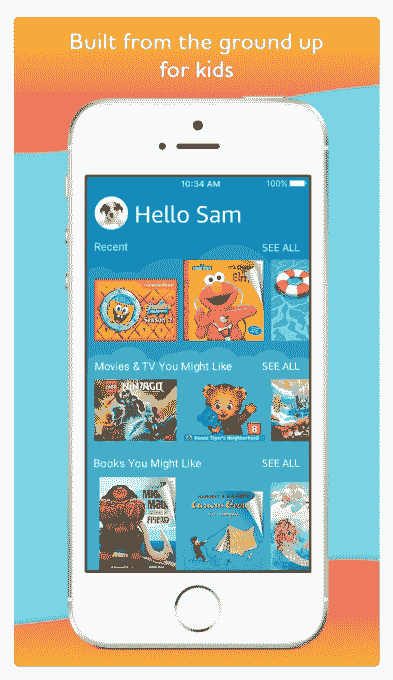
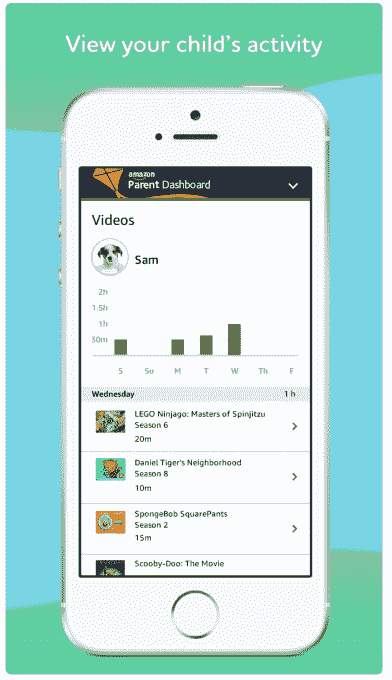
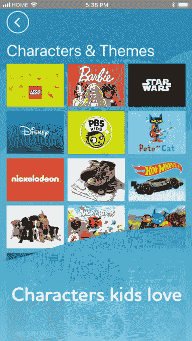

# 亚马逊免费无限时间终于登陆苹果应用商店 

> 原文：<https://web.archive.org/web/https://techcrunch.com/2018/06/22/amazon-freetime-unlimited-finally-lands-on-apples-app-store/>

在 it [推出](https://web.archive.org/web/20221208104400/https://techcrunch.com/2012/12/04/amazon-launches-kindle-freetime-unlimited-a-content-subscription-with-movies-games-books-for-your-kids/)五年半之后，一款更受欢迎的儿童阅读和娱乐应用终于登陆了 iOS。电子商务巨头亚马逊免费无限时间(Amazon FreeTime Unlimited)为 3-12 岁的儿童提供订阅服务，可以无限制地访问 10，000 本书籍、电影和电视节目，Prime 会员每个月 2.99 美元起，非 Prime 会员每个月 9.99 美元起，一个家庭计划最多四个用户，通过平板电脑、手机、电子阅读器和智能扬声器，现在可以在 App Store 上使用[。](https://web.archive.org/web/20221208104400/https://itunes.apple.com/us/app/amazon-freetime-unlimited/id1324809509?mt=8)

苹果目前正在 App Store 的主页上推广这款新应用，一名读者看到后向我们做了标记。Prime 会员可以享受每月 6.99 美元的家庭计划折扣，但你需要通过亚马逊网站购买，而不是 iTunes。

“我们推出新产品和新功能，因为他们准备好了，”亚马逊发言人说。“我们很高兴将自由时间无限体验带到 iOS 设备，包括 iPhone、iPad 和 iPod touch。”

亚马逊设备和安卓系统已经可以使用 FreeTime Unlimited。现在，当用户在任何一个平台上注册订阅时，他们可以在所有平台上使用它——无论是 Fire 平板电脑、Fire Kids Edition 平板电脑、兼容的 Android 手机和平板电脑，还是兼容的 Echo 设备。

这一举措对苹果和亚马逊来说都意义重大。当其他媒体公司推出儿童友好版本的服务时，这些服务引入了更多的家长控制和更好的过滤器，以帮助阻止不适合年轻人的内容，FreeTime Unlimited 被证明是最受欢迎的儿童娱乐应用之一——内容包括来自迪士尼、Nickelodeon、芝麻街、PBS Kids、国家地理和亚马逊的儿童原创视频——但它不能在儿童使用的最受欢迎的(也是最受好评的)平板电脑上使用。

虽然亚马逊最初在最初几年将它作为亚马逊独有的产品——作为推动其硬件销售的一种方式——但去年终于推出了一个适用于 Android 设备的版本，但又过了一年多才最终将其引入 iPhone 和 iPad 设备。

原因之一可能是亚马逊和苹果之间正在进行的斗争。在某些方面，这两家公司是互补的:例如，亚马逊销售大量苹果产品，就在线销售而言，iOS 是亚马逊非常强大的平台。

但在其他领域——比如硬件、越来越多的在线娱乐和“拥有”客户，以及打造产品的人才——这两家公司是竞争对手。例如，苹果不允许其 iOS 平台上的应用程序直接从其应用程序中购买亚马逊图书，亚马逊也不从自己的应用程序中出售图书和电影，以避免苹果的分成。所以看到亚马逊也以牙还牙地推迟苹果平台上的某些内容和功能也就不足为奇了。

我猜这些小冲突将会持续很长一段时间，但就目前而言，iPad 和 iPhone 用户在他们的设备上会比以前拥有更多的亚马逊。为什么是现在？这可能是因为亚马逊觉得其他平台的用户增长正在放缓，所以现在是增加新可用性的好时机。

这也可能是受苹果公司越来越重视 iOS 上的[家长控制功能的影响，这可能会让一些家长觉得他们有足够的选择来锁定他们孩子的设备，同时仍然允许他们访问更健康和教育的内容。这可能会限制亚马逊免费无限时间订阅服务的吸引力。但 iOS 12——包括新的家长控制——要到今年秋天晚些时候才会面向公众推出。这让亚马逊有时间同时吸引用户使用自己的服务。](https://web.archive.org/web/20221208104400/https://www.usatoday.com/story/tech/talkingtech/2018/06/05/parental-controls-coming-ios-heres-what-you-can-do-them/672232002/)

与现有版本的 FreeTime Unlimited 一样，该应用程序分为不同的年龄组，将通过亚马逊家长仪表盘进行家长控制，以及讨论卡，为他们提供关于工作的谈话要点和孩子们正在观看的内容的摘要。

可能会因地理位置而有所不同，但在美国，内容将包括《冰雪奇缘》、《海洋奇缘》、《星球大战》和《内外兼修》等电影；PBS 电视台的《芝麻街》、《亚瑟》、《丹尼尔·泰格的邻居》等电视剧；泡泡孔雀鱼、乌米佐米队和尼克国际频道的爱探险的朵拉；漫威漫画包括蜘蛛侠、复仇者联盟、美国队长；和亚马逊原创，如只是添加魔法，踢，雷鸟是去，创造性的银河，和翻滚叶。

iOS 版 FreeTime Unlimited 的一个缺点是，与亚马逊自己的平板电脑不同，你不能配置 FreeTime Unlimited 来完全重置设备的用户界面，以保持孩子对体验的锁定。苹果就是不允许第三方应用有那种程度的控制。相反，FreeTime Unlimited 的工作方式与任何其他应用程序一样——你可以随时启动和退出它。

与其他应用程序一样，订阅 FreeTime Unlimited 将通过用户的 iTunes 帐户进行(因此苹果将获得分成)，并将自动续订，直到您在续订日期前 24 小时关闭自动续订。还有 30 天的免费试用期。

*更新了个人、家庭和主要家庭等级的明确定价。*