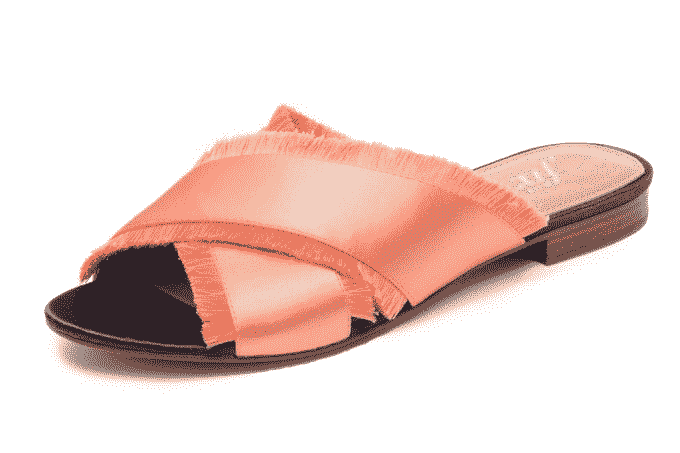
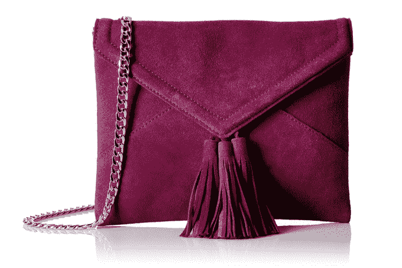

# 亚马逊以其新的私人时尚品牌“The Fix”TechCrunch 进军鞋类和手袋市场

> 原文：<https://web.archive.org/web/https://techcrunch.com/2017/07/28/amazon-gets-into-shoes-and-handbags-with-its-new-private-fashion-label-the-fix/>

亚马逊本周推出了另一个自有品牌 Fix，再次扩大了其在时尚行业的影响力。Prime 会员的新标签针对女性，以设计师潮流为灵感的鞋子和手袋为特色，但以折扣价出售。

与设计师系列不同，Fix 将按月发布新款式，而不是按季节发布。这种加速的时间表使亚马逊能够立即跟进与购物者产生共鸣的趋势。

本周， [WWD](https://web.archive.org/web/20221210062833/http://wwd.com/fashion-news/fashion-scoops/amazon-launches-private-accessories-label-10952330/) 、[商业内幕](https://web.archive.org/web/20221210062833/http://www.businessinsider.com/amazon-shoes-and-handbags-line-the-fix-2017-7)、[足本新闻(经由美国消费者新闻与商业频道)](https://web.archive.org/web/20221210062833/http://www.cnbc.com/2017/07/27/amazon-in-the-business-of-everything-launches-private-label-shoe-purse-brand-the-fix.html)和其他人报道了该品牌的发布。

为了选择修复的物品，亚马逊的编辑在市场上搜寻新的和受欢迎的物品，然后以较低的价格提供类似的款式，与设计师的物品进行比较。

在 Fix 的首个系列中，手袋起价为 49 美元，鞋子起价为 69 美元。

在描述新系列的首批产品时， [FootWearNews](https://web.archive.org/web/20221210062833/http://footwearnews.com/2017/focus/womens/amazon-fashion-launches-the-fix-private-label-shoe-handbag-collection-398765/) 说，在发布会上，顾客会发现缎面滑梯、彩色运动鞋、钉钉平底鞋、彩色拖鞋和花卉装饰的靴子。现在有 45 个 SKU 出现在 Fix 的页面上，有些鞋子高达 99 美元，有些包的价格高达 119 美元。

甚至还有[山寨的 Birkenstock](https://web.archive.org/web/20221210062833/https://www.amazon.com/Fix-Womens-Studded-Footbed-Platform/dp/B01ND0UWUV/ref=sr_1_27?srs=10065543011&ie=UTF8&qid=1501256604&sr=8-27)——你知道，[凉鞋制造商去年从亚马逊](https://web.archive.org/web/20221210062833/http://www.cnbc.com/2016/07/20/birkenstock-quits-amazon-in-us-after-counterfeit-surge.html)撤下了它的产品。亚马逊现在从第三方采购鞋子——这一举动激怒了 Birkenstock 美国首席执行官 David Kahan，他威胁 Birkenstock 将关闭转售鞋子的零售商。卡汉还表示，他正在考虑对亚马逊采取法律行动。

现在，Fix 是亚马逊内部时尚品牌的一个庞大且不断增长的名单中的一员。

如今，这家零售商还提供女装，品牌包括[詹姆斯&艾琳](https://web.archive.org/web/20221210062833/https://www.amazon.com/Clothing-Shoes-Jewelry-James-Erin/s?ie=UTF8&field-brandtextbin=James%20%26%20Erin&page=1&rh=n%3A7141123011)、[百灵鸟&罗](https://web.archive.org/web/20221210062833/https://www.amazon.com/Lark-Ro/pages/10772216011)、[北十一](https://web.archive.org/web/20221210062833/https://www.amazon.com/Clothing-Shoes-Jewelry-NORTH-ELEVEN/s?ie=UTF8&field-brandtextbin=NORTH%20ELEVEN&page=1&rh=n%3A7141123011)、[纽约社会](https://web.archive.org/web/20221210062833/https://www.amazon.com/Clothing-Shoes-Jewelry-SOCIETY-NEW-YORK/s?ie=UTF8&field-brandtextbin=SOCIETY%20NEW%20YORK&page=1&rh=n%3A7141123011)、[艾拉·穆恩](https://web.archive.org/web/20221210062833/https://www.amazon.com/Ella-Moon/pages/16152709011)、[巴黎周日](https://web.archive.org/web/20221210062833/https://www.amazon.com/PARIS-SUNDAY/pages/16140439011)；贴身服装品牌[Mae](https://web.archive.org/web/20221210062833/https://www.amazon.com/Mae-Womens-Lace-Padded-Bralette/dp/B01N66PVVO)；[亚马逊必需品](https://web.archive.org/web/20221210062833/https://www.amazon.com/l/16118543011?pageId=TO33GDFJIO2YHTD&slashargs=&ingress=3&tag=googhydr-20&hvadid=193557795591&hvpos=1t1&hvexid=&hvnetw=g&hvrand=12438409565491892025&hvpone=&hvptwo=&hvqmt=e&hvdev=c&ref=pd_sl_8zn703yvwj_e&hvtargid=kwd-34244754084)下的男女基本 t 恤、衬衫、短裤、裤子和内衣；[富兰克林&弗里曼](https://web.archive.org/web/20221210062833/https://www.amazon.com/Clothing-Shoes-Jewelry-Franklin-Freeman/s?ie=UTF8&field-brandtextbin=Franklin%20%26%20Freeman&page=1&rh=n%3A7141123011)、[富兰克林定制](https://web.archive.org/web/20221210062833/https://www.amazon.com/Clothing-Shoes-Jewelry-Franklin-Tailored/s?ie=UTF8&field-brandtextbin=Franklin%20Tailored&page=1&rh=n%3A7141123011)、[纽扣式](https://web.archive.org/web/20221210062833/https://www.amazon.com/Buttoned-Down/pages/16108266011)、 [Goodthreads](https://web.archive.org/web/20221210062833/https://www.amazon.com/Goodthreads/pages/15263862011) 等品牌的男装和鞋；以及 [Scout + Ro](https://web.archive.org/web/20221210062833/https://www.amazon.com/Scout-Ro-by-Amazon/b?ie=UTF8&node=11449477011) 品牌下的童装。

它的一些品牌只提供给 Prime 订户，为消费者提供了加入年度会员计划的另一个激励，该计划的额外福利今天远远超出了免费的两天送货。

该修复程序现在是这个 Prime-only 组的一部分。

然而，这并不是亚马逊第一次进入手袋领域——亚马逊的女装系列也有一些。但这是亚马逊首次推出只关注女鞋和手袋，而非服装的系列。

此次发布正值亚马逊准备在[推出自己的 Stitch Fix 竞争对手亚马逊 Prime 衣柜](https://web.archive.org/web/20221210062833/https://beta.techcrunch.com/2017/06/20/amazon-prime-wardrobe/)，可能早于 Stitch Fix 预计的 [IPO](https://web.archive.org/web/20221210062833/http://www.reuters.com/article/us-stitch-fix-ipo-idUSKBN18R36N) 。但与 Stitch Fix 不同的是，它使用造型师来管理每月发货的箱子，Prime 衣柜将允许购物者在箱子里装满衣服和鞋子以及其他在家试穿的物品。那些他们不喜欢的东西很容易被退回。

很容易理解亚马逊如何在 Prime 衣柜服务中推广自己的品牌，因为它已经有了自己的服装系列——从休闲装到工作服再到正装——以及配饰。

亚马逊今年还获得了一项新的按需服装制造系统的专利，该系统可以在五天内生产出产品。它还推出了 Echo Look，这是一款带有摄像头的智能设备，可以拍摄你的服装照片，这可能会给亚马逊提供一个关于人们实际穿着的新数据来源。