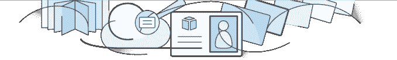

# 随着 AWS 目录服务 TechCrunch 的推出，亚马逊变得更加企业友好

> 原文：<https://web.archive.org/web/http://techcrunch.com/2014/10/22/amazon-gets-more-enterprise-friendly-with-launch-of-aws-directory-service/>

# 随着 AWS 目录服务的推出，亚马逊变得更加企业友好

随着公司 it 友好型 Fire HD 和 HDX 平板电脑的推出，亚马逊已经进入企业世界，它自己的安全存储服务 Zocalo 和虚拟桌面计算平台 WorkSpaces，更不用说云计算巨头亚马逊网络服务了。如今，随着 AWS 目录服务[的推出，该公司正在使内部和云资源的组合更易于管理。该服务还可以满足那些需要 AWS 云中更简单的独立目录的人的需求。](https://web.archive.org/web/20230131004254/https://aws.amazon.com/directoryservice/)

根据公司的需要，这种新产品允许两种不同类型的目录。

如果组织已经在运行一个现有的目录——很多都是这样，AWS 目录服务提供一个“AD 连接器”目录类型来连接到已经存在的目录。这对于运行像微软的 Active Directory 这样的目录的组织来说是一个很大的好处，它允许计算机加入域，验证用户，定位并连接到域中的设备，如打印机，并访问其他网络服务，如 SQL Server 数据库。

当公司引入基于云的服务时，他们有时会被迫建立一个独立的基于云的目录，与他们在内部运行的目录并行。这就是这种新的“广告连接器”的用武之地。这是一种网关技术，可以作为现有目录的云代理，不需要复杂的同步技术或联合登录。亚马逊今天早上在其 [AWS 博客](https://web.archive.org/web/20230131004254/https://aws.amazon.com/blogs/aws/new-aws-directory-service/)上宣布了这一消息。相反，所有通信都通过 [AWS 直连](https://web.archive.org/web/20230131004254/https://aws.amazon.com/directconnect/)或[亚马逊虚拟私有云](https://web.archive.org/web/20230131004254/https://aws.amazon.com/vpc/)内的安全 VPN 连接进行。

这意味着最终用户可以使用与活动目录帐户相关联的现有用户名和密码登录 Amazon [工作区](https://web.archive.org/web/20230131004254/https://aws.amazon.com/workspaces/)、 [Zocalo](https://web.archive.org/web/20230131004254/https://aws.amazon.com/zocalo/) 、 [EC2](https://web.archive.org/web/20230131004254/https://aws.amazon.com/ec2/) 实例以及 [AWS 管理控制台](https://web.archive.org/web/20230131004254/https://console.aws.amazon.com/)。

新 AWS 目录服务提供的第二个选项是云中基于 Samba 的目录，它是通过“简单 AD”目录选项建立的。这支持常见的 AD 功能，如加入 Windows 域、管理组策略和单点登录目录驱动的应用程序。该选项将允许系统管理员和开发人员使用目录凭证登录 AWS 管理控制台来管理资源，并且允许对运行 Windows 的 EC2 实例的管理进行集中管理。在这种情况下，Zocalo 和 WorkSpaces 也可以利用这个目录。

Amazon 声称设置和管理这两种目录都很简单，但奇怪的是，它选择了基于目录大小的小时定价。(任何一种类型的小目录都是 0.05 美元/小时，大目录在美国东部地区是 0.15 美元/小时。其他受支持的地区可能有不同的定价，包括[美国西部(俄勒冈州)](https://web.archive.org/web/20230131004254/https:///)、[亚太地区(悉尼)](https://web.archive.org/web/20230131004254/https:///)、[亚太地区(东京)](https://web.archive.org/web/20230131004254/https:///)和[欧洲(爱尔兰)](https://web.archive.org/web/20230131004254/https:///)地区。这使得习惯于考虑按月甚至按年支付云服务费用的管理员更加困难，(因为 it 预算是为来年制定的。)

这两种目录类型目前在上述地区都可用。