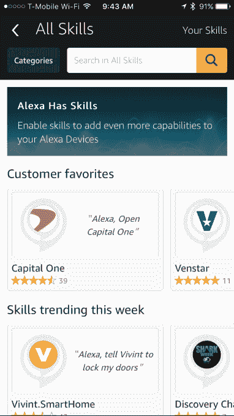

# 亚马逊对 Alexa“应用商店”进行了改造，现在可以通过语音添加新技能 

> 原文：<https://web.archive.org/web/https://techcrunch.com/2016/06/28/amazon-gives-the-alexa-app-store-a-makeover-now-lets-you-add-new-skills-by-voice/>

亚马逊今天早上宣布，现在可以更容易地添加“技能”——通过语音激活应用程序向亚马逊的智能扬声器 Echo 和其他 Alexa 驱动的设备添加新功能。该公司最终对其技能“应用商店”进行了改造，并引入了一种通过语音添加新技能的方式。

亚马逊的 Echo 和其他 Alexa 设备有可能成为继应用程序之后的下一个大型计算平台——也就是说，他们正在以一种消费者似乎感兴趣的方式为家庭提供基于语音的计算。

通过一个配套的移动设备 Echo 应用程序，Echo 的所有者，以及那些通过亚马逊的小扬声器如 [Tap 和 Dot](https://web.archive.org/web/20221205082839/https://beta.techcrunch.com/2016/03/03/amazon-adds-the-130-tap-and-the-90-dot-to-the-echo-family/) 或 Fire TV 使用虚拟助手 Alexa 的人，可以为他们的设备添加技能。

这些技能是语音驱动的应用程序，可以做一些事情，如发布新闻简报，与孩子们玩游戏，让你点优步或披萨，开始日常锻炼，控制其他智能家居设备等等。

然而，坦率地说，这个所谓的技能“应用商店”到目前为止相当糟糕。它只是一个长长的技能列表，一页又一页，没有合理的顺序，缺乏强大的搜索功能、推荐、列表或消费者现在在浏览应用商店时期望找到的其他东西。

今天，亚马逊正在采取措施纠正这个问题。技能部分——基本上是 Alexa 的应用商店——已经有了巨大的改变。

例如，现在技能被分为“智能家居”和“生活方式”等类别，你只需点击屏幕顶部的新“类别”按钮即可浏览。与此同时，Alexa Skills 主页的功能是收集技能，以便更好地发现这些附加功能，包括“让你的家更智能”、“娱乐”等组，以及突出客户最爱和当前趋势的部分。

如果你正在寻找一项特殊的技能，搜索功能也得到了改进。现在，类似于在亚马逊零售网站上的搜索，你可以根据相关性、平均客户评级或者与应用相关的发布日期对结果进行排序。

此外，亚马逊推出了一项新功能，让你只需通过说话就可以为你的 Alexa 设备添加技能——这对语音计算平台来说很有意义。要激活一个技能，你只需要说“Alexa，激活…”然后跟着技能的名字。(例如，“Alexa，启用 NBC 新闻。”)

亚马逊表示，随着 Lyft 和霍尼韦尔的加入，它今天还增加了两项值得注意的技能。前者类似于优步之前推出的技能，因为它让你只需说话就可以订购 Lyft 汽车。

今天，有成千上万的开发人员在为 Alexa 开发技能，Alexa 已经发展到提供超过 1400 种这种“无应用”的附加软件。根据亚马逊 Alexa 副总裁史蒂夫·拉布钦在 T2 发表的声明，在宣布这些变化时，技能部分在一个多月内增长了 50%。

智能家居技能是最受欢迎的，自 2016 年 1 月以来增长了 5 倍。当时， [Alexa 的应用商店只有 130 多项技能可用。](https://web.archive.org/web/20221205082839/https://beta.techcrunch.com/2016/01/04/amazons-other-app-store-alexas-skills-section-has-quietly-grown-to-over-130-apps/)对于这个新的生态系统来说，在不到一年的时间里从 130 个技能增加到超过 1，400 个技能是一个显著的增长，尤其是考虑到 Alexa 一年前才向开发者开放。

迄今为止，客户从十大最受欢迎的技能中提出了超过 300 万个请求，其中包括 Jeopardy！，每日肯定，魔 8 球，Fitbit，还有调酒师。该公司表示，它还通过其 Alexa 基金投资了 16 家初创公司，并将在未来一年扩大这一投资，以包括对专注于机器人、开发工具、医疗保健、无障碍环境和其他领域的初创公司的投资。