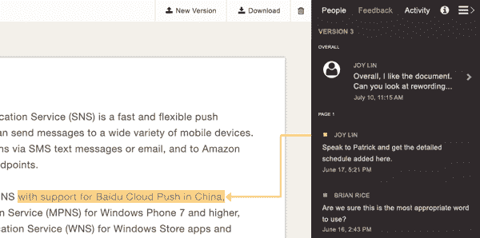

# 亚马逊追逐 Box、Dropbox 和 Huddle，推出 Zocalo 用于安全企业存储 

> 原文：<https://web.archive.org/web/https://techcrunch.com/2014/07/10/amazon-goes-after-box-dropbox-and-huddle-launches-zocalo-for-secure-enterprise-storage/>

电子商务巨头[亚马逊](https://web.archive.org/web/20221209140349/http://www.crunchbase.com/organization/amazon)凭借亚马逊网络服务在云服务市场取得了巨大的竞争优势，今天它又增加了一项功能，将与 [Box](https://web.archive.org/web/20221209140349/http://www.crunchbase.com/organization/box) 和 [Dropbox](https://web.archive.org/web/20221209140349/http://www.crunchbase.com/organization/dropbox) 等公司展开直接竞争:它推出了安全的企业存储服务 [Zocalo](https://web.archive.org/web/20221209140349/http://aws.amazon.com/zocalo/) 。该公司将从今天开始推出 Zocalo——西班牙语中的广场或城镇广场——的有限预览版。

亚马逊[将](https://web.archive.org/web/20221209140349/http://phx.corporate-ir.net/phoenix.zhtml?c=176060&p=irol-newsArticle&ID=1946543&highlight=)这项服务描述为“一项全面管理、安全的企业存储和共享服务，具有强大的管理控制和反馈功能，可以提高用户的工作效率”，让用户“从他们选择的设备上存储、共享和收集对文档、电子表格、演示文稿、网页、图像、pdf 或文本文件的反馈。”换句话说，它直接与 Box 和 Huddle 等公司竞争，为企业提供存储、访问和协作处理文档的场所。该产品包括适用于 [iOS](https://web.archive.org/web/20221209140349/https://itunes.apple.com/lt/app/id878419553?mt=8) 和 [Android](https://web.archive.org/web/20221209140349/https://play.google.com/store/apps/details?id=com.amazon.zocalo) *的原生应用。*

[定价](https://web.archive.org/web/20221209140349/http://aws.amazon.com/zocalo/pricing/)很激进。每个用户每月 5 美元，其中包括每个用户 200 GB 的存储空间。一家公司只为活跃用户账户付费，这还不包括最多 50 名用户的 30 天试用期。

对于 AWS 最忠实的用户来说，有一种甜味剂。该公司表示，亚马逊 WorkSpaces 的客户将免费获得 Zocalo 包括每个 WorkSpaces 用户 50 GB 的存储空间。该公司表示，对于每个工作区用户每月 2 美元的折扣率，这可以升级到 200 GB 的存储空间。

最重要的是，额外费用会根据使用的空间而浮动。

虽然已经有许多服务提供了亚马逊将通过 Zocalo 提供的服务，但亚马逊正在利用这样一个事实，即我们仍处于一个基本未开发的市场，当你考虑到许多企业仍在使用传统的内部解决方案，并为此支付相当多的费用时。

“客户告诉我们，他们受够了现有的老式企业文档和协作管理工具的成本、复杂性和性能，”亚马逊网络服务的亚马逊 Zocalo 总经理 Noah Eisner 在一份声明中说。“越来越多的人要求 AWS 提供易于使用的企业存储和共享工具，允许用户与其他人快速协作，并满足其组织的严格安全需求。这就是亚马逊 Zocalo 的目的。”

以下是亚马逊在其公告中详细列出的产品列表:

*   轻松分享: Amazon Zocalo 允许用户与他人分享文档、电子表格、演示文稿、网页、图像、pdf 或文本文件。
*   **从任何设备访问**:用户可以从他们选择的设备，包括笔记本电脑、iPad、Kindle Fire 和 Android 平板电脑，随时随地访问存储在亚马逊 Zocalo 中的数据，查看和留下反馈。亚马逊 Zocalo 可以跨设备同步文件，以确保文件随时随地可用。
*   **简单反馈**:用户可以请求和管理他人的反馈，贡献者可以突出显示文档或文件的任何单词、句子、段落或区域，并留下详细的反馈。Amazon Zocalo 还通过电子邮件通知贡献者和文档所有者有关评审活动和临近截止日期的信息。
*   中央文件中心:Amazon Zocalo 为用户提供了一个中央位置，可以存放他们正在查看的文档和文件，以及他们拥有的和正在征求反馈的文档和文件。由于所有这些文件都在一个位置，审阅者可以在一个 web 视图中访问所有相关的反馈，从而使阅读或提供评论变得简单，只需点击几下鼠标。
*   **与 Amazon WorkSpaces** 一起提供:Amazon WorkSpaces，AWS 在云服务中的虚拟桌面，与 Amazon Zocalo 集成。所有亚马逊 WorkSpaces 客户都可以免费获得亚马逊 Zocalo(最高 50 GB 的存储空间)。

管理部门可以管理安全性以及与公司的公司目录的集成。

今天早些时候，亚马逊在纽约举行的峰会上宣布了这一消息，该公司还在会上公布了一项针对移动开发者提供服务的 T2 新举措。

这既是一次整合，也是一次更大的产品发布。一款名为 [Cognito](https://web.archive.org/web/20221209140349/http://phx.corporate-ir.net/phoenix.zhtml?c=176060&p=irol-newsArticle&ID=1946542&highlight=) 的产品将允许开发者存储和管理其应用程序用户的身份。亚马逊也在整合和增强它提供给用户的分析类型，用了一个恰当但缺乏创意的名字“亚马逊移动分析”。

它还包括 AWS Mobile SDK，支持 iOS、Android 和 Fire OS，是开发人员用来访问 Cognito 的工具；移动分析；以及其亚马逊 SNS 移动推送服务(也是过去宣布的)；除了别的以外。