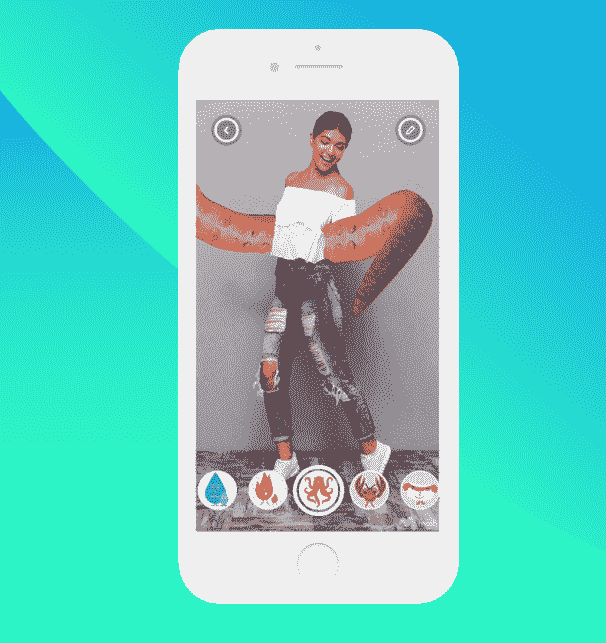
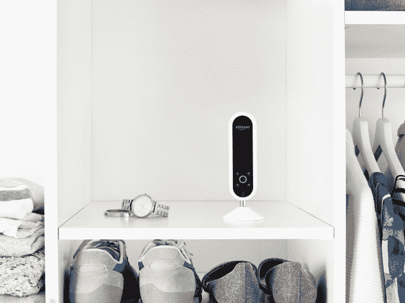

# 亚马逊以 5000 万至 7000 万美元收购了 3D 人体模型初创公司 Body Labs 

> 原文：<https://web.archive.org/web/https://techcrunch.com/2017/10/03/amazon-has-acquired-3d-body-model-startup-body-labs-for-50m-70m/>

TechCrunch 获悉，亚马逊已经收购了 [Body Labs](https://web.archive.org/web/20221210091840/https://beta.techcrunch.com/2015/11/03/body-labs-raises-8-million-to-create-ultra-realistic-3d-body-images/) ，该公司声称其目标是创建逼真的 3D 人体模型，以支持各种 b2b 软件应用程序——例如虚拟试穿衣服或游戏的真实感头像。

一位消息人士暗示，亚马逊为 Body Labs 支付的价格可能超过 1 亿美元。然而，另一个可靠的消息来源表明，它更接近 7000 万美元，而不是 1 亿美元——所以我们把它固定在 5000 万到 7000 万美元之间。

亚马逊发言人拒绝对此次收购置评。

根据 [CrunchBase](https://web.archive.org/web/20221210091840/https://www.crunchbase.com/organization/body-labs#/entity) 的消息，总部位于纽约的 Body Labs 成立于 2013 年 3 月，已经在两轮投资中筹集了超过 1000 万美元——在 2015 年 11 月完成了[800 万美元的首轮融资。](https://web.archive.org/web/20221210091840/https://beta.techcrunch.com/2015/11/03/body-labs-raises-8-million-to-create-ultra-realistic-3d-body-images/)

该公司表示，其人工智能、计算机视觉和身体建模专业知识源于布朗大学和马克斯·普朗克智能系统研究所的研究。

联合创始人兼首席执行官 Bill O'Farrell 在他的 Body Labs 的传记中列出了一些以前退出的公司:即被 Nuance 收购的 SpeechWorks 被 Adobe 收购的 CoSA；以及 Netsuite 收购的 OpenAir。显然他现在可以划掉第四个了。

在撰写本文时，Body Labs 尚未回复置评请求。

该公司的社交媒体账户自 8 月以来一直很安静，这可能表明这笔交易最近已经完成。

Body Labs 网站上的一则消息证实了此次收购，称这家初创公司“期待代表客户进行创新”。

## 模拟人体

Body Labs[网站](https://web.archive.org/web/20221210091840/https://www.bodylabs.com/)上的视频演示显示，该公司的技术正被用来在人走动时给人增加数字内容，给人穿上全身游戏化身“套装”，或者给跳舞的人戴上拳击手套和兔子拖鞋。

Body Labs 还表示，其“SOMA Shape API”可用于“仅使用一张图像就能准确预测和测量客户的 3D 形状”，这表明这可以为“定制服装”提供动力，或被希望提供尺码建议的时尚电子商务零售商使用。

该公司还建议将其“脂肪和所有”3D 人体建模技术用于健康和健身跟踪，甚至设备设计和制造。

在 2015 年的一个视频中，O'Farrell 表示，高度精确的 3D 身体扫描将使“身体本身成为一个平台，围绕这个平台，商品和服务被设计、制造、买卖和推荐。”

目前还不清楚亚马逊打算用 Body Labs 做什么，但如果这家初创公司拥有大规模提供精确的 3D 人体模型的技术，那么有很多潜在的用例可以与其现有的商业利益相吻合，并可能扩展其现有的商业利益。

例如，除了通过其电子商务市场销售其他品牌的服装，亚马逊近年来一直在提升自己的时尚业务，扩大和发展其自有品牌时尚品牌。

能够提供定制合身的衣服可能会给亚马逊的自有品牌时装品牌带来优势，尽管改善亚马逊购物者的尺码预测可能有助于推动整个平台的服装购物，并有助于减少不合身衣服的退货。

亚马逊 Prime 会员最近的一项特权是为名为[亚马逊衣柜](https://web.archive.org/web/20221210091840/https://beta.techcrunch.com/2017/06/20/amazon-prime-wardrobe/)的先试后买服务提供免费退货。如果更少的人退回更少的衣服，这项服务对亚马逊来说显然会更便宜。

首席执行官杰夫·贝索斯[一直将时尚](https://web.archive.org/web/20221210091840/https://www.theguardian.com/technology/2014/aug/15/amazonfresh-online-grocery-market-amazon-deliver)列为支撑他对亚马逊电子商务帝国的巨大野心的两个关键领域之一([食品是另一个](https://web.archive.org/web/20221210091840/https://beta.techcrunch.com/2017/08/24/amazon-says-whole-foods-deal-will-close-monday/))。

https://www.youtube.com/watch?v=33qBnhdWQ7w

该公司在 Body Labs 的技术可能适用的另一个潜在领域也有很大的兴趣:游戏。

它运营着自己的游戏工作室——通过更早的收购，如双螺旋游戏，它在 2014 年收购了。它还分发了 [Lumberyard](https://web.archive.org/web/20221210091840/https://aws.amazon.com/lumberyard/) ，一个集成了 AWS 和 Twitch 的免费 AAA 游戏引擎；并提供 [GameLift](https://web.archive.org/web/20221210091840/https://aws.amazon.com/gamelift/) ，这是一项为多人游戏部署和管理服务器的托管服务。

今年夏天，有消息称该公司已经收购了 GameSparks，这也是一项面向游戏开发者的“后端即服务”。因此，它对拓展视频游戏内容有着浓厚的兴趣——比如能够为游戏玩家提供逼真的虚拟形象。

如果你从更长远的角度来看潜在的使用案例，这甚至没有触及 3D 人体模型技术在 VR 世界中的表面。(或者说确实是为了 AR 和 AR 游戏的目的。)

游戏通常是亚马逊的战略兴趣领域，不仅因为内容本身非常受欢迎，利润丰厚，而且也是推动其云计算部门亚马逊网络服务使用的另一种方式。它能托管的内容越多，AWS 能创造的收入就越多。

3D 人体模型技术的另一个潜在用例可能是通信领域，亚马逊最近在这一领域进行了新的尝试，包括在视觉通信领域——这是通过发布一系列内置 Alexa voice AI 的联网设备来拥有智能家居的更大努力的一部分。

[今年 5 月](https://web.archive.org/web/20221210091840/https://beta.techcrunch.com/2017/05/09/amazon-unveils-the-230-echo-show-with-a-screen-for-calls-shipping-june-28/)亚马逊推出了一款 Echo 设备，其屏幕旨在实现家庭视频通话。

## 哦，嘿，你看，艾可

它还发布了另一款专门为时尚自拍设计的 Echo 设备(名为 [Look](https://web.archive.org/web/20221210091840/https://beta.techcrunch.com/2017/04/26/amazons-new-echo-look-has-a-built-in-camera-for-style-selfies/) )。因此，该公司可能会对能够为有趣和时尚的目的提供视觉转换的技术感兴趣，例如能够在 Echo Show 视频电话中为人们的面部和身体添加实时效果，例如 la Snapchat 自拍镜头。

Body Labs 有一个名为 [Mosh](https://web.archive.org/web/20221210091840/https://www.bodylabs.com/mosh/) 的移动人工智能，用于根据其技术检测和适应人的姿势来添加特效照片。

或者——为了更实际的电子商务相关目的——让其 Echo Show 的用户通过让计算机视觉软件在逼真的人体模型上制作数字动画，来虚拟展示他们想购买的时尚物品。因此，他们可以，比如说，问问妈妈对他们看中的裙子的第二种意见，然后直接让 Alexa 去买。

亚马逊如何通过添加摄像头将混合现实带入客厅来利用 Echo 做更多事情，这是 TechCrunch 在 2015 年挖掘的一个话题。

然而，在 Body Labs 的具体案例中，一个关键的考虑因素是，不清楚该公司使用什么核心技术来生成精确的 3D 扫描。

在一些视频演示中，可以看到 Body Labs 使用个人大小的扫描仪来生成高度精确的人体模型——这种技术显然无法满足亚马逊追求的大规模消费目的。尽管它也声称能够从“日常照片或视频”中推断出人体模型。

它的联合创始人之一，也是它的科学顾问，迈克尔·布莱克博士，是一位计算机视觉专家，他通过从照片中推断姿势数据来制作逼真的 3D 人体模型，这种方法，如果证明足够强大，将为亚马逊提供一种更可行的途径，将可行的人体模型推广到数百万消费者。

因此，也有可能 Body Labs 的收购主要是亚马逊的收购，旨在获得处理数据的人才和专业知识，该公司希望通过其 Echo Look 设备收集数据，值得注意的是，该设备包含一个机载深度传感器，可以用来通过用户的风格自拍提取身体形态的 3D 数据。

正如我们在 4 月的[中所写的，Echo Look 风格的自拍设备看起来很像亚马逊收集人们的全身自拍的一种方式，以开始建立自己的尺寸和合身数据集，这与它的电子商务时尚雄心完全吻合。](https://web.archive.org/web/20221210091840/https://beta.techcrunch.com/2017/04/29/how-echo-look-could-feed-amazons-big-data-fueled-fashion-ambitions/)

因此，贝佐斯可能希望让 Body Labs 的团队对它从 Echo Look 获得的身体数据进行逆向工程，并在消费者不需要自己的淋浴大小的家用扫描仪的情况下，获得非常准确的 3D 身体模型。相反，他们只需要在书架上放一个 Echo Look。

【T2