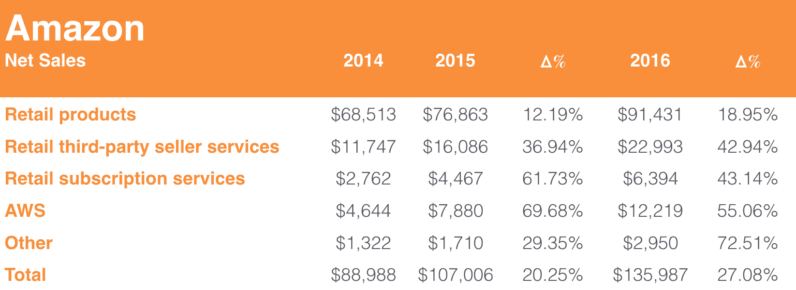

# 亚马逊在最新文件中暗示黄金销售 

> 原文：<https://web.archive.org/web/https://techcrunch.com/2017/02/13/amazon-hints-at-prime-sales-in-latest-filing/>

# 亚马逊在最新文件中暗示 Prime sales

亚马逊 Prime 多年来一直在推动这家电子商务公司的增长。但亚马逊传统上对披露关于这项流行服务的太多细节持谨慎态度。在一份总结 2016 年全年业绩的 10-K 文件中，该业务做了一些引起华尔街分析师注意的事情。它指定了一个名为“零售订阅服务”的类别，这在一定程度上是指 Prime。

2016 年，亚马逊报告零售订阅服务的销售额接近 64 亿美元。客观地说，仅 Prime 的销售额就超过了[梅西百货、家得宝和百思买的整个电子商务销售额。这个数字比去年的 45 亿美元增长了 43%。Prime 的热情增长让 AWS——亚马逊最喜欢的孩子和华尔街乐观主义的源泉——为它的钱而战——这不是一个小壮举。](https://web.archive.org/web/20230131031056/http://wwd.com/business-news/financial/amazon-walmart-top-ecommerce-retailers-10383750/)

每个人都想从报告的销售额中得出的数字是“主要客户总数”。亚马逊在提交的文件中指出，其零售订阅服务类别大致包括“与亚马逊 Prime 会员资格相关的年费和月费，以及有声读物、电子书、数字视频、数字音乐和其他订阅服务。”因此，第一步是将 Prime 销售与其他零售订阅销售分开。

Business Insider 引用了摩根士丹利分析师 Brian Nowak 的一份报告，该报告估计全球有 6500 万 Prime 会员。诺瓦克的估计既假设了所有市场上每位用户为 Prime 支付的平均价格为 88 美元，也假设了 Prime 在相应类别中的销售额占 90%。

我在办公室的白板上粗略地勾勒了一下自己的模型，最终的订阅人数刚刚超过 7000 万，这可能是亚马逊在亚洲的渗透率更高的结果。我还认为，假设 90%的零售订阅收入来自 Prime 可能不够慷慨。

对亚马逊音乐订阅的有些过时的估计表明，只有[几百万](https://web.archive.org/web/20230131031056/http://musically.com/2015/10/26/amazon-prime-music-several-million-people-using/)用户订阅了这项服务，每年[从 48 美元到 180 美元](https://web.archive.org/web/20230131031056/https://www.amazon.com/gp/dmusic/promotions/PrimeMusic)，不太占销售额的 10%——尽管当你加入其他订阅服务时，事情变得更加复杂，所以很难说。

除了所有主要的戏剧，亚马逊还指出，它在 2016 年投入了 1.03 亿美元进行收购。相对于其去年总计 6.9 亿美元的活动，这个数字相对较小。像 Harvest.ai 这样的小型收购并没有像 Twitch 或 Zappos 这样的数字。