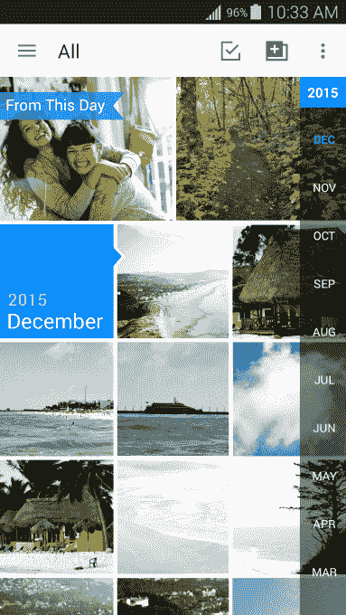

# 亚马逊家庭计划扩展至无限照片存储 

> 原文：<https://web.archive.org/web/https://techcrunch.com/2015/11/20/amazon-households-program-expands-to-include-unlimited-photo-storage/>

亚马逊家庭(Amazon Household)计划允许生活在同一屋檐下的成年人分享他们的亚马逊 Prime 福利，包括免费送货和访问 Prime 视频流，该计划今天已经扩展到现在包括 Prime 照片存储。这意味着每个账户持有人将在云中获得无限的照片存储空间，外加 5 GB 的视频和其他文件存储空间。

直到今天，照片存储是家庭计划不包括的少数选项之一，因为它已经允许成员在他们的共享设备上共享电子书、有声读物、应用程序和游戏。

免费的照片存储似乎成为了照片分享服务的新基准。

例如，谷歌在谷歌照片上为“高”质量的照片提供无限制的免费存储，只有当你想保存“原始”质量的图像时才收费。与此同时，Flickr 提供 1tb 的免费存储空间，这对大多数人的照片库来说绰绰有余(至少目前如此)。虽然脸书目前并不强调这一点，但如果你打开自动同步智能手机照片到社交网络上的私人相册的选项，它似乎永远不会用尽空间。

与其他免费照片存储网站类似，亚马逊照片也有一些限制。你从桌面浏览器上传的照片大小必须小于 2 GB(要超过这个大小，你必须使用 Cloud Drive 桌面应用)，并且对支持的格式有一些限制(虽然不是很多)。例如，许多 RAW 文件类型受[支持，但不是所有的。此外，亚马逊表示，其免费的无限照片存储是为个人使用而设计的](https://web.archive.org/web/20221209173928/https://www.amazon.com/gp/help/customer/display.html?nodeId=201649930)——不是为专业摄影师设计的。

亚马逊从未真正大力推广其 Prime Photos 的优势，相关的移动应用程序多年来几乎没有重大更新。它本质上仍然很实用——一个用于自动将照片备份到亚马逊云端以安全保存的工具，仅此而已。与竞争对手不同，亚马逊似乎没有试图与社交照片分享服务竞争，也没有围绕用户分享的照片开发一个社区。相反，免费照片存储只是亚马逊的另一个选择——尽管它检查的有点晚——当谈到亚马逊家庭的好处时。

同样值得注意的是:这家零售商今年一直在调整其亚马逊家庭计划，使其更适用于更传统的双亲家庭，而不是用户邀请朋友尝试有限的 Prime 会员资格的方式。过去，亚马逊允许 Prime 会员与多达四个其他“家庭”成员分享他们的运输利益和更多，但今年夏天改变了这一点，将分享限制为仅两个成人和最多四个孩子。鉴于分享利益的新限制，亚马逊现在向其家庭成员推出无限照片存储是有道理的。