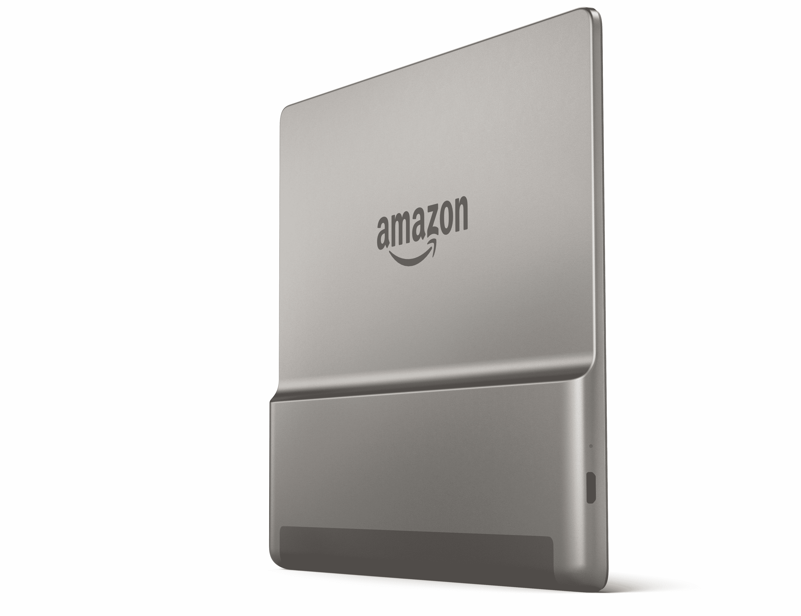

# 亚马逊推出防水 Kindle Oasis，配有 7 英寸屏幕和音频播放技术

> 原文：<https://web.archive.org/web/https://techcrunch.com/2017/10/11/amazon-introduces-a-waterproof-kindle-oasis-with-a-seven-inch-screen-and-audible-playback/>

几周前，当亚马逊在一系列产品发布中跳过 Kindle 时，我们有些轻微的心悸。但是不用担心，该公司坚持说它仍然致力于它的硬件根基——毕竟(老实说，我对这一发现有点惊讶)，过去的 Prime Day 显然是 Kindles 在美国和世界上最畅销的一天。Kindle 的疏忽是因为“事件集中在 Alexa 上。”

该公司提前一个月左右庆祝该系列即将到来的 10 周年纪念日(11 月 19 日)，更新了高端 Kindle Oasis。新的 Kindle 是第一个防水的，对于去海滩和浴缸阅读来说等级为 IP8(Kobo 已经提供了几代人的功能)。它还通过蓝牙音频将音频回放直接带到设备上。

大约一年半前，第一辆 Oasis 标志着该公司对该系列的重新承诺。作为最高端的 Kindle 阅读器，这款设备的目标消费者相对狭窄——那些想要一款功能基本单一、外形高端的设备的人。并且愿意为此买单。新的绿洲起价为 249 美元，以后还会上涨。

这个价格让你获得了该公司分辨率最高的屏幕(300 PPI)，这次是 7 英寸的尺寸。这比该公司几代人前确定的默认电子阅读器屏幕尺寸大了整整一英寸。当然，它正在与更大的屏幕调情，最明显的是大尺寸的 Kindle DX，但 6 英寸一直是亚马逊和大多数竞争对手的最佳选择。

当然，大屏幕的好处显而易见。你一次在页面上多得到 30%的文本，这意味着更少的翻页。当试图在 thing 上阅读像漫画这样的大量图片作品时，它也有一个明显的优势(尽管就我而言，在电子阅读器上阅读漫画仍然是一大禁忌)。缺点也同样明显:占地面积更大。

尽管亚马逊向我保证，由于这款设备相对较薄，它已经设法让它小到足以塞进裤子的口袋。这一直是这些产品的基准——当然，你的个人结果会有所不同，这取决于你是否住在威廉斯堡。

更大的表面积也意味着电池有更多的空间展开——尽管该公司再次决定采用背面难看的电池凸起。将电池集中在一个点上意味着重量不是很均匀地分布，尽管它的位置使大部分重量都落在手上，电池唇提供了一个读者可以放下手的地方。

这也是亚马逊提供的最亮的屏幕。与上一个版本的 10 个 led 相比，板上有 12 个 led，提供了更均匀的前照明。这种玻璃也是该公司提供的最坚固的玻璃——根据亚马逊的说法，这是一种专有的大猩猩玻璃。该公司最高端的阅读器都会有一些小而美的改动。

实体翻页按钮也回来了——老实说，这可能是最初的 Oasis 最让我兴奋的地方。再说一次，这是一件小事，但自从 Barnes & Noble 停止生产 Nook 后，我真的很怀念这个功能。这款设备还配有一个内置加速度计，因此它会根据握持方式自动切换方向——这对左撇子读者来说是个好消息。这也意味着你可以横向阅读，尽管这可能吸引力有限。

音频回放由车载蓝牙提供。出于可访问性的原因，亚马逊也将把这一功能添加到具有无线连接的老款 Kindles 上，但新的 Oasis 将首先获得这一功能。购买文本/音频捆绑书籍的用户将能够使用该功能，该功能使用阅读速度来计算您离开的位置，并切换到有声读物标题中的该位置。

该软件也有一些小的调整，包括更多的字体大小渐变和加粗任何字体的能力。文本对齐也可以调整为“参差不齐”的右侧，这意味着文本被隔开，以保持空白整洁。新的 Oasis 支持亚马逊的专有文件，以及 TXT、PDF、MOBI 和 PRC。对于像我这样使用大量 EPUB 文件的人来说，这是一个令人失望的事情——尽管鉴于其商店的重要性，亚马逊在这里封锁这些文件并不奇怪。

此外，与以往一样，没有可扩展的内存，但板载内存增加了一倍，达到 8GB，读卡器达到 32GB。这种扩张是因为 Audible 文件的本地存储大大改变了容量计算。充电口依然是 microUSB，但快充意味着两小时充满电。这相当于大约六个星期——比上一个绿洲少了两个星期，但这仍然是大量的阅读。

新款 Oasis 今天开始接受预购，并于万圣节开始发货。定价从 249 美元起，支持 LTE 的 32GB 版本需要额外支付 100 美元。