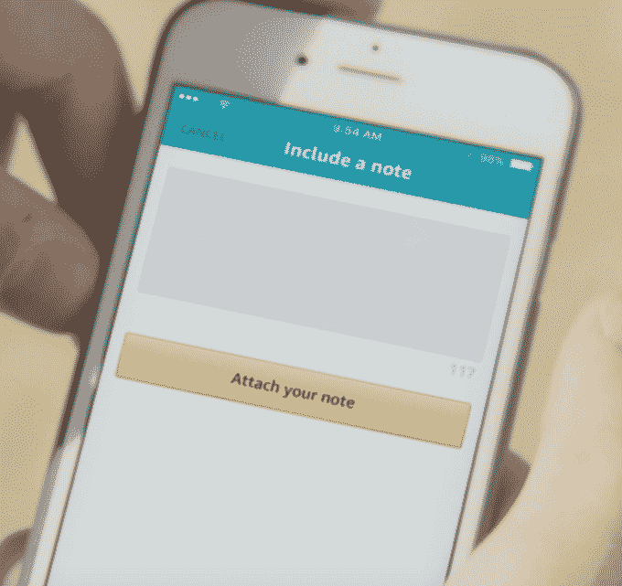
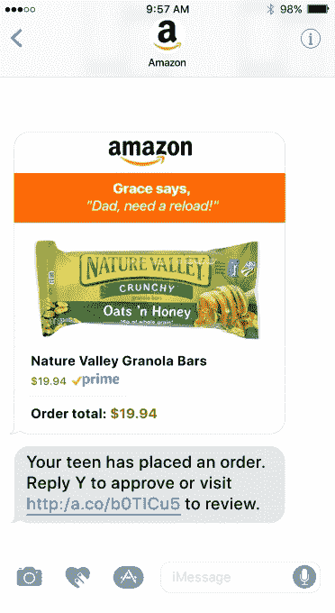
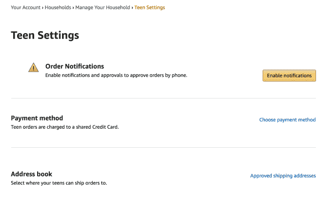

# 亚马逊为青少年引入了一种在父母同意后独立购物的方式 

> 原文：<https://web.archive.org/web/https://techcrunch.com/2017/10/11/amazon-introduces-a-way-for-teens-to-independently-shop-its-site-following-parents-approval/>

亚马逊今天宣布了一种新的方式，让青少年可以独立于父母的账户在网站上购物，并自己下单，父母可以选择在允许购买前进行审查。青少年还可以被分配预先设定的每个订单的消费限额，作为审查订单的替代方案。

亚马逊表示，这项通过 amazon.com/forteens 提供的新服务旨在给 13 至 17 岁的青少年更多自主权。

此外，它给了亚马逊一种方法，让全新的一批购物者沉迷于其更大的 Prime 平台，如果父母是 Prime 会员，青少年可以通过该服务获得该平台。这意味着青少年可以在两天内免费订购超过 5000 万件商品，他们还可以利用其他优惠，如 Prime Video 和 Twitch Prime 的游戏优惠。

该系统的工作原理是给青少年自己的登录和密码，以便在亚马逊上使用。父母可以为他们的孩子报名，或者孩子可以通过短信或电子邮件向父母发出邀请。收到订单后，家长会确认青少年的订单将使用哪种付款方式和送货地址。

之后，青少年将使用自己的用户名和密码登录亚马逊应用程序。当他们找到他们想买的东西时，该商品会通过短信或电子邮件发送给父母以获得批准。亚马逊表示，青少年还可以选择附上一张纸条，比如“这是我上课需要的书”。

默认情况下，订单审批是打开的，所以如果父母想让一个青少年在亚马逊购物时不审核每件商品，他们必须明确禁用该功能。但是对于不想提前检查所有东西的父母来说，设置预先批准的支出限额也是可行的。

然而，即使在允许青少年自己下订单的情况下，父母也可以收到每个订单的逐项通知，他们可以像往常一样取消或退货。

新的青少年账户是亚马逊家庭的一部分，亚马逊的这一功能允许客户与其他家庭成员分享他们的 Prime 账户，为家人创建共享的数字图书馆，并共享信用卡和借记卡。

举例来说，作为其他服务的一部分，家庭已经允许客户将其他成人和儿童(12 岁及以下)添加到他们的群中，例如适合儿童的订阅亚马逊免费时间无限。

在这个页面上，现在有一个新的选项来添加青少年，以及配置与他们的帐户相关的设置。

“作为一名青少年的父母，我知道他们多么渴望独立，但与此同时，这必须与父母需要的便利和信任保持平衡。亚马逊家庭副总裁迈克尔·卡尔在关于此次发布的声明中说:“我们听取了家庭的意见，为青少年和父母创造了美好的体验。”。

虽然青少年通过新系统的订单与家庭共享的信用卡相关联，但在许多情况下，青少年可能会通过在家里给妈妈或爸爸现金来自己支付这些购物费用。

这意味着亚马逊将利用青少年可能从兼职工作、保姆费、津贴等方面获得的零花钱。在过去，这可能是青少年在购物中心花的钱。

亚马逊的下一步将是让青少年更容易使用这些现金，也许是通过配置父母可以向青少年账户发放的数字津贴。

然而，就目前而言，该功能更多的是让青少年更加独立地购物。

面向青少年的亚马逊今天通过[Amazon.com/forteens](https://web.archive.org/web/20221205185014/http://www.amazon.com/forteens)直播。