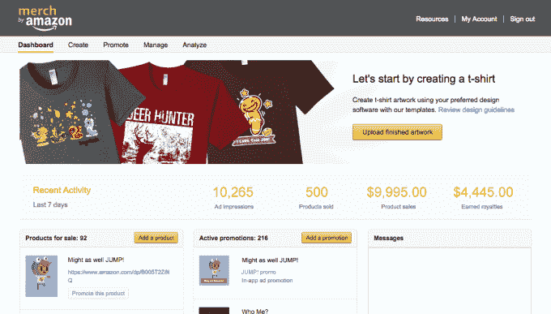
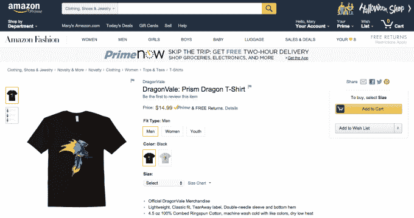

# 亚马逊推出了 Merch By Amazon，这是游戏开发者或任何人销售按需印刷 t 恤的一种方式 

> 原文：<https://web.archive.org/web/https://techcrunch.com/2015/09/30/amazon-introduces-merch-by-amazon-a-way-for-game-developers-or-anyone-to-sell-print-on-demand-tees/>

亚马逊今天[推出了](https://web.archive.org/web/20221206183830/https://developer.amazon.com/public/community/post/Tx3504078FRYE5I/Announcing-Merch-by-Amazon-A-New-Way-to-Generate-Revenue-with-Branded-T-Shirts)一项被亚马逊称为 [Merch 的新服务，旨在帮助应用程序开发者——或任何其他内容创作者——通过向客户销售品牌 t 恤来增加收入，这是一个聪明的举动，结合了亚马逊作为大型在线零售商和广告平台的实力及其在移动游戏市场的足迹。](https://web.archive.org/web/20221206183830/https://merch.amazon.com/)

开发者和其他人可以使用这项新服务来制作定制 t 恤，在他们的移动应用程序或其他在线地方做广告，然后按需印刷。粉丝每买一件 t 恤，创作者就会获得一笔版税，版税随着 t 恤销量的增加而增加。

在很大程度上，亚马逊与 Merch 的想法是提供一种自助服务工具，为那些希望超越传统应用内广告或应用内购买(如虚拟商品销售)的开发人员消除现金支出。

提供实体商品是许多游戏开发商尝试的事情，但这通常需要前期投资。这就是为什么这些年来你会看到来自更大品牌的商品，比如来自 [Rovio 的《愤怒的小鸟》系列的大量玩具和游戏、](https://web.archive.org/web/20221206183830/https://beta.techcrunch.com/2011/09/12/angry-birds-the-brand-rovio-sells-1m-t-shirts-and-1m-plush-toys-per-month/) [Plants vs. Zombies 的](https://web.archive.org/web/20221206183830/http://www.pvzstore.com/)商品、或者几年前 Zynga 和玩具制造商 Hasbro 的合作关系，但通常不会从独立开发者那里看到同样的东西。

与此同时，在今天的应用商店中赚钱是一个越来越大的挑战——特别是对新来者和较小的开发者来说，他们没有很多钱来支付用户获取成本等费用。

为了使用亚马逊的 Merch，创作者将他们的定制作品上传到在线仪表板上——比如他们游戏中的标志或艺术——或者他们可以使用亚马逊的[模板](https://web.archive.org/web/20221206183830/https://merch.amazon.com/resource/201851710)开始。然后，他们在亚马逊提供的计算器的帮助下为 t 恤定价，让他们看到每件衬衫的版税将取决于标价。

开发者根据他们设定的标价赚取版税，减去亚马逊的成本(8.10 美元)和少量的上市费(15%)。亚马逊要求最低价格涵盖自己的费用，包括从库存空白衬衫、订购时生产带有艺术品的衬衫、客户服务、用 Prime 或 Super Saver shipping 向客户发货以及销售费用在内的所有费用。

亚马逊指出，随着销售额的增长，印刷衬衫的成本下降，因此版税将会增加。(此处提供了批量销售的可用折扣列表[。)](https://web.archive.org/web/20221206183830/https://merch.amazon.com/resource/201858580)

亚马逊表示，衬衫本身可以配置为单面或双面印刷 t 恤，创作者可以指定使用的材料。创作者从 Anvil 和 American Apparel 品牌中挑选，这些衬衫在一个产品页面上有男式(S-3XL)、女式(S-XL)和儿童尺码(K4-K12)。销售完成后，这些衬衫由亚马逊拥有的打印机打印出来，并运送给世界各地的顾客。

因为这些衬衫可以通过亚马逊移动广告在 Android、Fire OS 或 iOS 版本的应用程序中进行促销，它们主要针对移动游戏开发者。但亚马逊表示，亚马逊的 Merch 不仅限于应用程序开发人员。

据一位发言人称，任何想按需制作 t 恤并在 Amazon.com 出售的人都可以使用这项服务。他们说，他们只需要在开发者门户网站上注册一个 Merch by Amazon 账户。

亚马逊进入按需印刷领域，对 CustomInk、Spreadshirt、Teespring、Zazzle、CafePress 等用户可以在线设计和销售 t 恤的服务提出了挑战。

在该平台发布之前，许多开发者已经在使用它，包括 Backflip Studios (DragonVale)、Etermax (Trivia Crack)、Big Blue Bubble(我的歌唱怪物)、ZeptoLab(割断绳子)、Glu Mobile(猎鹿人 2014)等。

亚马逊的 Merch 服务在这里上线[。](https://web.archive.org/web/20221206183830/https://merch.amazon.com/landing)