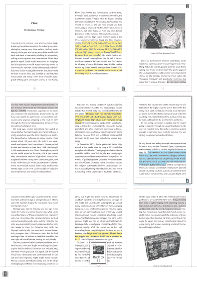

# 亚马逊推出了“翻页”功能，可以更方便地在 Kindle TechCrunch 上翻页

> 原文：<https://web.archive.org/web/https://techcrunch.com/2016/06/28/amazon-introduces-page-flip-for-kindle/>

# 亚马逊推出了“翻页”功能，可以更方便地在 Kindle 上翻页

需要在一本书里找到另外一段文字或图片，但发现用电子阅读器很难做到？想要前后翻页并快速查阅资料的 Kindle 阅读器现在有了一个更简单的方法，这就是一个叫做[翻页](https://web.archive.org/web/20221007233050/https://www.amazon.com/Kindle-eBooks/b?ie=UTF8&node=13632018011)的新功能。

 Kindle 称翻页是一种“重新想象的导航体验”这意味着你现在可以在 Kindle 上来回“翻页”。

从今天开始，所有在 iPhone 或 Android 上使用 Kindle 电子阅读器、Fire 平板电脑应用程序或 Kindle 移动应用程序的用户将获得应用程序更新，使他们能够翻页。

它的工作原理是通过选择页面来保存你在书中的位置，然后将其固定在屏幕的一侧。然后，读者可以翻到另一页参考。你只需点击屏幕边上被钉住的那一页，就可以回到书中原来的位置。

Kindle 副总裁查克·摩尔说，更新的灵感来自于观察人们如何阅读书籍的印刷版。

更新的几个亮点包括:

*   缩小-缩小以获得鸟瞰图，并快速找到您正在寻找的图片、地图或段落
*   像素精确的缩略图–缩略图能够根据不同的字体和边距设置进行调整。
*   轻松在页面间导航–锁定您当前正在阅读的页面，并来回翻页以查找其他页面。然后通过点击屏幕一侧的固定页面跳回原始页面。

这是一个小小的改进，但 Kindle 表示，客户已经希望有一段时间了，这是 Kindle 软件和硬件的几项更新的一部分，以帮助创造阅读印刷本的感觉。

[https://web.archive.org/web/20221007233050if_/https://www.youtube.com/embed/6fUKOadnt6g?feature=oembed](https://web.archive.org/web/20221007233050if_/https://www.youtube.com/embed/6fUKOadnt6g?feature=oembed)

视频