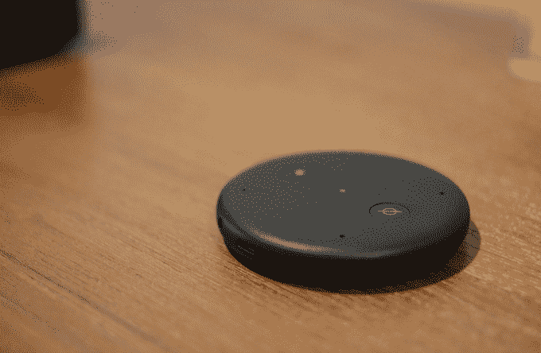

# 亚马逊推出 Echo Input，这是第一款没有扬声器的 Echo 

> 原文：<https://web.archive.org/web/https://techcrunch.com/2018/09/20/amazon-introduces-the-echo-input-its-first-echo-without-a-speaker/>

# 亚马逊推出了 Echo Input，这是第一款没有扬声器的 Echo

亚马逊今天推出了一款名为[回声输入](https://web.archive.org/web/20221025222229/http://amazon.com/echoinput)的新产品。这是一款非常薄的微型 Echo Dot，也是第一款没有扬声器的 Alexa 设备。这里的想法是提供一个设备，让您可以连接到您已经拥有的扬声器。该设备通过 3.5 毫米音频电缆或蓝牙连接到一个扬声器，并配有四个麦克风阵列，因此你可以与 Alexa 通话。但与 Echo Dot 不同，音频将通过连接的扬声器播放，而不是设备本身。

这款设备外形小巧，只有 12.5 毫米高，几乎可以放在任何地方。例如，你可以把它们放在整个房子里。

当扬声器连接到 Echo 输入时，可以将其添加到新的或现有的多房间音乐组中。

亚马逊表示，该产品还可以与人们喜欢的其他扬声器捆绑销售，例如 Bose，它是这款设备的第一个合作伙伴。

Echo Input 有黑白两种颜色，将于今年晚些时候在美国、英国和德国上市，售价为 34.99 美元。

