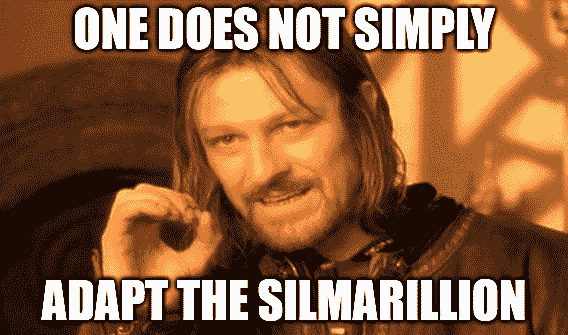

# 亚马逊正在制作《指环王》前传系列

> 原文：<https://web.archive.org/web/https://techcrunch.com/2017/11/13/amazon-is-making-a-lord-of-the-rings-prequel-series/>

# 亚马逊正在制作《指环王》前传系列

亚马逊正在制作一部*指环王*电视剧，但它并不是有史以来最伟大的幻想系列的直接改编——它是一部前传。该剧已经有了多季的承诺，将“探索 J.R.R .托尔金的*《指环王》T5 之前的新故事情节。”*

当然,*《霍比特人》*比*《友谊》*早很多年，但是这个故事被荒谬的三部曲如此巧妙地玷污了，以至于它被不明智地延长了，可能要过几年才会有人想重温它。

新系列可能会挖掘沉闷但丰富的素材，就像同人小说作家和传说迷几十年来所做的那样。远古精灵领主的功绩将会成为一部激动人心的史诗，而许多人将会为看到莫莉亚的鼎盛时期而激动不已。

 不过，这很大程度上取决于改编的质量。亚马逊在原创方面做得很好，但这将是一项远远超出其工作室和合作伙伴所尝试的范围的事业。亚马逊正在与新线影院合作，新线影院当然是 2001 年开始的备受喜爱的三部曲背后的电影公司，以及托尔金庄园，以及出于某种原因的哈珀柯林斯。

这笔交易还“包括一个潜在的额外衍生系列”，大概是如果它足够受欢迎的话。当然，这一切都将只对主要会员开放。

作为粉丝，我持谨慎乐观的态度。艾伦迪尔。