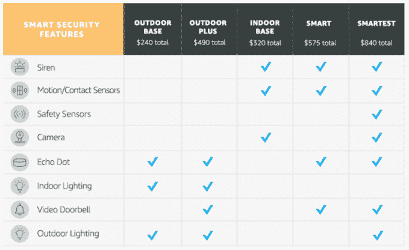

# 亚马逊现在出售家庭安全服务，包括安装和无月费 

> 原文：<https://web.archive.org/web/https://techcrunch.com/2018/04/26/amazon-is-now-selling-home-security-services-including-installations-and-no-monthly-fees/>

亚马逊在智能家居服务领域进行了大量收购，现在它提供了一种产品，将这些收购集中在一个屋檐下——你的屋檐下。

亚马逊已经悄悄地推出了一个门户网站，提供家庭安全服务——包括你需要的所有设备，以及亚马逊顾问亲自上门提供建议和安装工具包。这些套装分为五个价格等级，以固定的价格出售——没有每月服务合同，这是对目前出售的家庭安全服务的重大破坏。

最便宜的，240 美元的户外底座，给你一个回声点加上室内和室外照明设计“让你看起来像在家里。”最贵的一层是 840 美元的 Smartest，包括警报器、运动传感器、安全传感器、摄像头、Echo Dot、照明设备和视频门铃——可能是该公司以前推出的安全产品，如[亚马逊钥匙和云摄像头](https://web.archive.org/web/20221209195112/https://techcrunch.com/2017/10/25/amazon-debuts-cloud-cam-and-key-to-take-on-nest-august-and-others-in-home-security/)。所有这些都包括亚马逊员工的两次拜访，向您咨询并帮助安装。

去年 7 月[有消息称](https://web.archive.org/web/20221209195112/https://techcrunch.com/2017/07/10/amazons-latest-service-helps-you-set-up-your-alexa-powered-smart-home/?ncid=rss)亚马逊正在悄悄研究自己对百思买极客小队的回应——提供家庭 WiFi、智能家居设备、Alexa 安装和其他硬件相关服务的维修和安装。

亚马逊当时似乎从未证实过，但这项服务现在的官方名称似乎是“[智能家居服务](https://web.archive.org/web/20221209195112/https://www.amazon.com/b/ref=gurus_shrul?node=14586916011)”，它已经扩展到华盛顿、俄勒冈州、加利福尼亚州、亚利桑那州、得克萨斯州、内华达州、北卡罗来纳州、佐治亚州、伊利诺伊州、新泽西州、华盛顿特区和佛罗里达州。

除了按菜单销售报警器和其他设备，让消费者选择更全面的安全产品是有道理的，原因有几个。

首先，虽然有一些早期采用者可能喜欢自己安装这些服务的挑战，但会有许多中期和后期采用者对面对学习曲线不感兴趣。

亚马逊在智能家居安全领域的定位不仅仅是第三方设备的经销商——尽管它也销售这些设备——收购了智能门铃初创公司 [Ring](https://web.archive.org/web/20221209195112/https://techcrunch.com/2018/02/27/amazon-is-buying-smart-doorbell-maker-ring/) 和智能摄像头和门铃初创公司 [Blink](https://web.archive.org/web/20221209195112/https://techcrunch.com/2017/12/22/amazon-acquires-connected-camera-and-doorbell-startup-blink/) 。

第二，最常见的是，家庭安全系统与您家中的服务设施相结合，其中包括维护合同。因此，如果亚马逊希望吃掉部分市场，它需要提供类似的东西。

这也是该公司更广泛战略的一个有趣发展，该战略超越了实体产品，转向销售服务。服务是亚马逊针对不同类别的商业和不同的人口统计使其业务多样化的各种努力之一[。](https://web.archive.org/web/20221209195112/https://techcrunch.com/2018/04/23/amazon-home-shopping-evine/)

另一个涉足人力服务的是其图钉式的竞争对手亚马逊家庭服务，这是一个它在 2015 年推出的市场[用于寻找商人和其他自由服务提供商，如按摩师和语言教师。(值得注意的是，亚马逊在其安全页面上大肆利用亚马逊员工安装其安全系统。)](https://web.archive.org/web/20221209195112/https://techcrunch.com/2015/03/30/amazon-home-services-gets-its-official-launch/)

本月早些时候，有消息称亚马逊在智能家居领域抢在了苹果的前面，特别是通过与智能家居建筑商签订协议，这些建筑商选择亚马逊作为他们的首选供应商，为他们的购房者提供咨询和安装此类服务。

《信息报》的一篇报道指出，其中一家房屋建筑商 Lennar 在推荐中“优先考虑亚马逊”，同时仍在与苹果合作，部分原因是这家前公司更努力地与更多第三方产品整合，给买家提供了更广泛的选择。

进军安全服务也符合这一点。Lennar 现在恰好直接链接到亚马逊的安全主页上，但要明确的是，这项服务并不仅限于 Lennar 的房主。

我们已经就安全服务页面询问了亚马逊，该公司已经承认了这个问题，但仍未回复。如果我们了解到更多，我们会更新这篇文章。