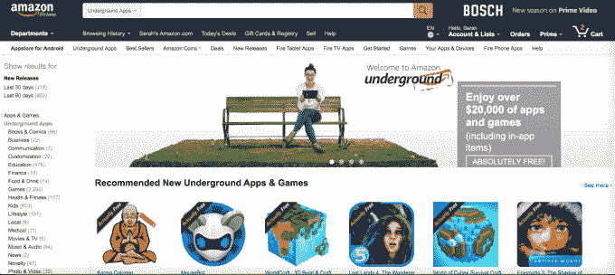
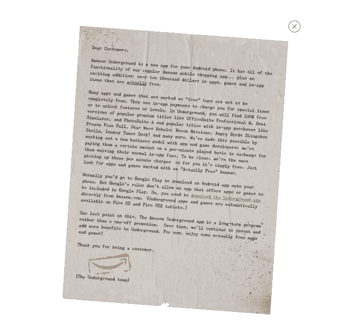

# 亚马逊关闭了免费赠送安卓应用的“地下实际免费”项目 

> 原文：<https://web.archive.org/web/https://techcrunch.com/2017/04/28/amazon-is-shutting-down-its-underground-actually-free-program-that-gives-away-free-android-apps/>

周五晚些时候，亚马逊[宣布](https://web.archive.org/web/20230211183847/https://developer.amazon.com/blogs/appstore/post/cbadeae1-990d-4d52-bef5-ea61f6114b94/announcement-amazon-actually-free-program)将关闭其“地下实际免费”计划，该计划为客户提供免费版本的 Android 应用程序，这些应用程序通常需要付费，包括那些依赖于应用内购买但在其他方面免费下载的应用程序。虽然亚马逊在 2015 年 8 月[首次亮相时承诺长期支持，但今天亚马逊表示，“实际免费”计划将在 2019 年完全停止。](https://web.archive.org/web/20230211183847/https://techcrunch.com/2015/08/26/amazon-underground-is-an-android-app-store-with-only-actually-free-apps/)

公平地说，在科技世界里，四年*是一段很长的时间。*

在发布时，阵容包括几个知名的游戏，如*冻结自由落体，星球大战反叛者:侦察任务，愤怒的小鸟弹弓斯特拉，Looney Tunes Dash！*等。该网站声称，现在“地下”中有价值超过 2 万美元的应用程序和游戏。

该计划更大的想法是吸引消费者购买亚马逊自己的硬件，Kindle Fire HD 和 Fire HDX 平板电脑，这些地下应用程序可以通过亚马逊内置的 Android 应用商店获得。然而，该公司还通过单独下载地下移动应用程序，将其地下应用程序提供给其他安卓设备。

当然，这款应用必须直接从亚马逊网站下载，因为谷歌不允许竞争对手的应用商店应用发布到其应用市场 Google Play。

亚马逊随后为这些“实际上免费”的应用买单，但想出了一种补偿开发者的新方法。亚马逊不会直接吃掉付费下载的成本，也不会为客户最终使用的游戏内物品付费，而是根据人们使用某个应用的时间长短向开发者支付费用。

这是亚马逊之前尝试过的一个补偿方案，它的 Kindle Unlimited 订阅服务根据人们阅读的页数向作家支付版税。

在最初推出时，亚马逊表示，“实际免费”计划不是“一次性”的促销活动，该公司致力于“长期”开展该计划。

然而，今天，这个故事发生了变化。

[在一篇博客文章](https://web.archive.org/web/20230211183847/https://developer.amazon.com/blogs/appstore/post/cbadeae1-990d-4d52-bef5-ea61f6114b94/announcement-amazon-actually-free-program)中，亚马逊表示，它已经为开发者提供了为他们的应用赚钱的新途径，包括通过使用其虚拟货币亚马逊币，以及通过亚马逊的[Merch](https://web.archive.org/web/20230211183847/https://developer.amazon.com/merch)销售印有他们游戏角色和图像的 t 恤。除了对这些额外收入来源的支持，该公司没有给出任何可靠的理由来解释为什么需要关闭该项目。

亚马逊表示，“实际免费”将分阶段关闭。截至 2017 年 5 月 31 日，该公司将不再接受该计划的应用程序提交，但现有参与者将继续根据其开发者协议获得报酬。

然后，亚马逊将在 2017 年夏天通过其 Android 应用程序的 Appstore 结束对地下实际免费商店的访问。该应用程序本身将继续在 Android 设备上运行，允许客户购买实物商品，观看 Prime 视频，并使用他们之前安装的免费应用程序。(这款应用的本意是作为应用商店和亚马逊购物主应用的组合。)

Fire 平板电脑用户也将能够使用他们的地下应用程序，并访问实际上免费的商店，直到该计划于 2019 年结束；然而，除了已经支持的设备之外，该程序和应用程序都不会出现在任何新设备上。

参与的开发者仍将能够提交应用更新，并仍将获得版税，直到该计划于 2019 年停止。

最后，客户不会失去他们已经下载的免费应用程序的访问权，尽管尚不清楚如果他们选择在以后升级硬件，这些免费应用程序是否会转移到新的设备上。

更多的细节和联系亚马逊的方法在 FAQ 中发布[这里](https://web.archive.org/web/20230211183847/https://forums.developer.amazon.com/articles/69139/underground-actually-free-program-faq-2017-update.html)。