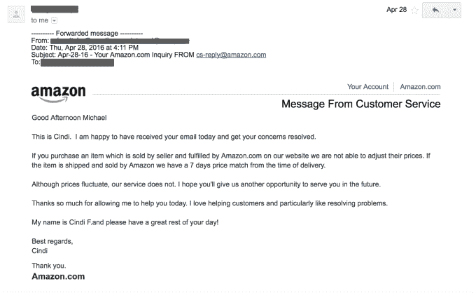
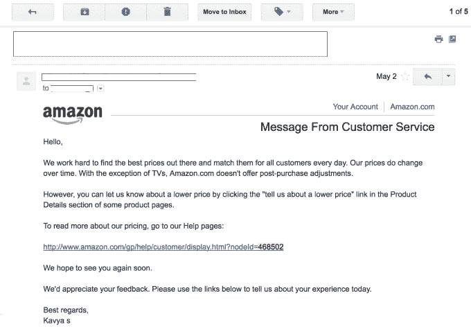

# 除了电视，亚马逊不再提供价格匹配退款

> 原文：<https://web.archive.org/web/https://techcrunch.com/2016/05/23/amazon-kills-its-price-protection-policy/>

亚马逊已经悄悄地结束了除电视外所有产品的价格保护政策。该公司政策的变化正值少数初创公司推出帮助消费者在在线网站价格变化时自动申请退款的过程，包括亚马逊和其他数十家电子商务商店。

例如，新人 [Earny](https://web.archive.org/web/20221208005950/https://www.crunchbase.com/organization/earny) 最近推出了一款手机应用，帮助消费者在价格下降后收回购买的商品。Earny 的联合创始人 Oded Vakrat 表示，到目前为止，该应用处理的退款请求中约有 50%是亚马逊购买的。恩尼还与 T4 Paribus 竞争，后者在网上和手机上提供类似的服务。与此同时，像 camelcamelcamel 这样的老网站允许消费者跟踪亚马逊的价格下跌并收到提醒。

在这一政策变化之前，亚马逊的价格保护政策已经是对消费者最不友好的政策之一，因为它过去常常在价格下降时提供七天的价格匹配。这意味着，如果你从亚马逊购买了一件商品，但该公司后来降低了价格，你可以要求退款。然而，与许多商店不同，亚马逊只匹配自己的商品价格，而不是竞争对手的价格——除了电视和手机。

相比之下，其他商店有更多的亲消费者政策，例如，百思买(Best Buy)在退换货期间提供价格匹配( [15 天是标准](https://web.archive.org/web/20221208005950/http://www.bestbuy.com/site/help-topics/return-exchange-policy/pcmcat260800050014.c?id=pcmcat260800050014))和沃尔玛(Walmart)，提供 90 天的保护。

Vakrat 表示，他的公司注意到亚马逊在 5 月初推出后几天就改变了政策，或者是在 2016 年 5 月 7 日或 8 日左右。

最初，亚马逊代理商像往常一样尊重价格匹配请求，称如果一件商品由亚马逊运输和销售，该公司从交付之时起有七天的价格匹配时间。比如看下面的邮件截图:

但当新政策生效时，客服人员却说“除了电视，Amazon.com 不提供购后调整。”

大约在同一时间，Reddit 上的用户也注意到了政策的变化，他们中的一些人甚至被代理商告知，亚马逊从未提供过之前的价格保护政策——它过去发布的退款是一个“例外”

亚马逊的网站现在也反映了这一新政策，称:

> “Amazon.com 一直致力于保持我们所有商品的竞争性价格，并将在某些商品上与其他零售商的价格相匹配。Amazon.com 将与选定的其他零售商对符合条件的电视采购进行价格匹配。对于所有其他商品，Amazon.com 不提供价格匹配。”

然后该网站链接到[的政策](https://web.archive.org/web/20221208005950/https://www.amazon.com/gp/help/customer/display.html?nodeId=200726210)，解释它将如何为电视购买定价。

至于这种变化会对 Earny 和 Paribus 这样的创业公司产生怎样的影响？Vakrat 乐观地将这一打击称为一个“伟大的机会”，以展示为什么消费者需要像 Earny 这样的创业公司支持他们。

亚马逊坚称[它的价格政策](https://web.archive.org/web/20221208005950/https://www.amazon.com/gp/help/customer/display.html?nodeId=201133150)没有改变——它说它的价格是动态的，它的客户服务代理过去也有例外，但那不是规则。此外，亚马逊希望提醒其客户，与第三方分享他们的凭据会使他们的账户面临风险。

亚马逊就此事发表了以下声明:

> 我们的客户希望来到亚马逊，找到最低的价格，我们致力于维护客户的信任。我们努力寻找最优惠的价格，并每天为所有顾客提供最优惠的价格。此外，我们非常重视客户安全，并希望提醒他们不要与任何人分享他们的亚马逊帐户凭据。