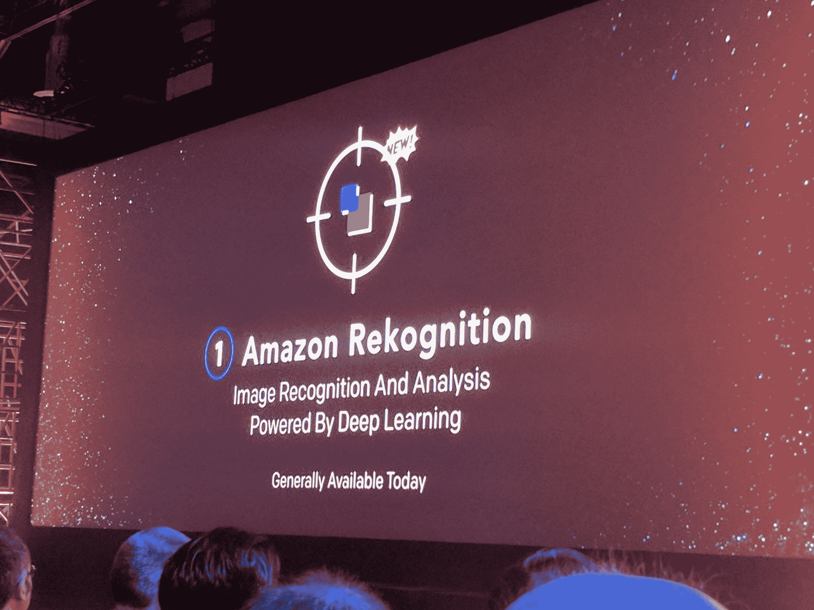
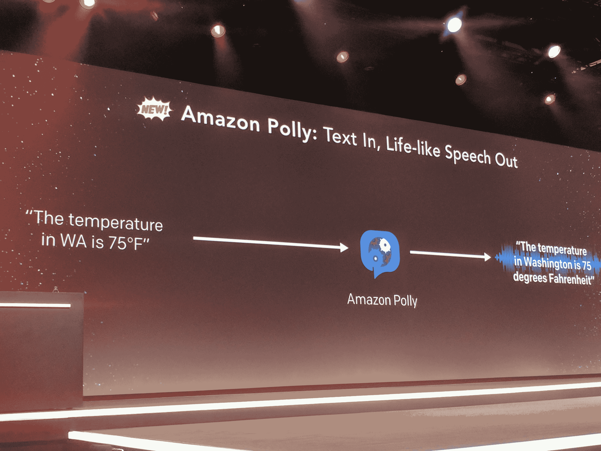
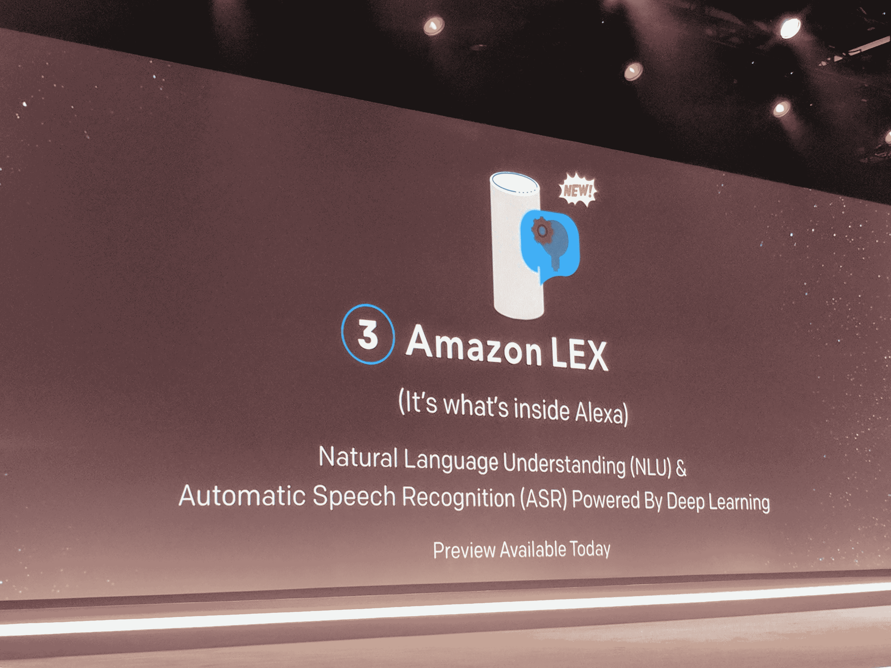
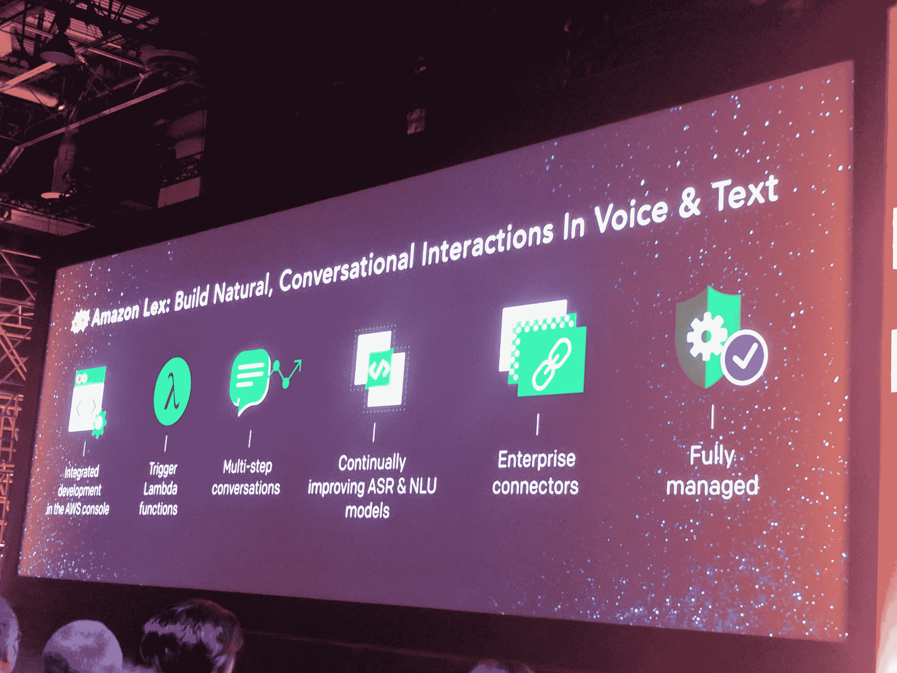
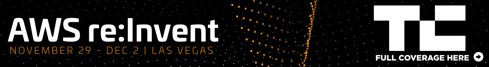

# 亚马逊推出亚马逊人工智能，将其机器学习智能带给开发者 

> 原文：<https://web.archive.org/web/https://techcrunch.com/2016/11/30/amazon-launches-amazon-ai-to-bring-its-machine-learning-smarts-to-developers/>

亚马逊今天在拉斯维加斯的 [re:Invent 开发者活动](https://web.archive.org/web/20230105121511/https://reinvent.awsevents.com/)上宣布推出新的亚马逊人工智能平台。这项新服务将亚马逊多年来在内部开发的许多机器学习智能带到了公司外部的开发人员手中。目前，该服务只提供三种不同的工具，但计划随着时间的推移增加更多的工具。

亚马逊网络服务首席执行官安迪·贾西(Andy Jassy)强调，亚马逊本身在机器学习方面有很多背景，尽管该公司并没有一直谈论它。“我们公司做了很多人工智能，”他说。“我们的业务中有数千人致力于人工智能。”

 
亚马逊人工智能旗下的这些新服务中的第一项是名为“ [Rekognition](https://web.archive.org/web/20230105121511/https://aws.amazon.com/rekogniton) 的图像识别服务它允许你识别物体和场景，类似于谷歌、微软和其他公司已经提供的服务。亚马逊强调，它的系统足够智能，可以识别图像中看到的狗的品种，尽管值得注意的是，它的竞争对手也经常这样做。Jassy 指出这项服务非常划算，尽管他没有公布价格。

第二个是[亚马逊波利](https://web.archive.org/web/20230105121511/http://aws.amazon.com/polly)，这是一种文本到语音的服务，在引擎盖下使用了大量的机器学习智能。Jassy 注意到它能产生逼真的语言。亚马逊解释说:“ Polly 旨在解决语音生成的许多更具挑战性的方面。”例如，考虑短语“我住在西雅图”和“住在纽约”中单词“live”的发音差异 Polly 知道这对同形异义词拼写相同，但发音完全不同。"

Polly 拥有 47 种男性和女性声音，支持 24 种语言。

第三种，也可能是最重要的新服务叫做“ [Lex](https://web.archive.org/web/20230105121511/https://aws.amazon.com/blogs/aws/amazon-lex-build-conversational-voice-text-interfaces/) Jassy 说，这基本上是推动亚马逊自己的 Alexa 服务的技术。它允许您构建能够进行多步对话的对话式应用程序。开发人员开始在 Lex 控制台中设计他们的对话，他们可以用一些示例短语来训练机器人。

“你可以使用 [Amazon Lex](https://web.archive.org/web/20230105121511/https://aws.amazon.com/lex) 来构建聊天机器人和其他类型的网络&移动应用程序，这些应用程序支持引人入胜、栩栩如生的交互，”亚马逊在今天的公告中解释道。“你的机器人可以提供信息，为你的应用提供动力，简化工作活动，或者为机器人、无人机和玩具提供控制机制。”

在今天的主题演讲中，亚马逊展示了如何让开发者只需通过你的声音就能轻松预订航班(不知何故，这正成为所有这些服务的典型演示)。Lex 与 Lambda 和其他 AWS 服务深度集成，还附带了许多企业连接器。此外，它还集成了 Facebook Messenger、Slack 和 Twilio，因此它不仅可以绑定到亚马逊自己的设备上，还可以内置到几乎任何其他设备上。

