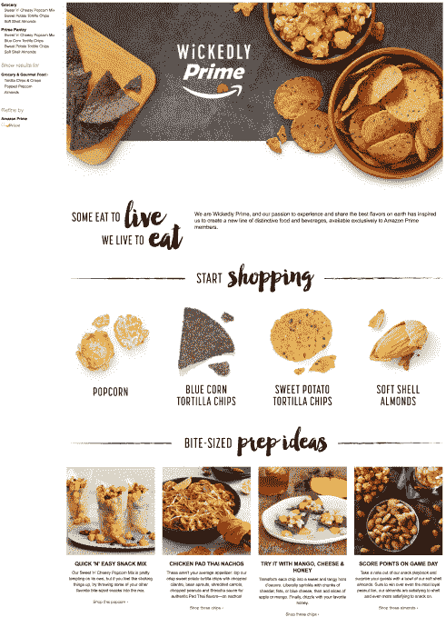

# 亚马逊推出了最新的自有品牌——Wickedly Prime 

> 原文：<https://web.archive.org/web/https://techcrunch.com/2016/12/23/amazon-launches-its-newest-private-label-wickedly-prime/>

本月，亚马逊继续推进自有品牌业务，推出了其最新品牌 [Wickedly Prime](https://web.archive.org/web/20230326163228/https://www.amazon.com/b?ie=UTF8&node=13854994011) 。不像亚马逊最近在自有品牌领域的一些条目，比如 Happy Belly、Mama Bear 和 Presto！Wickedly Prime 是自两年前亚马逊元素(Amazon Elements)首次亮相以来，第一个公开其与亚马逊的关系的品牌。

这代表了亚马逊对待自有品牌业务的战略转变。Wickedly Prime 没有让人们几乎无法分辨哪些品牌是由亚马逊制造的，而是欣然接受了亚马逊的从属关系。

电子商务数据测量公司 [One Click Retail](https://web.archive.org/web/20230326163228/http://oneclickretail.com/announcing-wickedly-prime) 在一份分析该品牌发布成功的新报告中指出，不仅它的名称中有“Prime ”,盒子的品牌标志中还有标志性的亚马逊“微笑”,产品包装甚至注明“由亚马逊履约服务公司分销”。

亚马逊之前的自有品牌商品只在包装上注明了“AFS Brands LLC”，作为对比。

顾名思义，新的 Wickedly Prime 品牌是亚马逊 Prime 会员的专属品牌，以“美食家”人群为目标，提供类似于你在 Trader Joe 商店所能找到的产品。这包括亚马逊自己的零食系列，如爆米花、玉米饼片和软壳杏仁，有多种口味。

亚马逊在自有品牌领域的努力最早是在 5 月份被华尔街日报发现的。文章详细介绍了即将推出的品牌产品，包括来自 Wickedly Prime 的产品

邪恶的 Prime 不是第一个发布的较新的私人标签。亚马逊很可能想在将自己的名字印在所销售的自有品牌商品上之前，先测试一下业务，找出问题所在。然而，随着早期发布的相对成功，该零售商现在似乎准备让消费者更了解其自有品牌商品。

尽管如此，Wickedly Prime 的发布还是有点低调——就像其他一些品牌一样，亚马逊并没有做出重大宣布，只是将产品添加到了网站上。One Click Retail 表示，到目前为止，最初的产品卖得很好，前四个 SKU 在第一周的销售额超过 500 美元。其他 SKU 每个破了 100 美元。One Click Retail 在其报告中指出，尽管这些数字无论如何都不是破纪录的数字，但“对于新产品来说，它们并非微不足道”。

基于其他私人品牌的表现，有稳定增长的潜力。例如，由于 Alexa 在 11 月份的一系列交易，以及 12 月 6 日的闪电交易，开心乐园的坚果和小道混合食品的销售额从 2 万美元增长到了 26.5 万美元。这比上个月增长了 5000%。亚马逊能够通过其交易平台以及现在消费者家中的联网设备网络来推广自己的产品，这是亚马逊随时都可以利用的一个杠杆。

零售商似乎也知道自己在做什么。[1010 data](https://web.archive.org/web/20230326163228/https://techcrunch.com/2016/11/03/amazons-private-label-brands-are-killing-it-says-new-report/)的一份早期报告发现，亚马逊的自有品牌正在占据各自类别的市场份额，包括扬声器(多亏了亚马逊 Echo)、婴儿湿巾(亚马逊元素)和电池(亚马逊 Basics)。

现在我们来看看亚马逊是否会在消费者包装商品领域取得同样的成功，比如它的快乐肚皮咖啡和小吃，邪恶的好小吃，和 Presto！洗涤剂。