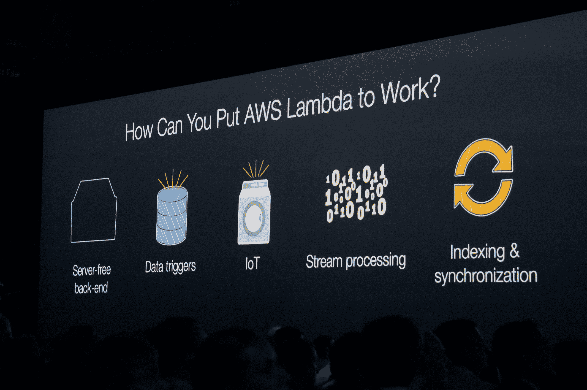
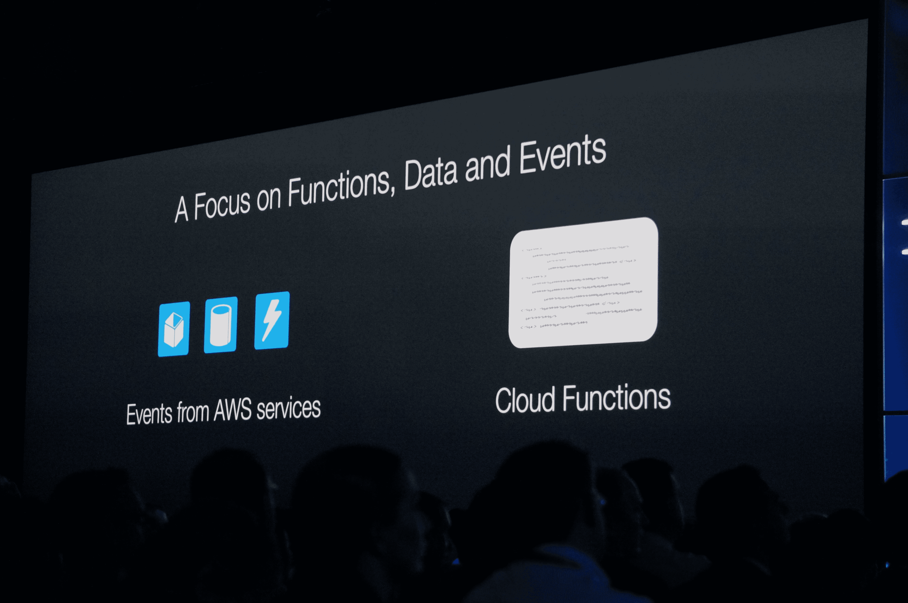

# 亚马逊推出 Lambda，一项事件驱动的计算服务

> 原文：<https://web.archive.org/web/https://techcrunch.com/2014/11/13/amazon-launches-lambda-an-event-driven-compute-service/>

# 亚马逊推出事件驱动的计算服务 Lambda

[亚马逊网络服务](https://web.archive.org/web/20230306001059/http://aws.amazon.com/)今天宣布了一项名为 Lambda 的新服务，这是一项面向动态应用的无状态事件驱动计算服务，不需要提供任何计算基础设施。

正如 AWS 的首席技术官沃纳·威格尔指出的，这将使程序员减少他们的整体开发工作。您只需编写代码并定义事件触发器，当条件满足时，它将自动为您运行。这种自动化可以节省时间和金钱，因为您现在可以在没有任何资源的情况下运行它，而不是为那些可能不经常运行的东西运行整个堆栈，它会自动运行。

值得注意的是，在[黑客新闻对新服务](https://web.archive.org/web/20230306001059/http://cheeaun.github.io/hackerweb/#/item/8602936)的讨论中，一位早期使用该服务的程序员表示，确实需要一些时间来适应这项服务，但一旦你这样做了，他就可以看到改变程序员使用 AWS 方式的潜力。

Lambda 将为您负责管理、扩展和监控。事件被触发后的几毫秒内，它将通过无状态的云函数进行处理，数以千计的这些事件可以并行运行(并且您不会受到资源的任何限制)。

正如沃格尔斯所指出的，Lamda 的设计遵循功能(业务逻辑)、数据(业务状态)和交互的基本编程原则，这些原则是由业务逻辑和它所操作的数据之间的交互事件驱动的。Lambda 也基于这些基本的编程原则运行。

目前，该服务只支持 Java Script/node，但沃格尔斯建议将来会有额外的语言支持。一旦你创建了你的函数，你需要给它上下文和相关的资源。当资源发生变化时，它会触发您的函数，并自动运行，就像您预期的那样，无需任何干预。

有一个免费层供您试用，每月提供 100 万个免费请求和每月高达 320 万秒的计算时间(尽管这也取决于您使用的内存量)。其他付费级别有些复杂，以 100 毫秒为单位向您收取计算时间费用，并且您为每个请求付费。