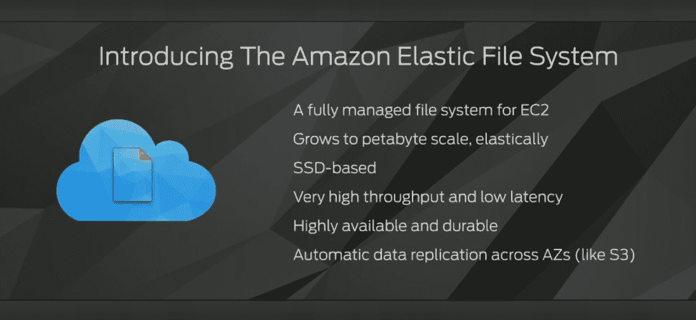
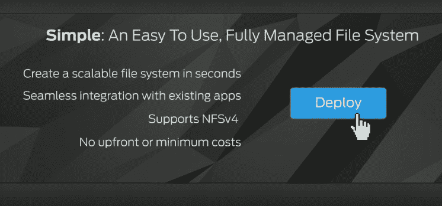
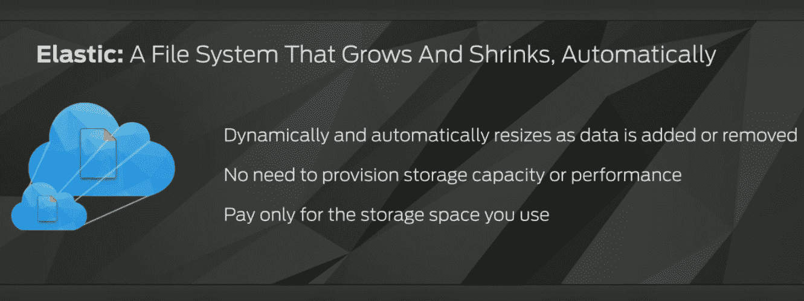

# 亚马逊为 EC2 TechCrunch 推出新的文件存储服务

> 原文：<https://web.archive.org/web/https://techcrunch.com/2015/04/09/amazon-launches-new-efs-file-storage-service-for-ec2/>

在旧金山举行的 AWS 峰会上，亚马逊今天[宣布](https://web.archive.org/web/20230129232135/https://aws.amazon.com/blogs/aws/amazon-elastic-file-system-shared-file-storage-for-amazon-ec2/)推出[亚马逊弹性文件系统](https://web.archive.org/web/20230129232135/https://aws.amazon.com/efs/) (EFS)，这是一种新的存储服务，通过标准 [NFSv4](https://web.archive.org/web/20230129232135/https://en.wikipedia.org/wiki/Network_File_System) 协议为 AWS 上的多个 EC2 虚拟机提供通用文件系统。这项新服务将在“不久的将来”推出预览版。

因为它支持标准的 NFS 协议，EFS 将与大多数现有的文件系统工具和应用程序一起工作，所以开发人员可以用任何标准的文件系统工具简单地安装和管理它们。

根据亚马逊的说法，这项服务的典型用例是内容存储库、开发环境、web 服务器场、主目录和大数据应用程序——基本上是涉及大量文件的任何东西。

正如亚马逊 AWS 负责人 Andy Jassy 在今天的主题演讲中指出的，该公司的客户要求这种服务已经有一段时间了。Jassy 认为，目前很难预测文件服务器的容量，管理可用性和性能也很困难。当出现问题时，这些问题也会迅速扩散，因为不同的应用程序通常都使用相同的文件。

有了 EFS，公司可以像现在在 AWS 上处理对象一样管理他们的整个文件系统。

所有 EFS 存储都基于固态硬盘，因此吞吐量和延迟应该不成问题。数据还会跨不同的可用性区域自动复制。

就像其他 AWS 服务一样，用户只需为他们实际使用的存储空间付费。亚马逊表示，当这项服务推出时，使用 EFS 的价格将为每月每千兆字节 0.30 美元(T2)。

EFS 将在亚马逊的其他文件存储服务中占据一席之地，包括用于对象存储的 [S3](https://web.archive.org/web/20230129232135/https://aws.amazon.com/s3/) ，用于块存储的[弹性块存储](https://web.archive.org/web/20230129232135/https://aws.amazon.com/ebs/)，以及用于档案存储的[冰川](https://web.archive.org/web/20230129232135/https://aws.amazon.com/glacier/)。

