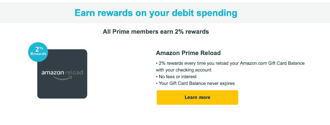
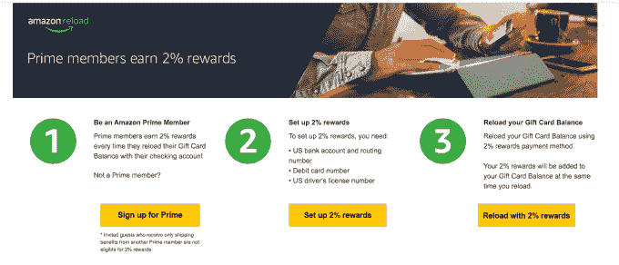

# 亚马逊推出 Prime Reload，为通过借记卡支付的购物提供 2%的退款 

> 原文：<https://web.archive.org/web/https://techcrunch.com/2017/06/13/amazon-launches-prime-reload-offering-2-back-on-purchases-funded-through-debit-cards/>

亚马逊今天为 Prime 会员推出了一项新的优惠，将给予他们购物返现——即使他们没有使用亚马逊返现信用卡支付商品。通过一个名为 [Amazon Prime Reload](https://web.archive.org/web/20221207102737/https://www.amazon.com/b?node=15452216011&ref=benefitmarketing) 的新奖励计划，Prime 会员首次使用银行支票账户附带的借记卡向亚马逊余额充值时，可以获得 2%的购物退款。

亚马逊 Prime Reload 旨在鼓励更多人注册 Prime，这是一个每年 99 美元的[会员计划](https://web.archive.org/web/20221207102737/https://www.amazon.com/Amazon-Prime-One-Year-Membership/dp/B00DBYBNEE)，包括数百万件产品的免费 2 天送货，加上选定市场的当天送货，以及一系列其他功能，如访问亚马逊类似网飞的服务 Prime Video，通过 Prime Music 播放音乐，通过 Prime Reading 免费电子书和杂志，音频频道，通过 Prime Photos 无限制备份和存储照片，Twitch Prime，提前获得交易等等。

然而，亚马逊 Prime Reload 对零售商来说还有另一个优势——它可能会鼓励人们向他们的亚马逊余额中存入大笔金额，以确保他们不会意外地直接通过借记卡或信用卡支付某件商品，从而错过现金返还选项。

随着亚马逊账户中的额外资金闲置，这可能会促使用户进行更多的即兴购买，因为他们不必计算商品是否是他们负担得起的。实际上，这感觉就像有一个礼品卡余额随时可以使用。

事实上，亚马逊 Prime Reload 是建立在已经存在的礼品卡基础设施之上的，根据[页面](https://web.archive.org/web/20221207102737/https://www.amazon.com/b?node=15452216011&ref=benefitmarketing)详细介绍了这项新服务的工作原理。

在这里，亚马逊解释了如何开始赚取奖励。

首先，如果你还没有注册，你需要一个主要会员。接下来，你需要向亚马逊提供你的借记卡号码和美国银行账户信息(账号和银行代码)，以及你的美国驾照号码。然后你继续充值你的礼品卡余额——也就是你的亚马逊余额——这样你就有资金在购物时使用。

亚马逊解释说，每次充值时，你的 2%奖励将被添加到你的礼品卡余额中，而不是按每笔交易计算。

亚马逊表示，它会要求您提供借记卡号码和银行信息，因为它有时会通过您的借记卡发送订单，以更快地满足您的充值请求。(然而，它没有说什么时候或者为什么会这样。)

在大多数情况下，重新充值将在 5 分钟内提供资金。然而，亚马逊表示，如果有必要进行更仔细的审查，一些重新装载可能会延迟 4 小时。

亚马逊 Reload 的推出是在 1 月份与大通银行合作推出亚马逊 Prime Rewards Visa 卡(T2)之后。该卡只提供给 Prime 会员，另外在餐馆、加油站和药店提供 2%的折扣，在所有其他购物上提供 1%的折扣。

亚马逊也有一个 Prime Store 卡，包括 5%的退款和特殊融资选项，如 12 个月无息同酬融资。

除了简单地奖励那些喜欢用借记卡支付的人，亚马逊 Prime Reload 也可以被视为零售商接触低收入购物者的另一种方式。该公司最近一直在瞄准这一消费者群体，包括早先推出的亚马逊现金(一种无需银行卡的购物方式)，以及最近为那些接受政府公共援助项目的人提供的[折扣优惠会员资格。](https://web.archive.org/web/20221207102737/https://beta.techcrunch.com/2017/06/06/amazon-launches-a-low-cost-version-of-prime-for-customers-on-government-assistance/)

关于亚马逊充值和其他返现信用卡的更多信息在亚马逊网站刚刚改版的 [Prime Rewards 部分。](https://web.archive.org/web/20221207102737/https://www.amazon.com/b/?node=16914437011)