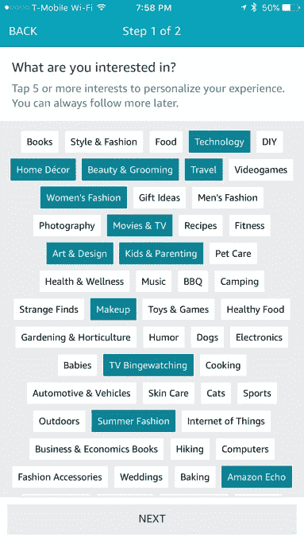

# 亚马逊推出了 Spark，这是一个针对主要会员的可购买的故事和照片源

> 原文：<https://web.archive.org/web/https://techcrunch.com/2017/07/18/amazon-launches-spark-a-shoppable-feed-of-stories-and-photos-aimed-at-prime-members/>

亚马逊今天推出了亚马逊星火，一个旨在改进产品发现的新功能，似乎是受 Instagram 及其可购买照片的使用的启发。同样，鼓励亚马逊 Spark 用户发布他们喜欢的产品的故事、想法和图片，其他人可以用评论和“微笑”来回应——这是亚马逊自己版本的“喜欢”或“最喜欢”按钮。

在今天面向美国消费者发布之前的几个月里，这家零售商一直在悄悄地测试亚马逊星火(Amazon Spark)的测试版。新计划的目标是将一些围绕非现场产品的社交活动转移回亚马逊，在亚马逊，产品灵感可以直接转化为点击按钮的购买行为。

这样，亚马逊 Spark 也可以被视为 Pinterest 的竞争对手，但该服务的实际形式是一个 feed 风格的界面——这就是为什么与 Instagram 相比似乎更合适。

要开始使用亚马逊 Spark，您必须使用亚马逊移动应用程序，因为该功能目前不是为桌面使用而设计的。

当您第一次加入 Spark 时——它可以通过应用程序导航中的“程序和功能”菜单选项获得——您需要选择至少五个您想关注的兴趣。利用这些信息，亚马逊火花将创建一个定制的产品，图像和想法的饲料，将涉及的东西，你喜欢购物，或了解更多。

您可以选择五个以上的兴趣，但您必须至少选择五个类别才能继续。

[gallery ids="1515883，1515888，1515880，1515889，1515884，1515881"]

这些兴趣各不相同，通常倾向于与亚马逊自己的流行商品类别相匹配，如“书籍”、“风格与时尚”、“技术”、“家居装饰”、“音乐”、“健身”、“玩具与游戏”等等。但也有一些小众类别，如“电视 Bingewatching”、“Cats”、“Internet of Things”、“BBQ”和其他更具体、更集中的类别。

一旦你完成了设置——还包括输入你的名字，并选择性地启用你的 Spark 帖子更新通知和评论回复——你就会看到一个产品创意和其他故事的大量图片。在某些情况下，这些帖子读起来更像是产品评论——例如，有人详细描述了他们对某件商品的个人体验。

其他时候，你可能只会看到一张漂亮的照片，那里出售的产品不太明显——类似于你在 Instagram 上看到的那种时尚灵感照片。

当一张照片包含亚马逊销售的产品时，右下角会有一个购物袋图标，上面有一个数字，表明照片中有多少物品可以在亚马逊的网站上购物。

例如，在下面的照片中，一个女人在约塞米蒂看日落，点击购物袋图标将带你到她戴的帽子的产品详情页面。

除了生活方式图片，Spark 帖子还可以包含产品照片、文本、链接或投票。

在亚马逊网站上购买照片的体验要比在 Instagram 上无缝得多，在 Instagram 上，时尚品牌的 insta gram 手柄通常会被标记在照片中，但你无法直接进入产品页面，查看标记的大量服装和配饰。

或者，如果你设法找到了有问题的产品，你有时会发现它不再销售或脱销。这不应该发生在亚马逊 Spark 上，这要感谢产品图片与亚马逊库存的联系方式。

在某种程度上，该零售商将亚马逊 Spark 视为产品评论的新前沿。有了 Spark，亚马逊不再奖励那些写下他们的想法和评价项目的“顶级评论者”，而是拥抱一个奖励那些“爱好者”的新系统。

发烧友还会收到一个徽章，在他们发帖 Spark 或写产品评论时出现。

任何人都可以通过向 Spark 投稿成为一名发烧友，但有一个条件——要发表文章，你必须是亚马逊的 Prime 会员。非 Prime 会员可以浏览 Spark 的 feed，但不能发帖或评论。

鼓励产品发现是亚马逊的一个新重点，它也一直在稳步升级其产品创意策划商店“有趣的发现”，通过一个名为“我的组合”的功能，根据用户的活动和购物模式提供[个性化建议它还](https://web.archive.org/web/20230316161342/https://techcrunch.com/2017/06/09/amazons-launches-my-mix-a-personalized-shop-filled-with-your-favorite-things/)[悄悄地开始测试它自己的只接受邀请的影响者项目](https://web.archive.org/web/20230316161342/https://techcrunch.com/2017/03/31/amazon-quietly-launches-its-own-social-media-influencer-program-into-beta/)，该项目允许消费者通过社交媒体上的影响者帖子与亚马逊产品联系。

亚马逊 Spark 与这两个早期项目没有直接联系，但它确实有一个类似的目标，即帮助人们更偶然地发现他们可能喜欢购买的新东西。

它还为生活在亚马逊上的社交网络奠定了基础，因为客户的用户档案——已经存在多年，但并不真正为人所知——现在成为亚马逊体验中更重要的一部分。

在未来，人们可以想象，用户也将能够通过他们的 Spark 帖子产生某种收入。从 Spark 上发布的产品建议中赚钱不是亚马逊今天准备讨论的这个项目的一个方面。但是，像这样一个吸引影响者的服务最终需要确定一个赚钱的角度，如果它真的想挑战 Instagram 的话——在 insta gram 上，最受关注的用户可以通过他们发布的照片和活动赚取[五六位数](https://web.archive.org/web/20230316161342/https://www.forbes.com/sites/clareoconnor/2017/04/10/earning-power-heres-how-much-top-influencers-can-make-on-instagram-and-youtube/#4e97331124db)。

然而，在短期内，亚马逊将专注于帮助 seed Spark 提供更多内容。例如，7 月 30 日，它将开始允许用户从个人资料中分享他们以前写的产品评论到 Spark。

亚马逊 Spark 今天在美国上市，仅在亚马逊 iPhone 应用程序中提供。