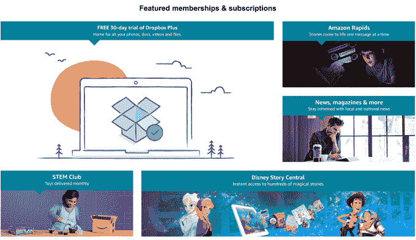
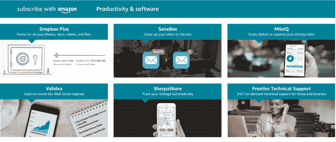
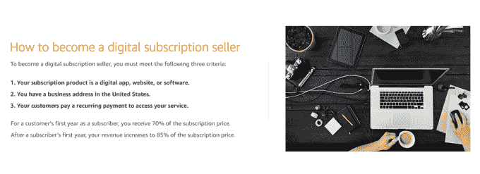

# 亚马逊推出“向亚马逊订阅”，这是一个数字订阅市场 

> 原文：<https://web.archive.org/web/https://techcrunch.com/2017/04/24/amazon-launches-subscribe-with-amazon-a-marketplace-for-digital-subscriptions/>

亚马逊在订阅业务方面取得了进展，为消费者提供了 Subscribe & Save 功能，如果你同意经常购买，可以提供产品折扣价格。现在，这家零售商正在寻求通过一个名为 [Subscribe with Amazon](https://web.archive.org/web/20221207133133/http://www.subscribewithamazon.com/) 的新项目来扩大其订阅范围，该项目旨在让亚马逊成为发现、订阅和管理一系列数字订阅的地方——从流媒体服务到基于订阅的应用程序，从膳食规划服务到在线健身课程等等。

这项服务从去年开始在[开发，并且已经在亚马逊的网站上安静地运行了一段时间。然而，它还没有被广泛推广给消费者——随着](https://web.archive.org/web/20221207133133/http://www.talkingnewmedia.com/2017/03/24/amazon-introduces-subscribe-with-amazon-service-for-apps-websites-and-software/)[宣布](https://web.archive.org/web/20221207133133/http://www.businesswire.com/news/home/20170424005365/en/Amazon-Launches-Self-Service-Marketplace-Subscription-Providers)开放注册，今天这种情况有所改变。

市场上许多可用的数字订阅都是亚马逊已经在销售的东西——比如[新闻和杂志订阅、](https://web.archive.org/web/20221207133133/https://www.amazon.com/b/ref=s9_acsd_aas_bw_clnk_r?_encoding=UTF8&node=14498703011&pd_rd_r=890YMJ2GQDPJBWWV6GE8&pd_rd_w=tGeEW&pd_rd_wg=Ea4VJ&pf_rd_m=ATVPDKIKX0DER&pf_rd_s=merchandised-search-7&pf_rd_r=890YMJ2GQDPJBWWV6GE8&pf_rd_r=890YMJ2GQDPJBWWV6GE8&pf_rd_t=101&pf_rd_p=e78d6205-a489-4b45-a6f6-7870e9e59fd6&pf_rd_p=e78d6205-a489-4b45-a6f6-7870e9e59fd6&pf_rd_i=14498690011)或访问其儿童阅读应用[亚马逊急流](https://web.archive.org/web/20221207133133/https://www.amazon.com/gp/product/B01M3OC7V4/ref=s9_acsd_aas_bw_c_x_3_w?ie=UTF8&pd_rd_r=890YMJ2GQDPJBWWV6GE8&pd_rd_w=b7LSq&pd_rd_wg=ZIHsd&pf_rd_m=ATVPDKIKX0DER&pf_rd_s=merchandised-search-5&pf_rd_r=890YMJ2GQDPJBWWV6GE8&pf_rd_r=890YMJ2GQDPJBWWV6GE8&pf_rd_t=101&pf_rd_p=5e4a6d11-78cc-4de9-85b9-89422b897bfe&pf_rd_p=5e4a6d11-78cc-4de9-85b9-89422b897bfe&pf_rd_i=14498690011)或[其每月玩具俱乐部](https://web.archive.org/web/20221207133133/https://beta.techcrunch.com/2017/01/24/amazon-launches-a-subscription-service-for-stem-toys/)、 [STEM 俱乐部](https://web.archive.org/web/20221207133133/https://www.amazon.com/gp/product/B01M71IUZ7/ref=s9_acss_bw_cg_swasffms_3a1_w?pf_rd_m=ATVPDKIKX0DER&pf_rd_s=merchandised-search-4&pf_rd_r=890YMJ2GQDPJBWWV6GE8&pf_rd_t=101&pf_rd_p=455f5fa8-b578-4b24-82b8-5b23f1dcc632&pf_rd_i=14498690011)。但是新的亚马逊订阅门户将所有不同类型的订阅聚集和组织在一个屋檐下。

它还为消费者提供了一个单一的目的地，可以通过在线仪表板管理这些订阅。

该网站上一些更著名的名字包括[迪士尼故事中心，](https://web.archive.org/web/20221207133133/https://www.amazon.com/gp/product/B01I0I49NC/ref=s9_acss_bw_cg_swasffms_3b1_w?pf_rd_m=ATVPDKIKX0DER&pf_rd_s=merchandised-search-4&pf_rd_r=252Q5B7B2EPGK4D33GCK&pf_rd_t=101&pf_rd_p=455f5fa8-b578-4b24-82b8-5b23f1dcc632&pf_rd_i=14498690011)一个以受欢迎的迪士尼角色为特色的儿童故事订阅服务； [Fitbit 的 Fitstar](https://web.archive.org/web/20221207133133/https://www.amazon.com/gp/product/B01JGYJIWQ/ref=s9_acss_bw_sc_swasftop_ar_s2_w?pf_rd_m=ATVPDKIKX0DER&pf_rd_s=merchandised-search-top-2&pf_rd_r=252Q5B7B2EPGK4D33GCK&pf_rd_r=252Q5B7B2EPGK4D33GCK&pf_rd_t=101&pf_rd_p=17571432-c21c-48f0-b805-88fb90c0ee85&pf_rd_p=17571432-c21c-48f0-b805-88fb90c0ee85&pf_rd_i=14498690011) 私教平台； [Creativebug 的线上美术和工艺课](https://web.archive.org/web/20221207133133/https://www.amazon.com/gp/product/B01C6KLFZU/ref=s9_acss_bw_sc_swasftop_ar_s4_w?pf_rd_m=ATVPDKIKX0DER&pf_rd_s=merchandised-search-top-2&pf_rd_r=252Q5B7B2EPGK4D33GCK&pf_rd_r=252Q5B7B2EPGK4D33GCK&pf_rd_t=101&pf_rd_p=17571432-c21c-48f0-b805-88fb90c0ee85&pf_rd_p=17571432-c21c-48f0-b805-88fb90c0ee85&pf_rd_i=14498690011)；云存储服务[Dropbox Plus](https://web.archive.org/web/20221207133133/https://www.amazon.com/gp/product/B01MTJ04P6/ref=s9_acss_bw_cg_swasffms_2a1_w?pf_rd_m=ATVPDKIKX0DER&pf_rd_s=merchandised-search-4&pf_rd_r=252Q5B7B2EPGK4D33GCK&pf_rd_t=101&pf_rd_p=455f5fa8-b578-4b24-82b8-5b23f1dcc632&pf_rd_i=14498690011)；流媒体电视服务[Sling TV；](https://web.archive.org/web/20221207133133/https://www.amazon.com/gp/product/B01J63J6OW/ref=s9_acsd_aas_bw_c_x_1_w?ie=UTF8&pd_rd_r=252Q5B7B2EPGK4D33GCK&pd_rd_w=dQ3wR&pd_rd_wg=M0vW4&pf_rd_m=ATVPDKIKX0DER&pf_rd_s=merchandised-search-6&pf_rd_r=252Q5B7B2EPGK4D33GCK&pf_rd_r=252Q5B7B2EPGK4D33GCK&pf_rd_t=101&pf_rd_p=f26cec8c-753b-4296-9a1c-d9e3d462a760&pf_rd_p=f26cec8c-753b-4296-9a1c-d9e3d462a760&pf_rd_i=14498690011)膳食计划和菜谱订阅[电子邮件](https://web.archive.org/web/20221207133133/https://www.amazon.com/gp/product/B06XG1TCW2/ref=s9_acsd_aas_bw_c_x_10_w?ie=UTF8&pd_rd_r=252Q5B7B2EPGK4D33GCK&pd_rd_w=dQ3wR&pd_rd_wg=M0vW4&pf_rd_m=ATVPDKIKX0DER&pf_rd_s=merchandised-search-6&pf_rd_r=252Q5B7B2EPGK4D33GCK&pf_rd_r=252Q5B7B2EPGK4D33GCK&pf_rd_t=101&pf_rd_p=f26cec8c-753b-4296-9a1c-d9e3d462a760&pf_rd_p=f26cec8c-753b-4296-9a1c-d9e3d462a760&pf_rd_i=14498690011)；演唱会会员服务[Jukely](https://web.archive.org/web/20221207133133/https://www.amazon.com/gp/product/B01N0C0M7A/ref=s9_acss_bw_cg_swasfssl_3a1_w?pf_rd_m=ATVPDKIKX0DER&pf_rd_s=merchandised-search-11&pf_rd_r=QEXGQ67CWNRRM2TXYTZX&pf_rd_t=101&pf_rd_p=31e31268-bd01-4237-960b-8ad7612fb903&pf_rd_i=14498690011)；和冥想服务[顶部空间](https://web.archive.org/web/20221207133133/https://www.amazon.com/gp/product/B01JNAV0W4/ref=s9_acsd_aas_bw_c_x_3_w?ie=UTF8&pd_rd_r=252Q5B7B2EPGK4D33GCK&pd_rd_w=dQ3wR&pd_rd_wg=M0vW4&pf_rd_m=ATVPDKIKX0DER&pf_rd_s=merchandised-search-6&pf_rd_r=252Q5B7B2EPGK4D33GCK&pf_rd_r=252Q5B7B2EPGK4D33GCK&pf_rd_t=101&pf_rd_p=f26cec8c-753b-4296-9a1c-d9e3d462a760&pf_rd_p=f26cec8c-753b-4296-9a1c-d9e3d462a760&pf_rd_i=14498690011)。

亚马逊还出售出版物的订阅，如《华尔街日报》、《芝加哥》、《论坛报》、《纽约客》和《消费者报告》。其他在发布时直播的包括 Texture、LegalZoom、MileIQ 和 Tawkify。

虽然还没有推出，但我们知道订阅鸡尾酒初创公司[Hooch](https://web.archive.org/web/20221207133133/https://hooch.co/),[在美国主要地铁](https://web.archive.org/web/20221207133133/https://beta.techcrunch.com/2016/10/11/hooch-raises-1-5m-to-expand-its-drink-a-day-subscription-cocktail-app/)的酒吧和俱乐部提供每天免费饮料，很快就会在网站上推出。Hooch 是一个有趣的合作伙伴，因为亚马逊必须在注册过程中验证用户的年龄。

Hooch 证实了它的参与，该公司提供了更多关于它为什么想要参与的见解——也就是说，超出了明显的客户获取游戏。

“亚马逊的客户将直接在 Amazon.com 门户网站上管理他们的订阅，”Hooch 首席执行官戴琳说。

“我们认为这对我们来说是积极的，因为很多时候我们的客户并不打算取消，但他们的信用卡到期了，或者他们搬到了一个新的公寓或不同的地址，他们忘记在 Hooch 上更新他们的地址，”他解释道。“但人们更有可能在亚马逊上更新支付方式，所以我们认为中断会更少。”

任何曾经不得不在网上更新信用卡信息的人都能理解这种挣扎。通常很难记住你已经注册的许多服务，并且单独更新每一个都是一件麻烦的事情。

亚马逊不会普遍解决这个问题，因为它不太可能向网飞或 Spotify 等竞争对手提供订阅服务，但它确实有可能将许多其他数字订阅整合到一个界面中，以便于管理。

这也是一些初创公司一直在解决的一个领域，包括 [Trim](https://web.archive.org/web/20221207133133/https://beta.techcrunch.com/2015/11/09/trim-will-find-and-cancel-your-subscriptions/) 、 [TrueBill](https://web.archive.org/web/20221207133133/https://beta.techcrunch.com/2016/02/02/truebill-wants-to-help-you-manage-your-online-subscriptions/) 和 [Billy](https://web.archive.org/web/20221207133133/https://beta.techcrunch.com/2016/04/01/billy-lets-you-track-your-subscriptions-and-bills-in-a-simple-app/) 。

对于消费者来说，订阅亚马逊门户网站的功能就像一个应用程序商店。不同的类型被分成不同的类别，如新闻和杂志、生活方式、教育、电影和电视(奇怪的是，它还提供精选视频租赁)、生产力和软件等等。

然而，门户网站并不是在 Amazon.com 上发现这些订阅的唯一途径。我们还知道，交叉促销将通过将订购与实体产品捆绑在一起来实现。例如，如果你正在购买鸡尾酒配方书，你可能会看到对[烈酒](https://web.archive.org/web/20221207133133/https://hooch.co/)的订阅，作为一个你可以捆绑购买的项目。这将通过锁定已经对类似产品表现出兴趣的客户来增加网站订阅的可发现性。

对于希望在网站上销售订阅的企业，亚马逊提供了自助服务工具，他们可以管理自己的定价，并利用亚马逊的 API 从亚马逊订阅服务接收订单和更新。

他们还能够为潜在客户提供各种价格计划——介绍性的、每月的、每年的甚至是 Prime 会员专属折扣。(Texture 是第一家提供优惠折扣的公司，其数字杂志服务六个月优惠 50%。)

佣金结构在亚马逊网站的页面[上有详细说明(见上图)，与苹果应用商店](https://web.archive.org/web/20221207133133/https://www.amazon.com/b?ie=UTF8&node=16284748011)现在使用的[相似。第一年，亚马逊从订阅销售额中抽取 30%的分成，一年后这一比例降至 15%。](https://web.archive.org/web/20221207133133/https://beta.techcrunch.com/2016/06/08/apple-to-introduce-search-ads-on-app-store-along-with-changes-to-app-review-discovery-and-splits/)

“多年来，亚马逊在会员和订阅领域积累了丰富的经验，在 Prime 和 Kindle Unlimited 等项目上进行创新，”亚马逊订阅总经理洛维娜·麦克默奇在一份声明中说。“今天，我们很高兴通过向订阅企业提供自助服务方式来扩展我们的选择，使他们的订阅可以提供给数百万亚马逊客户。”