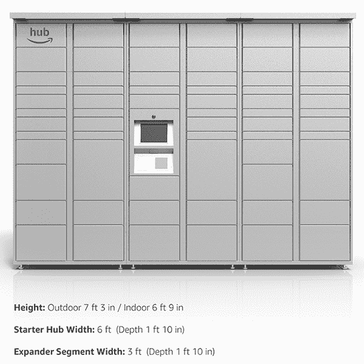

# 亚马逊推出面向公寓楼的包裹递送柜“The Hub”

> 原文：<https://web.archive.org/web/https://techcrunch.com/2017/07/27/amazon-launches-the-hub-parcel-delivery-lockers-for-apartment-buildings/>

亚马逊可能会越来越深入到媒体内容和云服务等一系列虚拟产品中，但它也在继续增加更多功能来锁定其业务的核心:电子商务市场和支撑它的庞大物流业务。

今天，亚马逊悄悄地推出了一项新服务，名为 [The Hub](https://web.archive.org/web/20221119065222/https://thehub.amazon.com/) ，这是一种安装在多租户住宅中的储物柜，这样居民就可以接收笨重的包裹，并在灵活的时间取货。这项服务的关键在于，亚马逊将它作为任何人的包裹递送选项，而不仅仅是亚马逊及其子公司。

“你可以在任何时候从任何寄件人、任何零售商那里拿到任何包裹，”网站上的一段宣传视频指出，视频滚动播放的包裹不仅来自亚马逊和 Zappos(亚马逊旗下)，还包括未具名的零售商，也许还有你的祖母。

该中心似乎是亚马逊运营多年的一项服务的发展，现在称为亚马逊储物柜，位于公共场所和零售商处的包裹交付储物柜，使交付和收取亚马逊包裹更加高效。

值得注意的是，储物柜和现在的这些枢纽都强调了亚马逊必须锁定物流和交付链中基本上不受其控制的部分的更大野心:最后一英里(甚至更具体地说是最后一英尺)交付。

这也是促使亚马逊开展一些早期工作的部分原因，这些工作涉及一些较新的服务，如运送包裹的无人机项目[prime air](https://web.archive.org/web/20221119065222/https://www.amazon.com/Amazon-Prime-Air/b?node=8037720011)；以及其收购特定市场的送货服务，如法国的 [Colis Prive](https://web.archive.org/web/20221119065222/http://www.seattletimes.com/business/amazon/amazons-delivery-ambitions-take-on-industry-giants/) 。

所有这些努力让亚马逊对包裹如何到达顾客手中有了更多的控制权，并有可能降低更多的运送成本。这对于为 Prime 这样的服务提供更好的利润尤为重要，Prime 是亚马逊的会员计划，为用户提供数千种商品的免费运输(以及一系列其他福利)。

今天早些时候，当亚马逊报告其季度[收益](https://web.archive.org/web/20221119065222/https://beta.techcrunch.com/2017/07/27/jeff-bezos-brief-stint-as-worlds-richest-human-ends-with-amazons-second-quarter-whiff/)时，其净收入下降了约 6.5 亿美元，每股收益低于预期超过 1 美元，部分原因是它正在进行投资以实现增长。提高利润率是它最终将不得不做的事情，今天推出这项服务很可能是亚马逊的一个微妙迹象，表明它可能会这样做。

同样不可低估的是像 Hub 这样的努力的更大影响，超出了亚马逊本身。事实上，亚马逊不仅为自己的包裹，也为任何人的包裹提供枢纽，这也使亚马逊与昔日的合作伙伴[如联邦快递、UPS](https://web.archive.org/web/20221119065222/https://www.bloomberg.com/features/2016-amazon-delivery/) 和 DHL 展开了激烈的竞争。

DHL 碰巧有自己的基于住所的储物柜系统，即[包裹站](https://web.archive.org/web/20221119065222/http://www.dpdhl.com/de/presse/mediathek/fotos/dhl_packstation_service_01.html)。它不是唯一一个在这个领域有所行动的公司。正如亚马逊涉足的许多领域一样，也有一些初创公司试图建立业务来解决同样的问题:它们包括 [Package Concierge](https://web.archive.org/web/20221119065222/http://packageconcierge.com/) 和 [Luxer One](https://web.archive.org/web/20221119065222/https://luxerone.com/) 。谷歌拥有另一个潜在竞争对手 BufferBox 的资产，它于 2012 年[收购了 buffer box，但后来关闭了。](https://web.archive.org/web/20221119065222/https://beta.techcrunch.com/2012/11/30/google-acquires-waterloo-based-e-commerce-startup-amazon-locker-competitor-and-yc-graduate-bufferbox/)

与亚马逊储物柜一样，该中心也在解决消费者、快递公司和亚马逊本身的一个重大痛点:如果你买了一些无法送到你常规邮箱的大件物品，确保你收到它涉及太多的变量。

除非你的公寓大楼里有门房，否则包裹要么被转送到包裹仓库，要么你不得不依靠邻居的善意来帮你拿，要么它们被送到你所在大楼的管理办公室，而该办公室可能不会一直开放。

亚马逊在其宣传材料中指出:“Hub by Amazon 将自助服务交付和值得信赖的客户支持结合在一起，创建了一个值得信赖的包裹管理解决方案。”。

亚马逊没有回应我们要求提供更多信息的请求，但作为一个对比，在 Luxer One 的一项竞争服务中，安装包裹锁的费用似乎在 6000 美元到 20000 美元之间，外加服务费，这些费用可能是由房东和业主以更高的租金或其他每月服务费的形式计算的。这给了亚马逊一个巨大的机会，通过削减这一利润来削弱竞争(正如亚马逊在其业务的许多其他领域所做的那样)。

但竞争对手声称，成本并不是唯一的潜在不利因素。Luxer One 认为提供“不可知论者”服务更私密。

“像亚马逊这样的零售商拥有包裹柜，他们可能会收集个人数据(人口统计、订单频率、商店偏好、包裹大小等。)不仅影响他们自己的顾客，也影响所有其他零售商的顾客，”一位发言人说。“如果使用与一个主要账户相关，你可以想象他们能够瞄准的产品，所有这些都基于第三方零售商的购买。为消费者回避了重大的隐私和安全问题，更不用说在零售商和他们的送货承运人合同之间周旋了。”

目前，看起来亚马逊的 Hub——有室内和室外版本，通过数字键盘打开——是为私人住宅设计的:当你点击进入申请在自己的财产上获得 Hub 的部分时，你会被带到一份问卷，询问你是否是财产所有者，以及你是否是公寓/公寓、办公室或房子的所有者。似乎你不能进入问题的后续页面，除非你表明你是一栋公寓楼的业主，但考虑到列表中的其他选项，可能会有一些计划扩展到其他类型的位置。

它将集线器描述为“可以轻松安装在各种场所的模块化系统”它有两种尺寸，一种是 6 英尺宽、有 42 个隔间的启动轮毂；和一个可增加 23 个隔间的扩展器段。“这些模块相互链接，为您的酒店需求提供合适的容量，”亚马逊指出。“所有的隔间大小和布局都是预先配置好的，所以没必要猜测你需要什么类型的隔间。”

我们正在向亚马逊询问更多细节，比如定价。

更新了 Luxer One 的评论。