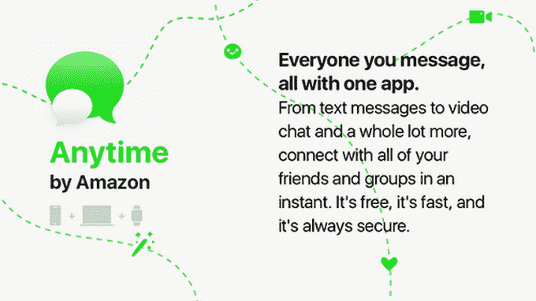
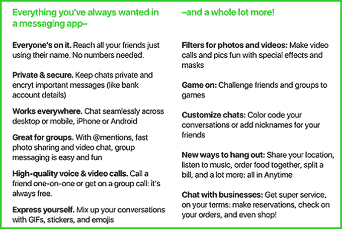

# 亚马逊正在开发一款名为 Anytime 的新消息应用吗？

> 原文：<https://web.archive.org/web/https://techcrunch.com/2017/07/14/amazon-messaging-app-anytime/>

如今，通讯应用是消费者最受欢迎的沟通方式之一，不仅是相互之间，而且越来越多地与企业和服务进行沟通。现在有迹象表明，除了脸书、Snapchat、微信等更成熟的服务之外，我们可能会看到另一个大玩家进入消息传递领域。

亚马逊似乎正在试探一项名为 Anytime 的新服务的市场，这是一款功能齐全的独立消息应用程序，适用于智能手机、平板电脑、个人电脑和智能手表，旨在让人们用文本和视频聊天，用滤镜互相发送有趣的照片，玩游戏，参与音乐和食品订购(以及其他购物)等亚马逊服务，并与企业互动。

据 [AFTV 新闻](https://web.archive.org/web/20221207073151/http://www.aftvnews.com/amazon-possibly-working-on-new-stand-alone-messaging-app-called-anytime/)报道，该公司一直在进行一项调查，以获得对新应用的反馈，该新闻发布了截图，详细介绍了 Anytime 名称和一些功能，由一名声称收到调查的用户提供。

调查中的描述指出，该应用程序还允许人们在不知道自己电话号码的情况下相互联系——这是 WhatsApp 或 Viber 等其他通讯应用程序的常见连接器。“只需使用朋友的名字就可以联系到他们。不需要数字，”它指出。

值得注意的是，AFTV 分享的一个调查页面在描述该应用隐私的部分也有一个错别字:“保持聊天隐私，加密重要信息，”它写道。这可能表明这不是亚马逊的真实调查，或者亚马逊市场研究团队的某个人没有进行拼写检查。这不会是亚马逊的第一个错别字。

我们已经联系了亚马逊，询问所有这些问题。该公司已经承认了这个问题，但没有做出回应。与此同时，我们环顾四周，目前为止在互联网上找不到任何指向任何时间存在的线索。

然而，亚马逊推出消费者信息应用的想法并不那么遥不可及。原因有很多:

首先，亚马逊已经在为企业和消费者建立消息服务。

在企业方面，该公司的 AWS 部门今年早些时候发布了一项名为 [Chime](https://web.archive.org/web/20221207073151/https://beta.techcrunch.com/2017/02/13/amazon-chime/) 的通信服务，包括消息和视频会议功能。这款应用在一定程度上使用了亚马逊通过从几家不同的初创公司收购人才和技术而获得的技术，包括视频会议应用 [Biba](https://web.archive.org/web/20221207073151/https://beta.techcrunch.com/2016/11/23/justin-biba-amazon-video/) 和会议生产力服务 [Do](https://web.archive.org/web/20221207073151/https://beta.techcrunch.com/2017/03/08/amazon-can-do-chime/) 。

有趣的是，正如我们当时指出的那样，我们发现了收购 Biba 的证据，该公司可以很容易地将该技术用于企业服务(似乎已经这样做了)，但它也有可能找到进入消费产品的方法。这可能是其中一种产品。

同样值得注意的是，亚马逊已经开始涉足消费者通信领域，即 Alexa Calling。

正如我们在 5 月份推出免费通话和信息服务[时指出的那样，我们认为值得注意的是，亚马逊从一开始就在 Echo 设备生态系统之外扩展通信体验:人们也可以在智能手机和其他硬件上使用他们的 Alexa 应用程序相互通信。](https://web.archive.org/web/20221207073151/https://beta.techcrunch.com/2017/05/09/amazon-enables-free-calls-and-messages-on-all-echo-devices-with-alexa-calling/)

亚马逊将开发一个更专注的、独立的信息体验，作为其发展的一部分，这很有意义。

还有亚马逊的长局要考虑。回到 1998 年，大约 20 年前，亚马逊收购了波士顿的一家名为 PlanetAll 的初创公司，这可能是脸书的早期前身(一直到哈佛的血统)。

亚马逊的创始人兼首席执行官杰夫·贝索斯[当时指出](https://web.archive.org/web/20221207073151/http://www.internetnews.com/bus-news/article.php/21851) PlanetAll 是“我所见过的互联网最具创新性的应用……它只是在做像保持联系这样基本而重要的事情上的一个突破。PlanetAll 拥有超过 150 万会员的原因很简单——而且增长速度甚至超过了互联网——它为用户创造了非凡的价值。我相信 PlanetAll 将被证明是最重要的在线应用之一。”

考虑到脸书在当今世界所代表的意义，这是一句至理名言。然而，亚马逊最终在 2000 年关闭了 PlanetAll，将它的一些推荐技术整合到它的市场中。

值得注意的是，它已经[持有 PlanetAll 的社交网络专利](https://web.archive.org/web/20221207073151/http://patft.uspto.gov/netacgi/nph-Parser?Sect1=PTO1&Sect2=HITOFF&d=PALL&p=1&u=/netahtml/PTO/srchnum.htm&r=1&f=G&l=50&s1=7,739,139.PN.&OS=PN/7,739,139&RS=PN/7,739,139)(以及【PlanetAll.net】的[重定向到亚马逊网站](https://web.archive.org/web/20221207073151/http://planetall.net/))。我们现在看到的可能是亚马逊重返这一领域的举措之一。

我们在 TC 得到的其他暗示表明，亚马逊正在实施一项更大的社交网络战略。我们在 2016 年得到的一个提示总结道:“有人需要在亚马逊的新绝密社交媒体平台上做一些调查，据说该平台是脸书的竞争对手，”它写道。“这不是 Goodreads，这是将与亚马逊整合的完全不同的东西。”(在我们得到这条消息时，亚马逊从未回复我们的置评请求。)

我在[5 月](https://web.archive.org/web/20221207073151/https://beta.techcrunch.com/2017/05/09/amazon-enables-free-calls-and-messages-on-all-echo-devices-with-alexa-calling/)推测 Alexa 来电可能与此有关；任何时候(或者不管这个应用叫什么名字)都可以。

这里还有其他值得注意的先例。被一些人称为“日本亚马逊”的乐天于 2014 年收购了自己的即时通讯应用 Viber 。Viber 现在正致力于与其他乐天服务的更多整合，包括购物推荐。

消息服务在过去几年里发展了很多，现在已经不仅仅用于简单的文本消息和免费通话。脸书和来自亚洲的应用程序，如 Line 和微信，已经率先推出了新功能，如基于人工智能的机器人，供用户与企业沟通和获取信息，以及购买物品、玩游戏等。

亚马逊在社交销售方面有成功也有失败(AmazonCart 发生了什么事？)但尽管如此，我的猜测是，它不想失去在这些平台上发生的任何客户交易的所有权。拥有自己的消息服务——用户已经通过 Alexa 在 Echo 上与亚马逊进行的对话的延伸——将使它创造出更紧密集成的体验，如团体订餐和团体音乐欣赏。为了与亚马逊开发 Echo 和 Fire 平板电脑等产品的方式保持一致，亚马逊从一开始就试图与其他产品建立协同效应。

随着我们了解更多，我们将更新这篇文章。(如果你了解 Anytime 或亚马逊在社交领域的其他活动，[联系](https://web.archive.org/web/20221207073151/https://beta.techcrunch.com/got-a-tip/)。)

*更新*:亚马逊没有回应，但一个可靠的消息来源证实，该公司正在开发一个新的消息应用。

“我在国内的任何地方都听到过这种叫法，”他说。“亚马逊可能会尝试使用 Fire 品牌。但我认为这不会发生。问题是，这是一种完全基于社交网络的扩张，社交购物是其中的一部分。”

他还补充说，这可能是一个完全不同的名字，可能包含其他功能:他指出，亚马逊的 Twitch 和 Alexa 团队最近也在合作，探索创造更多社交购物体验的方法，包括聊天和视频。

这里还有一些值得思考的事情:当我写[亚马逊悄悄收购 Biba](https://web.archive.org/web/20221207073151/https://beta.techcrunch.com/2016/11/23/justin-biba-amazon-video/) 时，我注意到它以“Justin Acquisition”而不是亚马逊的名义进行交易的公司，我想知道这是否是对亚马逊建立更多通讯工具的长期参考，这些工具可能会进入它已经通过 Twitch 取得的一些通讯领域。游戏网络已经提供了一个名为 [Twitch Messenger](https://web.archive.org/web/20221207073151/https://itunes.apple.com/us/app/twitch-messenger/id935720218?mt=8) 的独立应用程序有一段时间了。