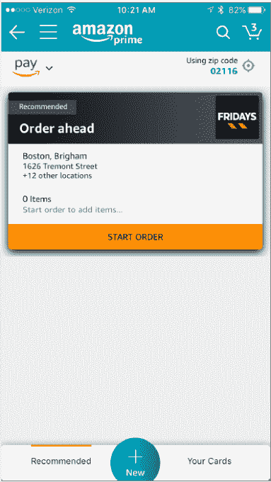

# Amazon Pay Places 让你可以用你的亚马逊信息支付现实世界的购物，从 TGI 星期五的订单开始 

> 原文：<https://web.archive.org/web/https://techcrunch.com/2017/07/19/amazon-pay-places-lets-you-pay-for-real-world-shopping-using-your-amazon-info-starting-with-tgi-fridays-to-go-orders/>

亚马逊今天推出了一项名为 Amazon Pay Places 的新功能，允许客户使用他们的亚马逊应用程序支付店内和提前订购购物体验。也就是说，在现实世界中购物时，你可以只使用你的亚马逊账户信息，而不是使用现金、支票、信用卡或借记卡。Pay Places 的第一次实施涉及与 TGI 星期五连锁餐厅的合作，但我们知道这一功能将在未来更多的店内和现实世界应用中得到支持。

作为亚马逊支付平台的合作伙伴，TGI 星期五是目前唯一可以使用该功能的地方。它在美国的连锁餐厅也不是很普遍。目前只有波士顿、费城、巴尔的摩、华盛顿特区、弗吉尼亚州里士满和宾夕法尼亚州威尔克斯-巴雷的亚马逊客户能够利用这一功能。

要访问 Amazon Pay Places，您需要 Amazon mobile 应用程序。启动后，点击下拉菜单进入应用导航，然后点击“程序与功能”

Amazon Pay Places 将在这部分支持的市场中提供。

在那里，你可以浏览 TGI 星期五的菜单，并直接通过应用程序下单。

使用亚马逊支付餐厅外卖订单是有意义的，因为它简化了下外卖订单的传统方式——通过电话给餐厅打电话并提供您的支付信息，下载餐厅专用的移动应用程序，或访问餐厅的在线订购页面。

但亚马逊的意图是将亚马逊支付的范围扩大到餐厅以外。不难想象，未来亚马逊旗下的全食超市(Whole Foods)会利用这一功能为[顾客](https://web.archive.org/web/20221207181716/http://www.wholefoodsmarket.com/tags/curbside-pickup) [提货](https://web.archive.org/web/20221207181716/https://www.wholefoodsmarket.com/shop/choose)订单提供服务。

据《T4 邮报》报道，与亚马逊餐厅不同，亚马逊餐厅与亚马逊的订单分成比例相当高，亚马逊支付平台是亚马逊支付的新功能。

Amazon Pay 在很大程度上是亚马逊自己的替代产品，类似于 PayPal。也就是说，它让在线商家能够在其网站的结账页面上添加一个按钮，让购物者通过他们的亚马逊账户信息进行支付。这样做的想法是，顾客更有可能不会放弃购物车，结账速度也会加快。

亚马逊支付对每笔交易收取 2.9%以上 0.30 美元的费用，也像贝宝一样。

这家零售商没有透露目前有多少商家在使用其支付平台，但[在 2 月份，它宣布迄今为止已有超过 3300 万顾客](https://web.archive.org/web/20221207181716/https://beta.techcrunch.com/2017/02/07/amazon-payments-nearly-doubled-transaction-volume-in-2016-added-10-million-more-customers/)使用亚马逊支付进行购物——这一数字比 2016 年 4 月的[2300 万增加了 1000 万。](https://web.archive.org/web/20221207181716/https://beta.techcrunch.com/2016/04/04/amazon-takes-on-paypal-and-others-with-launch-of-amazon-payments-partner-program/)

虽然亚马逊支付通常与电子商务联系在一起，但亚马逊也在慢慢地将其推广到现实世界。例如，[亚马逊去年与奢侈品服装商 Moda Operandi 合作，](https://web.archive.org/web/20221207181716/http://www.seattletimes.com/business/amazon/amazon-partners-with-luxury-clothing-merchant-in-click-and-collect-model/)允许店内顾客使用他们的亚马逊账户信息支付他们之前在网上选择的服装。

Amazon Pay Places 代表了 Amazon Pay out 在现实世界中的第二个用例。

这家零售商没有透露亚马逊 Pay Places 何时会进入其他市场或展示新的合作伙伴，但这肯定是一个值得关注的领域。