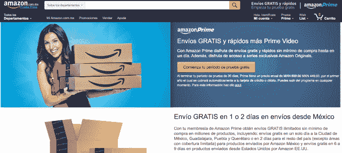

# 亚马逊 Prime 在墨西哥发布

> 原文：<https://web.archive.org/web/https://techcrunch.com/2017/03/07/amazon-prime-launches-in-mexico/>

亚马逊今天下午宣布，其年度会员计划 Amazon Prime 现已在墨西哥推出。这项服务将为超过 2000 万件商品提供无限制的免费运输，第一年的价格为 449 比索(23 美元)，第二年的标准价格为 899 比索(46 美元)。

这一举动距离亚马逊通过 Amazon.com.mx 在 T2 启动全面运营不到两年。该网站的西班牙语版本提供了数百万种商品，包括消费电子产品、厨房和家居用品、运动器材、工具、婴儿用品、健康和个人护理产品、珠宝、音乐、书籍、电影、软件等。

该公司还在 T4 提供亚马逊服务。

亚马逊 Prime 的墨西哥版不如美国版功能齐全。相反，它主要专注于提供免费送货，包括在某些地区提供 1 天或当天送货，以及访问亚马逊 Prime Video。

亚马逊在新国家推出 Prime 的标准做法是只提供快速免费送货。但墨西哥是这家零售商首次在第一天同时推出 Prime shipping 和 Prime Video。

墨西哥在第一天也有最大的 Prime 合格选择，这也是 Prime 在拉丁美洲的首次发布。

在墨西哥城、瓜达拉哈拉、普埃布拉和克雷塔罗，客户可以为特定数量的合格产品申请 1 天免费送货服务。在墨西哥城大都会区，数千种产品也可以当天送达。

亚马逊 ee 上的商品也有折扣和免运费，而且没有最低购买量。UU，订单发货后 6 到 9 天到达。

与此同时，亚马逊 Prime 视频服务将提供“数百部受欢迎的电影和电视节目”，亚马逊表示，包括其原创系列“丛林中的莫扎特”，由墨西哥演员盖尔·加西亚·贝纳尔主演。其他亚马逊节目，如《歌利亚》(Goliath)、《透明》(Transparent)、《城堡里的男人》(The Man in the High Castle)、《大旅行》(The Grand Tour)、《卑鄙的皮特》(Sneaky Pete)、《博施》(Bosch)等也将加入，随后是今年晚些时候上映的《美国众神》(American Gods)、《爱国者》(Patriot)和《滴答》(The Tick)。

据英国《金融时报》报道，根据 Statista 的估计，Prime Video 将在该地区与网飞竞争，后者在该地区约有 120 万用户。他们的报告还提到了亚马逊 Prime 在墨西哥推出的幸运时机:墨西哥比索在特朗普获胜后下跌，最近有所回升，消费者信心在 2 月份有所上升。(高盛(Goldman Sachs)的数据显示，2 月份经季节调整后，环比增长 11.1%。)

墨西哥是拉丁美洲第二大经济体，仅次于巴西，预计到 2018 年，墨西哥的网上销售额将达到 60 亿美元，高于 2015 年的 29 亿美元。

亚马逊不是唯一一家在墨西哥争夺关注的电子商务零售商，也不是唯一的主要零售商。去年 12 月，沃尔玛[宣布](https://web.archive.org/web/20230324024533/https://www.internetretailer.com/2016/12/12/wal-mart-de-mexico-boost-e-commerce-13-billion-investment)将投资 13 亿美元改善墨西哥的物流，包括建设新的配送中心——为其电子商务业务和实体店服务。