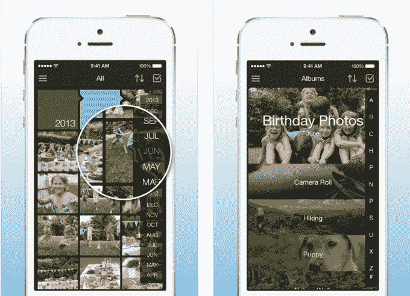

# 亚马逊 Prime 会员的最新福利是免费的无限照片存储 

> 原文：<https://web.archive.org/web/https://techcrunch.com/2014/11/04/amazon-prime-members-newest-benefit-is-free-unlimited-photo-storage/>

亚马逊 Prime 会员今天得到了另一个好处，该公司今天早上宣布:免费，无限的照片存储。在一项名为 Prime Photos 的新服务中，亚马逊会员计划的付费用户现在可以从任何设备上将照片以原始分辨率存储到亚马逊云驱动器中，包括 iOS、Android、Fire 手机和平板电脑，以及 Mac 和 Windows PCs。

这些照片可以在这些设备上观看，也可以通过亚马逊 Fire TV、[新的 Fire 电视棒](https://web.archive.org/web/20221006212748/https://beta.techcrunch.com/2014/10/27/amazon-fire-tv-stick/)、PlayStation 3 和 PlayStation 4 等游戏机以及 LG 和三星的一些型号的智能电视在大屏幕上观看。

为了开始使用 Prime Photos，亚马逊 Prime 订户现在可以访问新服务的主页(位于 www.amazon.com/primephotos[，以便下载 Cloud Drive Photos iOS 或 Android 应用程序，如果他们还没有安装的话，或者获得 Cloud Drive Windows 上传应用程序。(该网站告诉访问者，Mac 版本正在开发中。与此同时，Mac 桌面用户可以从 web 浏览器登录或使用他们选择的移动应用程序)。](https://web.archive.org/web/20221006212748/http://www.amazon.com/primephotos)

这款应用之前已经推出，但在定价之前对照片的免费存储空间有限制，允许用户以时间轴格式查看照片，在拍照时自动保存照片，并通过脸书、电子邮件和其他应用分享照片。

当然，对于订购 Fire 手机的亚马逊少数客户来说，亚马逊云驱动的照片存储选项已经内置。事实上，这是亚马逊进入智能手机市场的最初卖点之一。在 Fire 手机和平板电脑上，客户不需要下载应用程序——他们可以从设备上的照片部分访问他们的云驱动器图像。

## Prime 不涨价

亚马逊表示，额外的好处不会影响亚马逊 Prime 会员的费用，现在是每年 99 美元，今年早些时候宣布的价格上涨会导致会员放弃这项服务。事实证明情况并非如此。尽管亚马逊的收益令人沮丧，T2 的损失超过预期，T4 对 Fire Phone 的损失巨大，但 Prime 会员似乎是一个亮点。

[亚马逊首席财务官 Tom Szkutak 表示，自从价格上涨以来，这项服务](https://web.archive.org/web/20221006212748/http://seattletimes.com/html/businesstechnology/2024853575_amazonearningsxml.html)获得了“巨大的保留”,并表示“该项目发展非常快”除了说“数千万”之外，亚马逊没有透露其会员数量，但一些分析师估计 Prime 订户有 5000 万。除了 Prime Photos，会员还可以获得超过 2000 万件商品的两天免费送货服务，Prime Instant Video 上的数万个流媒体标题，Prime Music 上的 100 万首歌曲和数百个播放列表，Kindle 用户的借阅图书馆中的 60 多万本书籍，以及早期选择闪电交易。

该公司告诉 TechCrunch，非 Prime 和 Prime 用户将继续在亚马逊云驱动器上获得 5 GB 的免费存储空间，这相当于多达 2000 张照片。建立在亚马逊网络服务基础上的云驱动服务也允许用户存储音乐、视频和文档。但只有付费用户才能使用无限存储选项——亚马逊不会向非 Prime 会员提供相同的存储层，即使是收费的。

## 相对于竞争对手

亚马逊并不是第一家为客户提供大规模照片存储计划的科技公司——谷歌、脸书、雅虎的 Flickr 和苹果也是如此，但往往会有限制。在谷歌的例子中，[用户可以上传](https://web.archive.org/web/20221006212748/https://support.google.com/plus/answer/156348?hl=en)无限数量的标准尺寸照片，但全尺寸照片将计入他们的 Google Drive 存储配额。脸书提供无限制的照片存储，但是[限制相册](https://web.archive.org/web/20221006212748/https://www.facebook.com/help/227794810567981)为 1000 张照片，[默认](https://web.archive.org/web/20221006212748/http://petapixel.com/2010/03/13/dont-use-facebook-for-photo-storage/)为低分辨率照片，除非你[告诉它](https://web.archive.org/web/20221006212748/https://www.facebook.com/help/187741037945488)不然。Flickr 提供 1 TB 的免费存储空间(非常接近“无限”的感觉)，但包括[文件](https://web.archive.org/web/20221006212748/https://help.yahoo.com/kb/flickr/upload-limitations-flickr-sln15628.html)和[上传限制](https://web.archive.org/web/20221006212748/https://www.flickr.com/help/limits/#150427010)。而苹果最大的计划——1tb——[价格昂贵](https://web.archive.org/web/20221006212748/http://support.apple.com/en-us/HT5879)。

亚马逊表示，Prime Photos 不会有任何文件或上传限制。客户可以从任何设备上传原始文件大小的照片。但亚马逊的问题是，与苹果和谷歌等公司不同，它自己的智能手机客户很少，因此在让新用户使用其移动应用方面，它受应用商店动态的支配。与 Flickr 和脸书不同，它不被认为是一家照片分享是常态的“社交”公司。

尽管如此，这项服务确实利用了亚马逊最大的两个优势——对网络服务的投资和广受欢迎的订阅服务。现在，它已经有了让无限照片存储成为商品的基础设施，主要玩家将不得不在功能集上竞争。在这方面，谷歌凭借其自动照片编辑技术有可能处于领先地位，该技术可以将照片系列转换成类似 GIF 的动画图像，T2 创造故事，T4 创造故事。随着时间的推移，像这样的功能与智能搜索技术相结合，将使照片存储服务脱颖而出。毕竟如果找不到或者欣赏不到自己喜欢的照片，无限存储又有什么用呢？