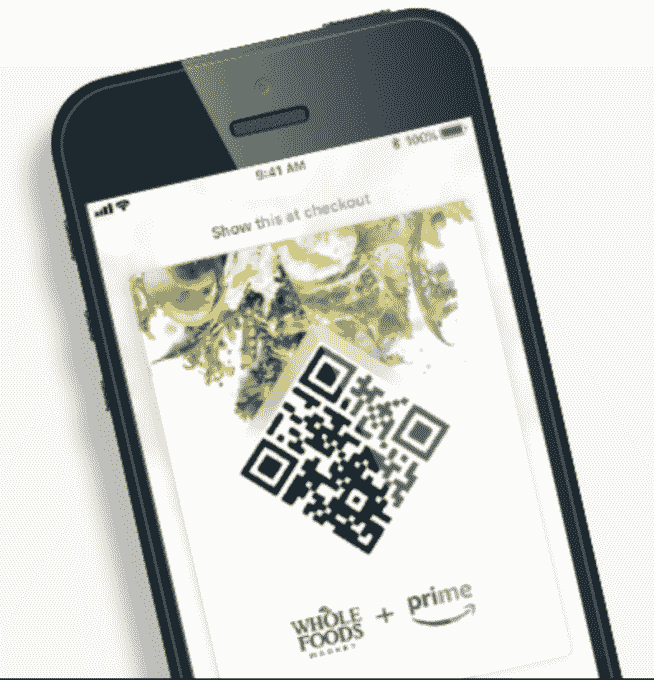
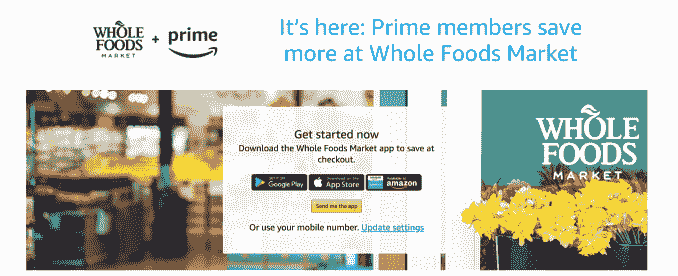
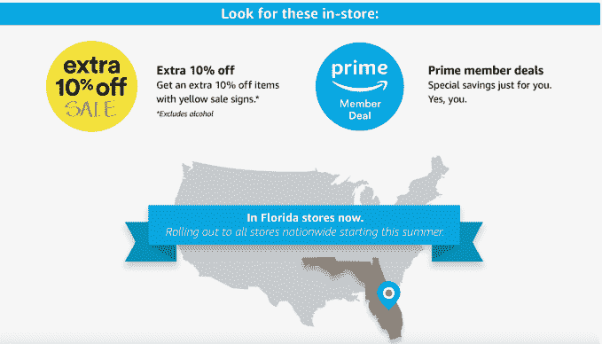

# 亚马逊 Prime 会员现在可以在全食超市获得 10%的折扣，外加其他每周折扣

> 原文：<https://web.archive.org/web/https://techcrunch.com/2018/05/15/amazon-prime-members-will-get-10-off-sale-items-at-whole-foods-plus-other-weekly-discounts/>

亚马逊今天宣布，它将开始向在全食超市购物的 Prime 会员提供独家折扣——自从亚马逊去年以 137 亿美元收购杂货商 T1，以及最近 T2 关闭全食超市的奖励计划和数字优惠券 T3 以来，人们就一直在期待这一举措。亚马逊表示，从今天开始，Prime 会员将能够在全食超市的数百种销售商品中获得 10%的折扣，并在畅销书中获得其他“每周深度折扣”。

这种节省最初在佛罗里达州的全食商店推出，但从今年夏天开始，将扩展到美国所有的全食超市和全食超市 365 家商店。

全食超市目前在美国、加拿大和英国总共有超过 470 家门店，但大多数(463 家)都在美国

亚马逊在利用其对实体杂货连锁店的投资方面做得相当迅速。几乎是在收购后不久，它就开始削减全食超市的价格。而且它已经向 Prime 会员提供了特别优惠券，帮助他们节省更多的时间——例如，当[打折感恩节火鸡](https://web.archive.org/web/20230324192721/https://techcrunch.com/2017/11/15/amazons-latest-whole-foods-price-cuts-include-deeper-discounts-for-prime-members/)时。

今天的新闻是将之前的努力正式确定为一个标准的奖励计划，Prime 会员可以在持续的基础上享受 10%的折扣，此外还有其他精选商品的每周折扣。这些将在店内分别贴上黄色的“10%折扣”销售标志和“高级会员交易”标志。

例如，本周(5/16-5/22)，受支持商店的 Prime 会员将享受以下优惠:

*   可持续来源的野生比目鱼排:9.99 美元/磅。，每磅节省 10 美元。
*   有机草莓:1 磅。2.99 美元，节省 2 美元
*   Allegro 咖啡吧的冷煮咖啡:16 盎司打五折。
*   格兰诺拉麦片:11 盎司。包 2/6 美元
*   365 日常价值苏打水:12 个装，买一送一
*   神奇蘑菇粉:五折

杂货店通常会提供每周优惠，但在全食超市的情况下，顾客不必注册会员卡或从通知中剪下优惠券——他们必须加入亚马逊 Prime 才能享受这些优惠。这对已经购买全食超市的 Prime 会员来说可能是一个诱惑，但鉴于其现有的高价声誉，这可能会使注重价格的购物者进一步远离连锁店。

为了利用这项新计划，Prime 会员需要全食超市的移动应用程序，他们用自己的亚马逊账户登录，然后在结账时扫描应用程序的“Prime Code”条形码，以申请适当的折扣。或者，如果愿意，他们可以选择在结账时使用他们的电话号码。

亚马逊还建立了一个专门的网站来获取更多关于折扣计划的信息([amazon.com/primesavings](https://web.archive.org/web/20230324192721/http://amazon.com/primesavings))。

这些店内节省并不是亚马逊将全食超市与其更大业务捆绑在一起的唯一方式。

亚马逊表示，这些公司还通过亚马逊的 Prime Now 服务在全美 10 个城市推出了全食超市的[两小时送货服务，今年还将推出更多服务。此外，亚马逊 Prime 会员](https://web.archive.org/web/20230324192721/https://techcrunch.com/2018/02/07/amazon-whole-foods-integration/)[用亚马逊 Prime Rewards Visa 卡购买全食食品可以获得 5%的退款](https://web.archive.org/web/20230324192721/https://www.nerdwallet.com/blog/credit-cards/amazon-prime-rewards-visa-whole-foods-5-percent-back/)，这些公司今年早些时候宣布。

商店本身也是亚马逊在线商店的实体存在，在近 400 家商店提供亚马逊储物柜和支持[退货](https://web.archive.org/web/20230324192721/https://www.amazon.com/gp/help/customer/display.html?nodeId=201262520)等东西[，另外还可以在一些商店购买亚马逊硬件，如 Echo 扬声器和 Fire TV。](https://web.archive.org/web/20230324192721/https://www.reuters.com/article/us-amazon-com-wholefoods/short-visits-rise-at-whole-foods-stores-with-amazon-lockers-idUSKBN1H20NE)

亚马逊 Prime 副总裁杰姆·西贝(Cem Sibay)在关于折扣计划启动的声明中表示:“全食超市的这一新优惠是健康和美味食品的完美结合，价格更实惠。”“我们的愿景是，每天的 Prime 让你的生活更美好、更轻松、更有趣，在全食超市购物享受独家优惠和优惠就是这一切，甚至更多。”