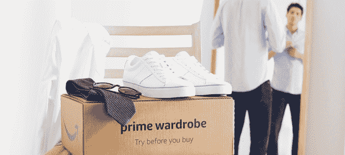

# 亚马逊 Prime 衣柜正式向所有美国 Prime 会员推出

> 原文：<https://web.archive.org/web/https://techcrunch.com/2018/06/20/amazon-prime-wardrobe-officially-launches-to-all-u-s-prime-members/>

亚马逊的“先试后买”购物服务第一个[于去年夏天](https://web.archive.org/web/20230224143424/https://techcrunch.com/2017/06/20/amazon-prime-wardrobe/)宣布推出，Prime 衣柜正式退出测试，并于今天向美国所有 Prime 会员开放。在过去的一年中，这项服务已经在[逐渐向更多的客户开放](https://web.archive.org/web/20230224143424/https://techcrunch.com/2018/04/12/amazon-finally-opens-up-prime-wardrobe-to-more-customers/)，所以在今天的正式发布之前，许多 Prime 会员可能已经可以使用了。

Prime 衣柜是亚马逊对越来越受欢迎的个性化购物服务的回应，如 Stitch Fix 和 Trunk Club，这些服务定期向客户发送一箱精选的衣服。这些服务允许消费者在家里试穿衣服和其他物品，然后留下他们喜欢的，并把剩下的寄回去。

然而，亚马逊的服务更多的是 DIY 版本——而不是使用造型师，你每次在自己的盒子里装满至少三件甚至多达八件物品。然后，你有一周的时间试穿这些物品，并在付费前退回你不想要的物品。

像它的许多竞争对手一样，Prime 衣柜不仅仅针对女性，它还提供针对男性、儿童和婴儿的系列。

这项服务主要是为了帮助解决网上购物最大的问题之一:合身。

服装设计师对尺码有自己的解释，购物者不试穿的话通常很难感觉到某件衣服的真实样子。商品可能太短或太长，在某些地方太长或太紧，或者购物者可能对面料的感觉、悬垂感、裙边、做工质量和其他问题有意见。

家庭试穿消除了网上服装购物的这一障碍，因为它可以很容易地在物品不工作时将其退回。

并非所有亚马逊的在线库存都包含在 Prime 衣柜中，这意味着你不能只是浏览网站，挑选任何你想要的东西回家试穿。

相反，你必须去高级衣柜区才能装满你的箱子。

该网站倾向于亚马逊的内部服装品牌，但也有一些较大的品牌，如礼来普利策，汤米·席尔菲格，阿迪达斯，Guess，李维斯，卡尔文克莱恩，九西，化石，鳄鱼，雨果博斯，Stride Rite，迪士尼，彪马，疯狂 8，金伯瑞，新百伦，斯图尔特韦茨曼，丽贝卡泰勒，J 品牌，A|X 阿玛尼交易所，等等。

该零售商表示，在测试期间，Prime 会员已经订购了“数千种款式”女人们买了牛仔布和连衣裙；男人买了上衣、牛仔裤和休闲裤；对孩子们来说，鞋子是最受欢迎的。

同样值得注意的是，亚马逊表示，其自有品牌 Lark & Ro、Daily Ritual、Amazon Essentials 和 Goodthreads 是最受欢迎的商品。这意味着 Prime 衣柜至少对亚马逊来说是不错的，即使它的服装选择比网上购物者想要的更有限。