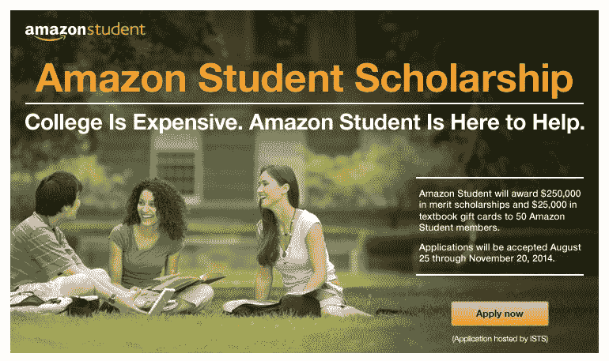

# 亚马逊用 50 个大学奖学金推广其学生项目 

> 原文：<https://web.archive.org/web/https://techcrunch.com/2014/08/27/amazon-promotes-its-student-program-with-50-college-scholarships/>

# 亚马逊用 50 个大学奖学金推广其学生项目

亚马逊今天早上宣布，它将为 50 名全日制本科生提供大学奖学金，其中包括 5000 美元的学费，以及另外 500 美元用于购买亚马逊的教科书。奖学金将以成绩为基础，将在 2015 年秋季学期及时发放。

据亚马逊学生项目主管 Ripley MacDonald 称，该奖学金旨在“奖励在领导能力和创新思维方面表现出非凡能力的学生。”

申请的学生将根据他们的 GPA，社区参与，领导经验进行评判，并且需要完成一篇论文才能进入最后一轮——这是非常标准的大学奖学金。获奖者将于 2015 年 4 月收到通知，奖学金将于 2015 年 7 月颁发。

这一声明并不完全是亚马逊的慈善行为。它选择了美国最聪明、最投入和最活跃的学生，并帮助他们成为亚马逊品牌大使。

该奖学金的更大目标是传播消息，增加[亚马逊学生的注册人数，](https://web.archive.org/web/20221006180758/https://www.amazon.com/gp/student/signup/info)该公司为大学生设计的项目是亚马逊 Prime 的打折版。该计划是半价(49 美元/年)，同时仍然提供免费的两天运输和其他优惠，如 Prime 即时视频、Prime 音乐、访问 Kindle 借阅图书馆，以及其他针对学生的促销活动。

为了获得奖学金，潜在的候选人必须是亚马逊的学生会员。[可以这么说，他们就是这样得到](https://web.archive.org/web/20221006180758/https://www.youtube.com/watch?v=zvRXp35rqjk)的。

学生们必须在美国的两年或四年制学校注册，他们可以从现在到 11 月 20 日在[申请](https://web.archive.org/web/20221006180758/http://www.amazon.com/b/?node=9944643011)。