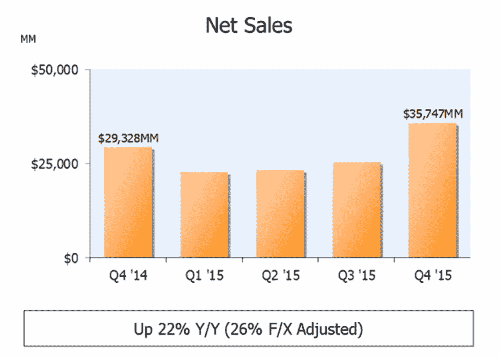

# 亚马逊在报告第四季度每股收益为 1.00 美元，净销售额为 357 亿美元后下跌 13% 

> 原文：<https://web.archive.org/web/https://techcrunch.com/2016/01/28/amazon-tanks-11-after-reporting-strong-q4-miss-with-1-00-eps-35-7b-net-sales/>

# 亚马逊在报告第四季度每股收益 1.00 美元，净销售额 357 亿美元后下跌 13%

尽管亚马逊公布了有史以来最好的季度利润，但由于未能实现净销售额和每股收益，其股价在盘后暴跌了 13%。此前，该股在财报发布前的几个小时内飙升至接近 9%的收盘水平。

这家总部位于西雅图的零售公司报告称，2015 年第四季度净销售额为 357 亿美元，比上一年的 293 亿美元增长 22%，每股摊薄收益为 1.00 美元。华尔街预期销售额为 359.8 亿美元，每股收益 1.56 美元。

AWS 同比增长 69%，至 24 亿美元，超过了 23.8 亿美元的市场预期。亚马逊报告 AWS 的部门运营收入为 6.87 亿美元，高于去年第四季度的 2.4 亿美元。亚马逊网络服务通常是该公司的主要利润来源，也是 2015 年股票增长的主要原因。

与苹果一样，亚马逊很快解决了不利的汇率波动的负面影响，并在报告中指出，“整个季度的汇率同比变化产生了 12 亿美元的不利影响。”

北美仍然是该公司的支柱，净销售额为 215 亿美元，高于 2014 年第四季度的 17.33 亿美元，尽管国际销售额也在增长——从去年第四季度的 105 亿美元增至 118 亿美元。

由于假日季节对零售的重大影响，亚马逊的第四季度对这家电子商务公司来说一直很重要。该公司的零售部门仍占其业务的 90%以上。

大多数分析师预计亚马逊将在假日销售中表现强劲。该公司在感恩节周末后报告称，他们自己的设备销售额比前一年高出三倍，这表明该公司的 Echo 设备、Fire 平板电脑和 Fire TV 设备增长强劲。

亚马逊还详细说明了付费 Prime 会员增加了 51%。这项服务允许消费者从该公司获得额外津贴，如免费送货、扩大目录和流媒体视频。