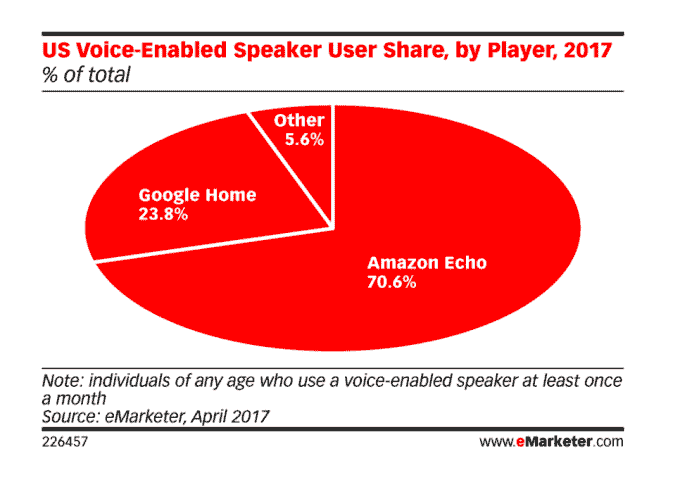
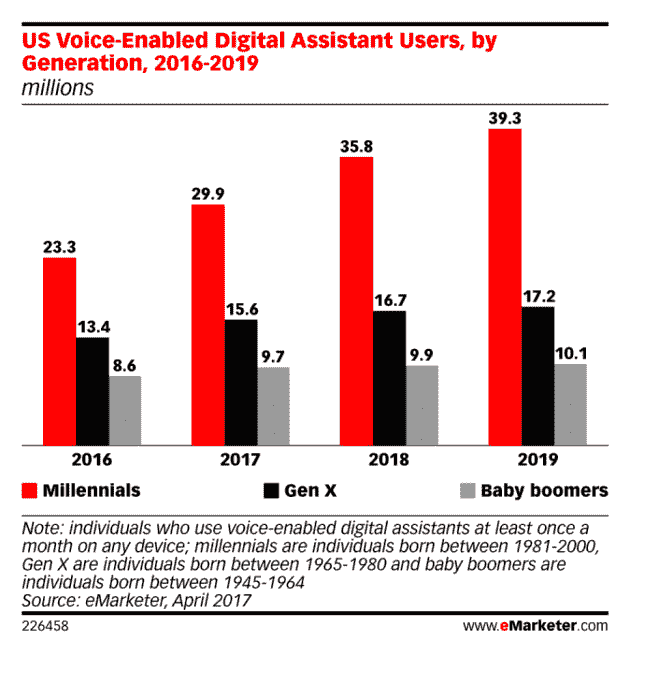

# 亚马逊今年将控制 70%的语音控制扬声器市场

> 原文：<https://web.archive.org/web/https://techcrunch.com/2017/05/08/amazon-to-control-70-percent-of-the-voice-controlled-speaker-market-this-year/>

根据 eMarketer 今天早上发布的新预测，亚马逊正在主导语音控制扬声器市场。Echo 品牌扬声器的制造商今年将拥有美国所有语音扬声器用户的 70.6%，远远超过 Google Home 的 23.8%和其他较小的参与者，如联想、LG、Harmon Kardon 和 Mattel，它们加起来只占用户的 5.6%。

这份新报告支持了【VoiceLabs 在 1 月份发布的另一份报告，该报告也发现，由于 Echo 的流行，亚马逊在语音优先设备市场处于领先地位。

虽然市场本身预计不会成为赢家通吃的局面，但亚马逊和谷歌等竞争对手将赢得整个家庭，因为大多数消费者都表示，一旦他们已经拥有一个语音控制扬声器，他们就不会考虑购买竞争设备。

Emarketer 表示，随着谷歌的家用设备进入更多消费者手中，亚马逊的份额将有所下降，但亚马逊将在“可预见的未来”引领市场。

该公司估计，今年将有 3560 万美国人每月至少使用一次声控设备，比 2016 年增加了 128.9%。(在这部分预测中，该公司没有将智能手机上的语音助手计算在内——只有独立语音扬声器上的数字助手。)

然而，eMarketer 表示，更广泛的语音助手市场——包括 Siri、Alexa、Google Now 和微软在任何设备上运行的 Cortana 预计今年将增长 23.1%。2017 年，6050 万美国用户将每月至少使用一次这些助手。报告指出，这超过了四分之一(27.5%)的智能手机用户，或近五分之一的美国人。

年轻人群的使用量最大——25 岁至 34 岁之间的人占虚拟助理用户的 26.3%。此外，超过三分之一的千禧一代(33.5%)将在 2017 年使用虚拟助手。

“年长的千禧一代是虚拟助理的核心用户，主要是因为他们对功能的需求超过了娱乐，”eMarketer 的预测副总裁马丁·乌特雷拉斯说。

亚马逊没有披露 Echo 的销售数据，但[在 2 月份](https://web.archive.org/web/20230316161016/https://techcrunch.com/2017/02/02/amazon-fumbles-earnings-amidst-high-expectations/)表示，Echo family 的销售额比上一季增长了 9 倍以上。VoiceLabs [估计](https://web.archive.org/web/20230316161016/https://techcrunch.com/2017/01/24/24-5m-voice-first-devices-expected-to-ship-this-year-but-apps-struggle-to-retain-users/)一月份消费者家中有超过 700 万台设备；与此同时,[的消费者情报研究伙伴(CIRP)将其调高至 820 万份](https://web.archive.org/web/20230316161016/https://www.geekwire.com/2017/8-million-people-amazon-echo-customer-awareness-increases-dramatically/)；摩根士丹利认为，在 2017 年假期之前，这一数字超过了 1100 万。

亚马逊对 Alexa 的策略是让助手不仅仅局限于 it 制造商的语音控制扬声器。该公司还在其亚马逊移动购物应用程序中包含了该助手，并让第三方[可以在他们自己的硬件和软件应用程序中使用。](https://web.archive.org/web/20230316161016/https://techcrunch.com/2017/05/06/amazon-echo-world-domination/)

凭借其主导的市场份额，亚马逊的 Alexa [到 2020 年可能带来 100 亿美元的收入](https://web.archive.org/web/20230316161016/http://www.cnbc.com/2017/03/10/amazon-alexa-voice-assistan-could-be-a-10-billion-mega-hit-by-2020-research.html)，加拿大皇家银行资本市场在 3 月份也曾估计。这一数字包括 Alexa 设备销售、语音购物销售和平台收入。该公司预测，2020 年将售出 6000 万台 Alexa 设备，安装量将达到 1.28 亿台。