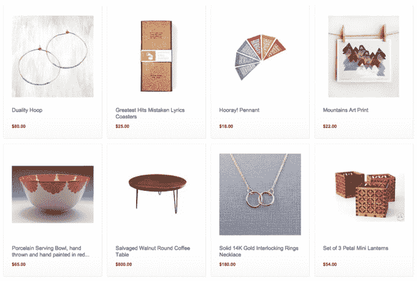

# 亚马逊推出手工市场 TechCrunch 触怒了 Etsy

> 原文：<https://web.archive.org/web/https://techcrunch.com/2015/10/08/amazon-treads-on-etsys-toes-with-handmade-marketplace-launch/>

亚马逊再次扩张了它的电子商务帝国，为手工制品开辟了一个市场，直接进入 Etsy 的定制针织品市场。

这个名为[manual at Amazon](https://web.archive.org/web/20221006071554/http://www.amazon.com/b?node=11260432011&ref=spkl_2_0_2235681382&qid=1444304539&pf_rd_p=2235681382&pf_rd_m=ATVPDKIKX0DER&pf_rd_t=301&pf_rd_s=desktop-signpost&pf_rd_r=PYEFKFW4AT8ATR16W0KZ&pf_rd_i=handmade)的新市场于今天早些时候在美国上线——提供以下初始类别的手工物品:珠宝、家居装饰、艺术品、文具&派对用品、厨房&餐厅、家具和床上用品。

亚马逊正在[大举推进](https://web.archive.org/web/20221006071554/http://services.amazon.com/handmade/handmade.html?ref=spkl_2_2_2235681382&qid=1444304539&pf_rd_p=2235681382&pf_rd_m=ATVPDKIKX0DER&pf_rd_t=301&pf_rd_s=desktop-signpost&pf_rd_r=PYEFKFW4AT8ATR16W0KZ&pf_rd_i=handmade)，向它希望吸引到市场的工匠兜售在其平台上销售的“好处”——宣传其庞大的客户群、免费电话和电子邮件支持、商业报告工具和定制订购工具。

亚马逊对手工制作的收费结构是每售出一件商品抽取 12%的佣金，如果一个工匠每月从其手工制作账户中售出 40 件以上的商品，则每月收取 40 美元的费用(尽管亚马逊在 2016 年 8 月前免收这笔费用，以推动手工编织的发展)。

该公司在这个阶段对有资格销售手工制品的人采用了严格的标准，注意到:

> 亚马逊手工商店中的所有产品必须完全由手工制作、手工修改或手工组装(而非成套)。产品必须由您(工匠)、您的一名员工(如果您的公司有 20 名或更少的员工)或少于 100 人的集体成员手工制作。批量生产的产品或由不同工匠手工制作的产品没有资格以手工方式销售。

这使得 Amazon.com 的这个新分支比 Etsy 更加“定制化”，Etsy 上个月[开放了一个制造项目](https://web.archive.org/web/20221006071554/https://beta.techcrunch.com/2015/09/14/etsy-opens-to-manufacturing/)，允许其平台上的卖家将制造外包给获得批准的 Etsy 制造商，以扩大其业务规模(使其进一步远离其严格的手工制作根源)。

当然，亚马逊已经为想要在 Amazon.com 上购买非自己制作的商品的个人卖家提供了一个标准的市场选项——所以它现在可以提供一个只针对工匠的细分市场，而没有任何负面影响。它大概是希望吸引那些可能对与外包制造的其他手工艺者竞争不满的小卖家。

负责手工制作的亚马逊副总裁彼得·法瑞西(Peter Faricy)在接受 [NYT](https://web.archive.org/web/20221006071554/http://www.nytimes.com/2015/10/08/business/amazon-challenges-etsy-with-strictly-handmade-marketplace.html?_r=0) 采访时，将这家 Amazon.com 电子商务帝国的子公司吹捧为“一个无工厂区，一个无大规模生产区”——这是对 Etsy 的明显抨击(同时回避了一个讽刺，即从整体上看，Amazon.com 绝对不是一个无工厂或无大规模生产区)。

工匠们是否会听从亚马逊的号召，将其托管在其庞大的电子商务帝国的一个“定制”子部分，还有待观察。据《NYT》报道，亚马逊的“手工制作”活动已经开始，有来自 60 个国家的约 5000 名卖家注册，有超过 80000 件手工制品出售。

Etsy 于 4 月份上市，自上市以来股价一直动荡不安，[投资者关注的焦点是收入增长放缓和成本上升——这可能解释了为什么它正在通过开放外包制造来扩大其平台上的卖家规模。对于总部位于纽约的工艺品市场来说，亚马逊就在它的后院，事情不会变得更容易。](https://web.archive.org/web/20221006071554/https://beta.techcrunch.com/2015/08/04/etsy-beats-in-q2-but-falls-13-after-hours-on-troublesome-q3-guidance/)